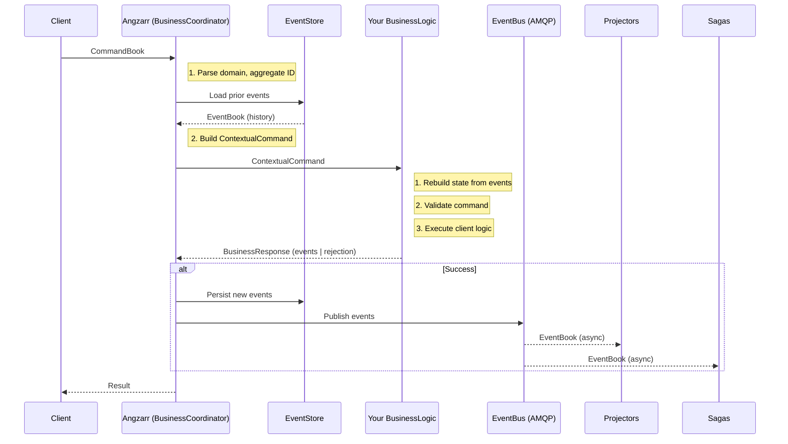
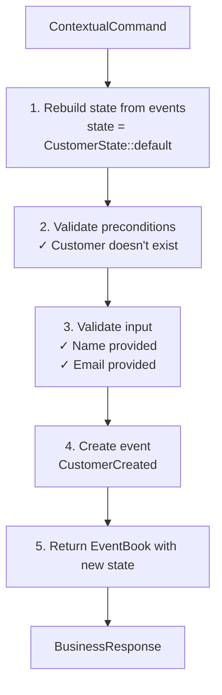

# Command Handlers (Aggregates)

> For CQRS/ES background, see [CQRS and Event Sourcing Concepts](../../cqrs-event-sourcing.md).

A **command handler** processes commands for a domain, validates business rules against current state, and emits events. In DDD terminology, this is the **aggregate**—the consistency boundary for a cluster of domain objects.

There is exactly **one aggregate codebase per domain**. The "flights" domain has one aggregate that handles all flight-related commands (CreateFlight, BoardPassenger, DepartFlight, etc.). This single codebase scales horizontally across many processes, but the client logic is defined once.

## Concepts

| Term | Definition |
|------|------------|
| **Domain** | A bounded context with its own ubiquitous language. Examples: `customer`, `transaction`, `inventory`. |
| **Aggregate Root** | The entity that owns all objects in the aggregate. Identified by UUID. |
| **Command** | A request to change state. May be accepted (events emitted) or rejected (error returned). |
| **Event** | Immutable record of state change. Past tense naming: `CustomerCreated`, not `CreateCustomer`. |
| **State** | Current aggregate state, reconstructed by replaying events. |
| **Snapshot** | Cached state at a sequence number. Optimization to skip replaying old events. |

---

## Aggregate Identity

Each aggregate within a domain is identified by `Cover.root`, a UUID. This UUID is computed deterministically from the domain's **business key** using a hash function.

### Hash Computation

The root UUID is derived from:
```
hash("angzarr" + domain + business_key)
```

| Domain | Business Key | Example |
|--------|--------------|---------|
| Customer | email | `hash("angzarr" + "customer" + "alice@example.com")` |
| Product | SKU | `hash("angzarr" + "product" + "SKU-12345")` |
| Order | order ID | `hash("angzarr" + "order" + "ord-abc-123")` |
| Inventory | product ID | `hash("angzarr" + "inventory" + "prod-xyz")` |

### Implementation

Use UUID v5 (SHA-1 namespace-based) for deterministic generation:

```rust
use uuid::Uuid;

/// Compute a deterministic root UUID from domain and business key.
pub fn compute_root(domain: &str, business_key: &str) -> Uuid {
    let seed = format!("angzarr{}{}", domain, business_key);
    Uuid::new_v5(&Uuid::NAMESPACE_OID, seed.as_bytes())
}

// Domain-specific helpers
pub fn customer_root(email: &str) -> Uuid {
    compute_root("customer", email)
}

pub fn product_root(sku: &str) -> Uuid {
    compute_root("product", sku)
}
```

### Why Deterministic UUIDs?

1. **Idempotent commands**: Sending the same command twice targets the same aggregate
2. **Natural deduplication**: Same business key → same root → Angzarr prevents duplicate creation
3. **No external lookups**: No need to query "does customer with email X exist?"—the hash collision handles it
4. **Consistent across services**: Any service can compute the root from the business key

### Duplicate Detection

When a client sends `CreateCustomer` with email `alice@example.com`:

1. client logic computes `root = hash("angzarr" + "customer" + "alice@example.com")`
2. Command is sent with `Cover { domain: "customer", root: <computed> }`
3. If aggregate already exists (prior events for this root), command is rejected

This means duplicate detection happens at the Angzarr level—client logic only needs to check "does this root have events?" rather than querying across all customers.

---

## Component Responsibilities

### What Angzarr Provides

| Component | Responsibility |
|-----------|----------------|
| **BusinessCoordinator** | Receives commands from clients, loads prior events, calls your handler, persists resulting events |
| **EventStore** | Append-only storage of events with sequence validation and optimistic concurrency |
| **SnapshotStore** | Caches aggregate state at checkpoints to optimize replay |
| **EventBus** | Publishes persisted events to projectors and sagas via AMQP |
| **EventQuery** | Query service for retrieving events by domain/aggregate |

### What You Provide

| Component | Responsibility |
|-----------|----------------|
| **BusinessLogic service** | gRPC server implementing the `BusinessLogic` interface |
| **State reconstruction** | Logic to rebuild aggregate state from event history |
| **Command validation** | Business rules that accept or reject commands |
| **Event creation** | Transform valid commands into domain events |
| **Domain types** | Protobuf definitions for commands, events, and state |

---

## Architecture



---

## gRPC Interfaces

### Client → Angzarr

Clients send commands to Angzarr's `BusinessCoordinator` service:

**[proto/angzarr/](../proto/angzarr/)** (framework service definitions)

```protobuf
// Angzarr exposes this to clients
service BusinessCoordinator {
  rpc Handle (CommandBook) returns (EventBook);
}

message CommandBook {
  Cover cover = 1;              // Domain + aggregate root ID
  repeated CommandPage pages = 2;  // Commands to process
  string correlation_id = 3;    // For tracking across services
}

message Cover {
  string domain = 1;            // e.g., "customer", "transaction"
  UUID root = 2;                // Aggregate root identifier
}

message CommandPage {
  google.protobuf.Any command = 1;  // The actual command (CreateCustomer, etc.)
}
```

### Angzarr → Your Handler

Angzarr calls your `BusinessLogic` service with prior events attached:

```protobuf
// You implement this service
service BusinessLogic {
  rpc Handle (ContextualCommand) returns (BusinessResponse);
}

message ContextualCommand {
  CommandBook command = 1;      // Original command from client
  EventBook events = 2;         // Prior events for this aggregate (for state rebuild)
}

message BusinessResponse {
  oneof result {
    EventBook events = 1;       // Success: new events to persist
    string rejection = 2;       // Failure: human-readable rejection reason
  }
}
```

### Event and State Containers

```protobuf
message EventBook {
  Cover cover = 1;                    // Domain + aggregate root ID
  repeated EventPage pages = 2;       // Events in sequence order
  google.protobuf.Any snapshot_state = 3;  // Optional: current state for snapshotting
  string correlation_id = 4;          // Propagated from command
}

message EventPage {
  int64 sequence = 1;                 // Monotonic sequence within aggregate
  google.protobuf.Any event = 2;      // The actual event (CustomerCreated, etc.)
  string timestamp = 3;               // RFC 3339 timestamp
}
```

---

## Handler Pattern

Every command handler follows this pattern:

1. **Receive** command + prior events
2. **Rebuild** current state from events (applying snapshot if present)
3. **Validate** command against state (preconditions + input validation)
4. **Execute** client logic
5. **Return** new events with updated snapshot state

**Input: ContextualCommand**
```json
{
  "command": { "CreateCustomer": { "name": "Alice", "email": "alice@example.com" } },
  "events": []
}
```



**Output: BusinessResponse**
```json
{
  "events": {
    "pages": [{ "CustomerCreated": { "name": "Alice", "email": "..." } }],
    "snapshot_state": { "CustomerState": { "name": "Alice", "loyalty_points": 0 } }
  }
}
```

---

## Aggregate Lifecycle

Every command follows the same five-step lifecycle inside the aggregate. This is the pattern every implementor follows.

```
 ┌──────────────────┐
 │  1. RESTORE       │  Snapshot → state, or Default → state
 │     STATE         │
 └────────┬─────────┘
          │
          ▼
 ┌──────────────────┐
 │  2. REPLAY        │  Apply events since snapshot
 │     EVENTS        │  to reach current state
 └────────┬─────────┘
          │
          ▼
 ┌──────────────────┐
 │  3. HANDLE        │  GUARD → VALIDATE → COMPUTE
 │     COMMAND       │  Check preconditions, validate input, run logic
 └────────┬─────────┘
          │
          ▼
 ┌──────────────────┐
 │  4. EMIT          │  Create events as immutable facts
 │     EVENTS        │  (absolute values, not deltas)
 └────────┬─────────┘
          │
          ▼
 ┌──────────────────┐
 │  5. APPLY &       │  Apply new events to state,
 │     RETURN        │  return events + updated snapshot
 └──────────────────┘
```

### Step 1–2: Restore State

The aggregate starts from a snapshot (or empty state) and replays events to reach current state. This is a single operation — the `rebuild_from_events` helper handles both:

```rust
pub fn rebuild_from_events<S: Message + Default>(
    event_book: Option<&EventBook>,
    mut apply: impl FnMut(&mut S, &prost_types::Any),
) -> S {
    let mut state = S::default();          // Empty state

    let Some(book) = event_book else {
        return state;                       // No history → new aggregate
    };

    // Restore from snapshot if present
    if let Some(snapshot) = &book.snapshot {
        if let Some(snapshot_state) = &snapshot.state {
            if let Ok(s) = S::decode(snapshot_state.value.as_slice()) {
                state = s;                  // Start from cached state
            }
        }
    }

    // Replay events since snapshot (or all events if no snapshot)
    for page in &book.pages {
        if let Some(event) = &page.event {
            apply(&mut state, event);       // Fold each event into state
        }
    }

    state
}
```

Each aggregate provides its own `apply_event` function — the single source of truth for state transitions:

```rust
pub fn apply_event(state: &mut CartState, event: &prost_types::Any) {
    if event.type_url.ends_with("CartCreated") {
        if let Ok(e) = CartCreated::decode(event.value.as_slice()) {
            state.customer_id = e.customer_id;
            state.status = "active".to_string();
            // ...
        }
    } else if event.type_url.ends_with("ItemAdded") {
        if let Ok(e) = ItemAdded::decode(event.value.as_slice()) {
            // Update item list and subtotal using absolute values
            state.subtotal_cents = e.new_subtotal;
            // ...
        }
    }
    // ... other event types
}
```

The rebuild function is called once per command, producing the current state from history.

### Step 3: Handle the Command

With current state in hand, the handler validates and processes the command. Every handler follows the same internal pattern: **GUARD → VALIDATE → COMPUTE**.

```rust
pub fn handle_add_item(
    command_book: &CommandBook,
    command_data: &[u8],
    state: &CartState,
    next_seq: u32,
) -> Result<EventBook> {
    // GUARD: Check preconditions against current state
    require_exists(&state.customer_id, errmsg::CART_NOT_FOUND)?;
    require_status_not(&state.status, "checked_out", errmsg::CART_CHECKED_OUT)?;

    // VALIDATE: Decode and validate command input
    let cmd: AddItem = decode_command(command_data)?;
    require_positive(cmd.quantity, errmsg::QUANTITY_POSITIVE)?;

    // COMPUTE: Derive new values (facts, not deltas)
    let new_quantity = existing_qty + cmd.quantity;
    let new_subtotal = calculate_subtotal(&updated_items);

    // ... steps 4 and 5 follow
}
```

Rejection happens here. If any guard or validation fails, the handler returns an error — no events are emitted and no state changes.

### Step 4: Emit Events

The handler creates events recording what happened. Events contain **absolute values** (facts), not deltas:

```rust
    // EMIT: Create event with computed facts
    let event = ItemAdded {
        product_id: cmd.product_id.clone(),
        name: cmd.name.clone(),
        quantity: new_quantity,          // Absolute: total quantity after add
        unit_price_cents: cmd.unit_price_cents,
        new_subtotal,                   // Absolute: cart total after add
        added_at: Some(now()),
    };
```

Absolute values ensure idempotent replay. Applying the same event twice produces the same state — the `apply_event` function uses assignment (`=`), never increment (`+=`).

### Step 5: Apply Events and Return Snapshot

The handler applies the new event to produce updated state, then returns both the event and the snapshot:

```rust
pub fn build_event_response(
    state: &CartState,
    cover: Option<Cover>,
    next_seq: u32,
    event_type_url: &str,
    event: impl Message,
) -> EventBook {
    // Encode the event
    let event_bytes = event.encode_to_vec();
    let any = prost_types::Any {
        type_url: event_type_url.to_string(),
        value: event_bytes.clone(),
    };

    // Apply the new event to current state → updated state
    let mut new_state = state.clone();
    apply_event(&mut new_state, &any);

    // Return both the event and the updated snapshot
    EventBook {
        cover,
        pages: vec![EventPage {
            sequence: Some(Sequence::Num(next_seq)),
            event: Some(any),
            created_at: Some(now()),
        }],
        snapshot_state: Some(prost_types::Any {
            type_url: STATE_TYPE_URL.to_string(),
            value: new_state.encode_to_vec(),
        }),
        snapshot: None,
    }
}
```

The `apply_event` function serves double duty:
1. **During rebuild** (steps 1–2): reconstructs state from stored events
2. **During response** (step 5): derives new snapshot from the event being emitted

This guarantees the snapshot is always consistent with the event stream — the same function produces state whether replaying history or handling a new command.

### Complete Handler

Putting it all together, a handler's full lifecycle:

```rust
pub fn handle_create_cart(
    command_book: &CommandBook,
    command_data: &[u8],
    state: &CartState,        // ← Steps 1-2 already done by dispatch
    next_seq: u32,            // ← Computed from prior events
) -> Result<EventBook> {
    // Step 3: GUARD — cart must not already exist
    require_not_exists(&state.customer_id, errmsg::CART_EXISTS)?;

    // Step 3: VALIDATE — decode command
    let cmd: CreateCart = decode_command(command_data)?;

    // Step 4: EMIT — create the event
    let event = CartCreated {
        customer_id: cmd.customer_id.clone(),
        created_at: Some(now()),
    };

    // Step 5: Apply event to state, return event + snapshot
    Ok(build_event_response(
        state,
        command_book.cover.clone(),
        next_seq,
        "type.examples/examples.CartCreated",
        event,
    ))
}
```

### Dispatch Wiring

The `dispatch_aggregate` helper ties the lifecycle together, connecting steps 1–2 (rebuild) to steps 3–5 (handler):

```rust
pub fn dispatch_aggregate<S>(
    cmd: ContextualCommand,
    rebuild: impl Fn(Option<&EventBook>) -> S,
    dispatch: impl FnOnce(&CommandBook, &prost_types::Any, &S, u32) -> Result<EventBook>,
) -> Result<BusinessResponse, Status> {
    // Steps 1-2: Rebuild state from snapshot + events
    let state = rebuild(cmd.events.as_ref());
    let next_seq = next_sequence(cmd.events.as_ref());

    // Extract command payload
    let cb = cmd.command.as_ref()
        .ok_or(BusinessError::Rejected(errmsg::NO_COMMAND_PAGES.to_string()))?;
    let command_any = extract_command(cb)?;

    // Steps 3-5: Handler validates, emits, applies, returns
    let events = dispatch(cb, command_any, &state, next_seq)?;

    Ok(BusinessResponse {
        result: Some(business_response::Result::Events(events)),
    })
}
```

The framework calls `dispatch_aggregate` with the prior events loaded from storage. client logic never touches storage directly — it receives state and returns events.

---

## Event Sequencing

**client logic is responsible for assigning explicit sequence numbers to new events.**

Each event has a `sequence` field that must be set to `Sequence::Num(n)` where `n` is the next available sequence number. The framework provides prior events with their sequences, so client logic can compute the next sequence.

### Why Explicit Sequences?

1. **Idempotency**: client logic can detect duplicate commands by checking if expected sequences already exist
2. **Correctness**: No counting or off-by-one errors—sequences flow directly from data
3. **Simplicity**: Framework doesn't need to track or compute sequences
4. **Visibility**: Sequences are explicit in the data, not hidden in framework state

### Computing Next Sequence

Use the `common::next_sequence()` helper to get the next available sequence:

```rust
use common::next_sequence;

fn handle(&self, cmd: ContextualCommand) -> Result<BusinessResponse> {
    let prior_events = cmd.events.as_ref();
    let state = self.rebuild_state(prior_events);
    let next_seq = next_sequence(prior_events);  // e.g., returns 0, 1, 5, etc.

    // Create event with explicit sequence
    let pages = vec![EventPage {
        sequence: Some(Sequence::Num(next_seq)),
        event: Some(...),
        ...
    }];
}
```

The `next_sequence()` function:
- Returns 0 if no prior events exist
- Returns `last_event.sequence + 1` if events exist
- Falls back to `snapshot.sequence + 1` if only snapshot exists

### Multiple Events

When emitting multiple events from a single command, increment the sequence for each:

```rust
let mut seq = next_seq;
let mut pages = vec![];

pages.push(EventPage {
    sequence: Some(Sequence::Num(seq)),
    event: Some(first_event),
    ...
});
seq += 1;

if should_emit_alert {
    pages.push(EventPage {
        sequence: Some(Sequence::Num(seq)),
        event: Some(alert_event),
        ...
    });
}
```

### Snapshot Sequence

The framework uses the last event's sequence to compute the snapshot sequence. If client logic provides `snapshot_state`, the framework stores a snapshot at `last_event.sequence + 1`.

---

## State Reconstruction

State is rebuilt by applying events in sequence:

```
Prior Events:
  [0] CustomerCreated { name: "Alice", email: "alice@example.com" }
  [1] LoyaltyPointsAdded { points: 100, ... }
  [2] LoyaltyPointsAdded { points: 50, ... }

Rebuild:
  state = CustomerState::default()
  apply(CustomerCreated) → state.name = "Alice", state.email = "..."
  apply(LoyaltyPointsAdded) → state.loyalty_points = 100
  apply(LoyaltyPointsAdded) → state.loyalty_points = 150

Result:
  CustomerState { name: "Alice", loyalty_points: 150, ... }
```

With snapshots, only events after the snapshot are replayed:

```
Snapshot at sequence 1:
  CustomerState { name: "Alice", loyalty_points: 100 }

Events after snapshot:
  [2] LoyaltyPointsAdded { points: 50, ... }

Rebuild:
  state = snapshot.state
  apply(LoyaltyPointsAdded) → state.loyalty_points = 150
```

---

## State Object Strategies

State objects can be managed two ways, each with trade-offs:

### Option 1: Protobuf State (Recommended)

Define state as a protobuf message and return it in `EventBook.snapshot_state`:

```protobuf
message CustomerState {
  string name = 1;
  string email = 2;
  int32 loyalty_points = 3;
}
```

**Benefits:**
- Angzarr persists snapshots automatically
- State is loaded from snapshot on subsequent commands—no full replay
- Works across languages (same protobuf definition)
- Efficient for high-volume aggregates

**Trade-offs:**
- Requires protobuf knowledge
- State schema must be defined upfront
- State changes require proto regeneration

### Option 2: Language-Native State

Define state as a native struct/class and rebuild from events on every command:

```python
@dataclass
class CustomerState:
    name: str = ""
    email: str = ""
    loyalty_points: int = 0
```

**Benefits:**
- Simpler—no protobuf templating
- State evolves with code changes naturally
- Good for prototyping and low-volume aggregates

**Trade-offs:**
- Full event replay on every command (no snapshots)
- State not visible to Angzarr—cannot be tracked or inspected
- Performance degrades as event count grows

### Recommendation

Use protobuf state for production aggregates. The snapshot optimization matters at scale, and cross-language consistency reduces bugs when multiple services interact with the same domain.

Use language-native state for:
- Early prototyping before schema solidifies
- Low-volume aggregates where replay cost is negligible
- Internal/temporary aggregates that don't need inspection

---

## Example Implementations

### Customer Domain

Handles customer lifecycle and loyalty points:

| Command | Precondition | Events Emitted |
|---------|--------------|----------------|
| `CreateCustomer` | Customer must not exist | `CustomerCreated` |
| `AddLoyaltyPoints` | Customer must exist, points > 0 | `LoyaltyPointsAdded` |
| `RedeemLoyaltyPoints` | Customer must exist, sufficient balance | `LoyaltyPointsRedeemed` |

**Implementations:**

| Language | File |
|----------|------|
| Rust | [examples/rust/customer/src/lib.rs](../../../examples/rust/customer/src/lib.rs) |
| Go | [examples/go/customer/logic/customer_logic.go](../../../examples/go/customer/logic/customer_logic.go) |
| Python | [examples/python/customer/customer_logic.py](../../../examples/python/customer/customer_logic.py) |

---

## Domain Types

Commands, events, and state are defined in protobuf:

**[proto/examples/](../proto/examples/)** (per-domain proto files)

### Customer Types

```protobuf
// Commands (imperative: what to do)
message CreateCustomer {
  string name = 1;
  string email = 2;
}

message AddLoyaltyPoints {
  int32 points = 1;
  string reason = 2;    // e.g., "signup_bonus", "purchase:txn-123"
}

message RedeemLoyaltyPoints {
  int32 points = 1;
  string reason = 2;    // e.g., "discount_applied"
}

// Events (past tense: what happened)
message CustomerCreated {
  string name = 1;
  string email = 2;
  string created_at = 3;  // RFC 3339 timestamp
}

message LoyaltyPointsAdded {
  int32 points = 1;
  int32 new_balance = 2;
  int32 lifetime_points = 3;
  string reason = 4;
  string added_at = 5;
}

message LoyaltyPointsRedeemed {
  int32 points = 1;
  int32 new_balance = 2;
  string reason = 3;
  string redeemed_at = 4;
}

// State (current aggregate state for snapshots)
message CustomerState {
  string name = 1;
  string email = 2;
  int32 loyalty_points = 3;     // Current balance (can decrease)
  int32 lifetime_points = 4;    // Total earned (never decreases)
}
```

---

## BDD Specifications

Business behavior is specified in Gherkin feature files:

| Feature | File |
|---------|------|
| Customer lifecycle | [examples/features/customer.feature](../../../examples/features/customer.feature) |

Example scenario:

```gherkin
Scenario: Add loyalty points to existing customer
  Given a customer "cust-123" exists with 50 loyalty points
  When I send an "AddLoyaltyPoints" command with 100 points
  Then a "LoyaltyPointsAdded" event is emitted
  And the customer has 150 loyalty points
```

---

## Validation Strategy

### Preconditions (State-Based)

Check current state before processing:

| Check | Error Message |
|-------|---------------|
| Customer exists for AddPoints | "Customer does not exist" |
| Customer doesn't exist for Create | "Customer already exists" |
| Transaction is pending for Complete | "Transaction is not pending" |
| Sufficient balance for Redeem | "Insufficient points" |

### Input Validation

Check command fields:

| Check | Error Message |
|-------|---------------|
| Name provided | "Customer name is required" |
| Email provided | "Customer email is required" |
| Points positive | "Points must be positive" |
| Discount valid | "Invalid discount type" |

---

## Testing

### Unit Tests

Each language has unit tests for the logic module:

```bash
# Rust
cargo test -p customer --lib

# Go
cd examples/go/customer && go test ./logic/...

# Python
cd examples/python/customer && uv run pytest test_customer_logic.py
```

### Acceptance Tests (BDD)

Gherkin scenarios test full behavior:

```bash
# Rust
cargo test -p customer --test cucumber

# Go
cd examples/go/customer && go test ./features/...

# Python
cd examples/python/customer && uv run pytest features/
```

---

## Next Steps

- [Projectors](../projector/projectors.md) — React to events, build read models
- [Sagas](../saga/sagas.md) — Orchestrate workflows across aggregates
