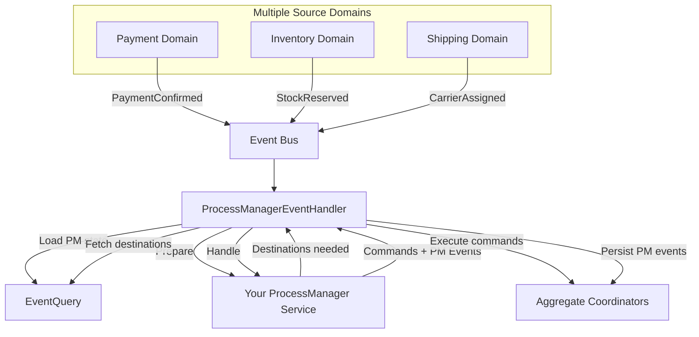

# Process Manager

A **Process Manager** (also called a **Workflow Manager**) is a stateful coordinator for long-running workflows that span multiple aggregates. Unlike sagas (which are stateless), process managers maintain their own event-sourced state and can subscribe to events from multiple domains.

## Warning: You Probably Don't Need This

**Before implementing a Process Manager, ask yourself:**

1. Can a simple saga + destination queries solve this?
2. Is the "state" you want to track already derivable from existing aggregates?
3. Are you adding Process Manager because the workflow is genuinely complex, or because you haven't designed your aggregates well?

**Process Manager is warranted when:**
- Workflow state is NOT derivable from aggregates (PM owns unique state)
- You need to query workflow status independently ("show all pending fulfillments")
- Timeout/scheduling logic is complex enough to merit its own aggregate
- You must react to events from MULTIPLE domains

**Process Manager is NOT warranted when:**
- You just need cross-domain coordination (use saga)
- State can be derived by querying aggregates (use saga + destinations)
- You're avoiding proper aggregate design

**Rule of thumb:** If your Process Manager's state is purely a mirror of aggregate states, you don't need it.

---

## Saga vs Process Manager

| Aspect | Saga | Process Manager |
|--------|------|-----------------|
| **State** | Stateless | Event-sourced in own domain |
| **Domain subscription** | Single domain (recommended) | Multiple domains |
| **Complexity** | Low | High |
| **Correlation** | Via correlation_id | Via correlation_id |
| **Use case** | Simple event → commands | Complex multi-step workflows |

### When to Use Each

**Use Saga when:**
- Reacting to events from ONE domain
- State derivable from querying other aggregates
- Simple event → command mapping
- No need to track workflow independently

**Use Process Manager when:**
- Must react to events from MULTIPLE domains
- Workflow state is NOT derivable from aggregates
- Need queryable workflow status
- Complex timeout/retry logic per workflow stage

---

## Correlation ID Requirement

**Process Managers require correlation_id on triggering events.** Events without correlation_id are silently skipped.

This is intentional:
- PM root = correlation_id (by design)
- Without correlation_id, there's no aggregate to load/update
- Single-domain operations don't need PM overhead

If your PM isn't activating, check that the originating command has correlation_id set. See [Correlation ID](../../patterns.md#correlation-id) for full documentation on when and how to use it.

---

## Architecture

Process Manager is an aggregate with its own domain, events, and state:

```
Domain: "order-fulfillment"
Root: correlation_id (as UUID)
Events: FulfillmentStarted, PaymentReceived, InventoryReserved, ...
State: FulfillmentState { stage, prerequisites, deadlines, ... }
```



---

## Two-Phase Protocol

Like sagas, process managers use a two-phase protocol:

### Phase 1: Prepare

PM receives trigger event + current PM state, declares additional destinations needed:

```protobuf
message ProcessManagerPrepareRequest {
  EventBook trigger = 1;       // Full state of triggering domain
  EventBook process_state = 2; // Current PM state (may be empty)
}

message ProcessManagerPrepareResponse {
  repeated Cover destinations = 1; // Additional aggregates needed
}
```

### Phase 2: Handle

PM receives trigger + PM state + destinations, produces commands + PM events:

```protobuf
message ProcessManagerHandleRequest {
  EventBook trigger = 1;
  EventBook process_state = 2;
  repeated EventBook destinations = 3;
}

message ProcessManagerHandleResponse {
  repeated CommandBook commands = 1;    // Commands for other aggregates
  EventBook process_events = 2;         // Events for PM's own domain
}
```

---

## State Design

Process Manager state should be **workflow-oriented**, not **aggregate-oriented**.

### Wrong - Mirroring aggregate fields:

```protobuf
message OrderFulfillmentState {
  string order_id = 1;
  bool payment_confirmed = 2;      // Just a copy of payment aggregate
  bool inventory_reserved = 3;     // Just a copy of inventory aggregate
  string customer_email = 4;       // Just a copy of customer aggregate
}
```

If your state looks like this, you don't need a Process Manager - query the aggregates.

### Right - Workflow-focused state:

```protobuf
message OrderFulfillmentState {
  string order_id = 1;
  FulfillmentStage stage = 2;                    // Workflow concept
  repeated string completed_prerequisites = 3;   // Workflow tracking
  repeated string pending_prerequisites = 4;     // What we're waiting for
  bool final_action_issued = 5;                  // Idempotency guard
  google.protobuf.Timestamp deadline = 6;        // Workflow timeout
  int32 retry_count = 7;                         // Workflow retry tracking
}
```

The state answers workflow questions:
- "What stage is this process in?"
- "What are we waiting for?"
- "Have we already taken the final action?"
- "When does this time out?"

NOT aggregate questions (query aggregates for those).

---

## gRPC Interface

```protobuf
service ProcessManager {
  // Get subscription filters - called at startup
  rpc GetSubscriptions (GetSubscriptionsRequest) returns (GetSubscriptionsResponse);

  // Phase 1: Declare additional destinations needed
  rpc Prepare (ProcessManagerPrepareRequest) returns (ProcessManagerPrepareResponse);

  // Phase 2: Handle with full context
  rpc Handle (ProcessManagerHandleRequest) returns (ProcessManagerHandleResponse);
}
```

### GetSubscriptions

At startup, the sidecar calls `GetSubscriptions` to learn which domains the PM wants to receive events from:

```protobuf
message Subscription {
  string domain = 1;
  repeated string event_types = 2;  // Empty = all events from domain
}
```

---

## Configuration

```yaml
process_managers:
  - name: "order-fulfillment"    # Also used as domain
    address: "localhost:50060"
    timeouts:
      payment:
        duration_minutes: 30
      reservation:
        duration_minutes: 15
```

---

## Fan-In Pattern

The primary reason to use Process Manager is the **fan-in pattern**: waiting for multiple domains to complete before taking action.

### Example: Three Domains Racing

```gherkin
Scenario: Action triggers only when all three domains complete
  Given an order requires payment, inventory, and shipping confirmation

  When payment domain emits PaymentConfirmed
  Then PM records payment complete, no action yet

  When shipping domain emits CarrierAssigned
  Then PM records shipping ready, no action yet

  When inventory domain emits StockReserved
  Then PM records inventory reserved
  And PM issues FulfillmentReady command (all three complete)
```

### Why Saga Cannot Handle This

With saga, if events arrive simultaneously:
- Each saga instance sees incomplete state
- Race condition: no instance sees all complete
- FulfillmentReady might never be issued

With Process Manager:
- PM aggregate sequence serializes concurrent writes
- Only ONE event sees all prerequisites complete
- `final_action_issued` flag prevents duplicates

---

## Timeouts

Process managers can use the `TimeoutScheduler` for deadline-based events:

1. PM state includes deadline timestamps
2. TimeoutScheduler queries for stale processes
3. Emits `ProcessTimeout` events to the bus
4. PM handles timeout like any other event

```protobuf
message ProcessTimeout {
  string correlation_id = 1;
  string process_type = 2;     // e.g., "order-fulfillment"
  string timeout_type = 3;     // e.g., "payment", "reservation"
  google.protobuf.Timestamp deadline = 4;
}
```

---

## Retry on Sequence Conflict

The ProcessManagerEventHandler implements retry logic:

1. Load PM state by correlation_id
2. Call Prepare + Handle
3. Attempt to persist PM events
4. On sequence conflict: reload state, retry
5. Execute commands after PM events persisted

This ensures correctness under concurrent access.

---

## Projectors for Workflow Operations

Projectors can subscribe to the PM domain for dashboards and reporting:

```yaml
projector:
  name: "fulfillment-dashboard"
  subscriptions:
    - domain: "order-fulfillment"
      event_types: ["FulfillmentStarted", "PaymentReceived", "Shipped", "Completed"]
```

Use cases:
- **Dashboard:** "47 orders awaiting payment, 12 reserving inventory"
- **Alerts:** "Order stuck in RESERVING for >15 minutes"
- **Reporting:** Workflow throughput, bottleneck analysis

---

## Next Steps

- [Sagas](../saga/sagas.md) — Simpler stateless coordination (prefer this when possible)
- [Projectors](../projector/projectors.md) — Building read models from event streams
- [Command Handlers](../aggregate/aggregate.md) — Processing commands and emitting events
