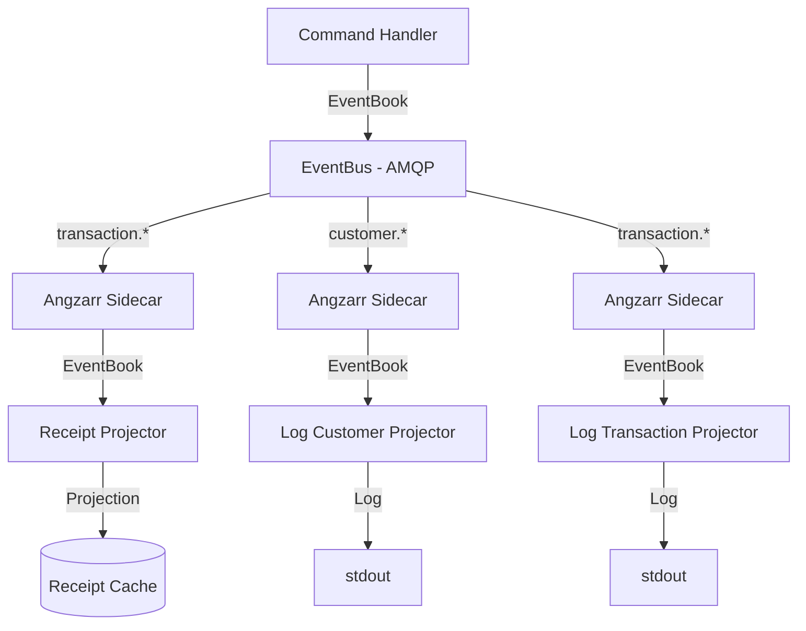
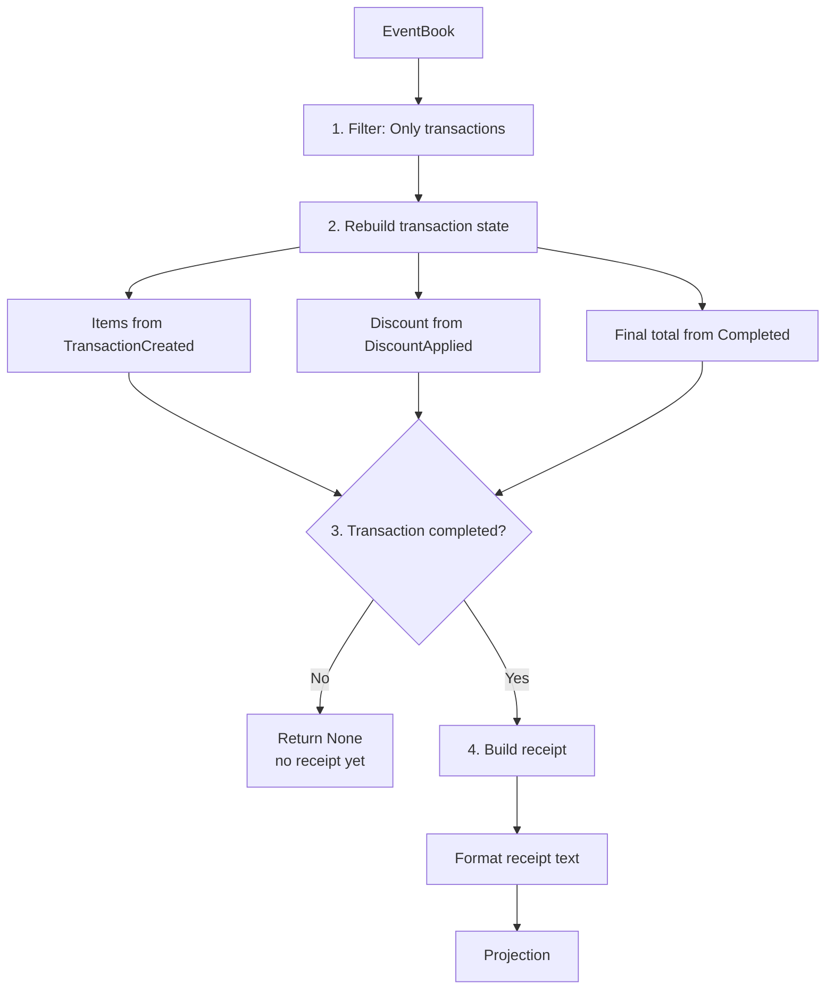
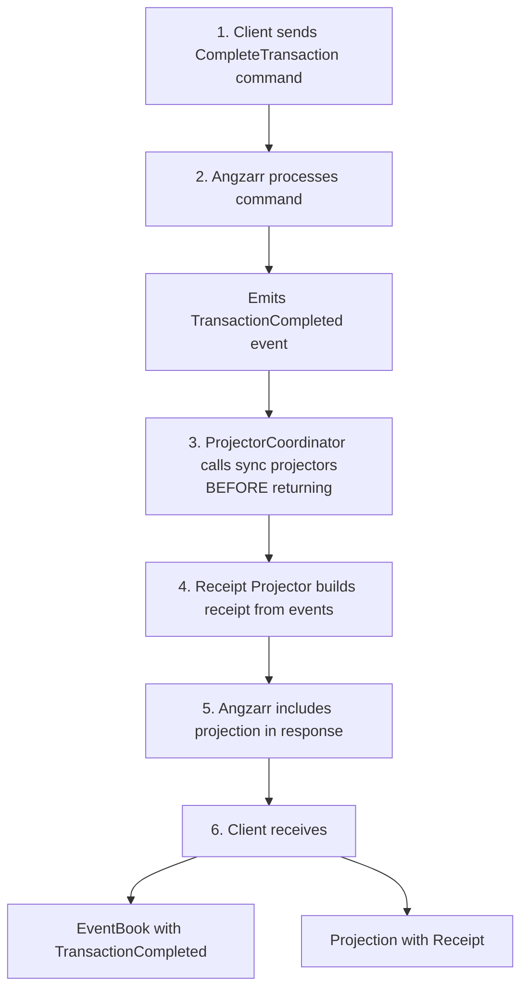
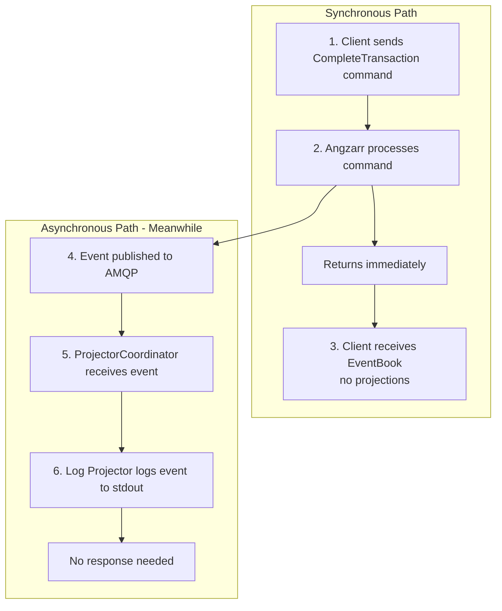

# Projectors

> For CQRS/ES background, see [CQRS and Event Sourcing Concepts](../../cqrs-event-sourcing.md).

A **projector** subscribes to domain events and performs **side effects**—typically building read models, writing to databases, or streaming data to clients. Projectors transform the append-only event log into whatever form is needed: denormalized views for queries, cache entries, search indexes, or real-time streams.

## Concepts

| Term | Definition |
|------|------------|
| **Projector** | A service that receives events and builds read models. |
| **Projection** | A denormalized read model built from events. Optimized for specific queries. |
| **Synchronous Projector** | Blocks command processing until projection is built. Result returned to caller. |
| **Asynchronous Projector** | Runs independently. Does not block command processing. |
| **Topic** | Event filter pattern. Projectors subscribe to specific domains or event types. |

---

## Component Responsibilities

### What Angzarr Provides

| Component | Responsibility |
|-----------|----------------|
| **ProjectorCoordinator** | Routes events to registered projectors based on topic subscriptions |
| **EventBus** | Delivers events from aggregates to projector coordinator via AMQP |
| **Projection delivery** | For sync projectors, returns projection in command response |

### What You Provide

| Component | Responsibility |
|-----------|----------------|
| **Projector service** | gRPC server implementing the `Projector` interface |
| **Event handling** | Logic to update read model based on event type |
| **Projection output** | For sync projectors, the read model to return |
| **Storage** | Where to persist the read model (Redis, Postgres, Elasticsearch, etc.) |

---

## Architecture



---

## gRPC Interface

Projectors implement the `Projector` service:

**[proto/angzarr/](../proto/angzarr/)** (framework service definitions)

```protobuf
// You implement this service
service Projector {
  // Asynchronous: fire-and-forget, no response expected
  rpc Handle (EventBook) returns (google.protobuf.Empty);

  // Synchronous: blocks until projection is ready, returns result
  rpc HandleSync (EventBook) returns (Projection);
}

message Projection {
  Cover cover = 1;                    // Domain + aggregate root ID
  string projector = 2;               // Name of projector that built this
  int64 sequence = 3;                 // Event sequence this projection reflects
  google.protobuf.Any projection = 4; // The actual projection (Receipt, etc.)
}
```

### Sync vs Async

| Mode | Use Case | Behavior |
|------|----------|----------|
| **Synchronous** | Projection needed in command response | Command waits for projection. Result included in response. |
| **Asynchronous** | Eventual consistency acceptable | Fire-and-forget. Command completes immediately. |

---

## Projector Pattern

Every projector follows this pattern:

1. **Receive** EventBook with domain events
2. **Filter** events relevant to this projector
3. **Apply** events to build/update read model
4. **Return** projection (sync) or nothing (async)

**Input: EventBook**
```json
{
  "cover": { "domain": "transaction", "root": "txn-123" },
  "pages": [
    { "TransactionCreated": { "items": [...] } },
    { "DiscountApplied": { "percent": 10 } },
    { "TransactionCompleted": { "final_total": 9500, "loyalty_points": 95 } }
  ]
}
```



**Output: Projection**
```json
{
  "projector": "receipt",
  "projection": {
    "Receipt": { "formatted_text": "=== RECEIPT ===\n..." }
  }
}
```

---

## Example Implementations

### Receipt Projector (Synchronous)

Builds formatted receipts when transactions complete. Blocks command processing until receipt is ready.

**Behavior:**
- Subscribes to `transaction` domain
- Rebuilds transaction state from events
- Only produces projection when `TransactionCompleted` event present
- Returns formatted text receipt

**Implementations:**

| Language | File |
|----------|------|
| Rust | [examples/rust/projectors/accounting/src/lib.rs](../../../examples/rust/projectors/accounting/src/lib.rs) |

### Log Projector (Asynchronous)

Logs events to stdout for observability. Fire-and-forget, never blocks.

**Behavior:**
- Subscribes to specific domain (`customer` or `transaction`)
- Logs each event with timestamp and type
- Handles unknown event types gracefully
- Never fails (best-effort logging)

**Implementations:**

| Language | File |
|----------|------|
| Rust | [examples/rust/projectors/logging/src/lib.rs](../../../examples/rust/projectors/logging/src/lib.rs) |

---

## Domain Types

Projections are defined in protobuf:

**[proto/examples/](../proto/examples/)** (per-domain proto files)

```protobuf
// Receipt projection - built by receipt projector
message Receipt {
  string transaction_id = 1;
  string formatted_text = 2;    // Human-readable receipt
  int32 subtotal_cents = 3;
  int32 discount_cents = 4;
  int32 final_total_cents = 5;
  int32 loyalty_points_earned = 6;
  string generated_at = 7;      // RFC 3339 timestamp
}
```

---

## Topic Subscriptions

Projectors declare which domains/events they care about:

```rust
impl Projector for ReceiptProjector {
    fn domains(&self) -> Vec<String> {
        vec!["transaction".to_string()]
    }
}
```

AMQP routing keys follow the pattern `{domain}.{event_type}`:

| Pattern | Matches |
|---------|---------|
| `transaction.*` | All transaction events |
| `customer.*` | All customer events |
| `*.TransactionCompleted` | TransactionCompleted from any domain |
| `#` | All events |

---

## BDD Specifications

Projector behavior is specified in Gherkin:

| Feature | File |
|---------|------|
| Receipt generation | *Feature file not yet created* |
| Event logging | *Feature file not yet created* |

Example scenario:

```gherkin
Scenario: Generate receipt when transaction completes
  Given a transaction "txn-123" with items totaling $100.00
  And a 10% discount was applied
  When the transaction is completed
  Then a receipt projection is generated
  And the receipt shows:
    | Subtotal | $100.00 |
    | Discount | -$10.00 |
    | Total    | $90.00  |
    | Points   | 90      |
```

---

## Synchronous Projection Flow

When a sync projector is registered, projections are included in the command response:



---

## Asynchronous Projection Flow

Async projectors run independently:



---

## State Management

Unlike command handlers, projectors can maintain their own state:

| Approach | Description | Use Case |
|----------|-------------|----------|
| **Stateless** | Rebuild from EventBook each time | Simple projections, one aggregate |
| **Local state** | Cache in-memory | Performance optimization |
| **External store** | Persist to Redis, Postgres, etc. | Cross-aggregate queries, durability |

The example projectors are stateless—they rebuild from the EventBook on each call.

---

## Error Handling

| Projector Type | Error Behavior |
|----------------|----------------|
| Synchronous | Errors propagate to command caller. Command may fail. |
| Asynchronous | Errors logged. Event may be redelivered (depends on AMQP config). |

Best practices:
- Log projectors should never fail (catch all exceptions)
- Sync projectors should validate carefully and return clear errors
- Consider idempotency—projectors may receive the same event multiple times

---

## Testing

### Unit Tests

```bash
# Rust
cargo test -p projector-accounting --lib
cargo test -p projector-logging --lib
```

---

## Infrastructure Projectors

In addition to client logic projectors, Angzarr includes infrastructure projectors that are part of the core framework:

### Stream Projector (angzarr-stream)

The stream projector enables real-time event streaming to clients via the gateway. Unlike client logic projectors that build read models, the stream projector's "projection" is an in-memory registry of active subscriptions.

**Architecture:**
```
[angzarr-projector sidecar] --(Projector gRPC)--> [angzarr-stream]
                                                        |
                                                        v
                                              (correlation ID match)
                                                        |
                                                        v
                                              [EventStream gRPC] --> [angzarr-gateway]
```

**Behavior:**
- Implements the `Projector` gRPC interface to receive events from the projector sidecar
- Exposes `EventStream` gRPC interface for gateway subscriptions
- Maintains correlation ID → subscriber registry
- Forwards events only to subscribers who registered interest in that correlation ID
- Drops events with no matching subscribers (no storage/buffering)

**Configuration:**
| Variable | Description | Default |
|----------|-------------|---------|
| `PORT` | Port for gRPC services | 50051 |

The stream projector is a **standalone infrastructure service**, not a sidecar. It deploys with an `angzarr-projector` sidecar that subscribes to AMQP and forwards events to it via the Projector gRPC interface—the same pattern as client logic projectors, but the "client logic" here is event filtering and streaming.

---

## Next Steps

- [Sagas](../saga/sagas.md) — Orchestrate workflows across aggregates
- [Command Handlers](../aggregate/aggregate.md) — Processing commands and emitting events
