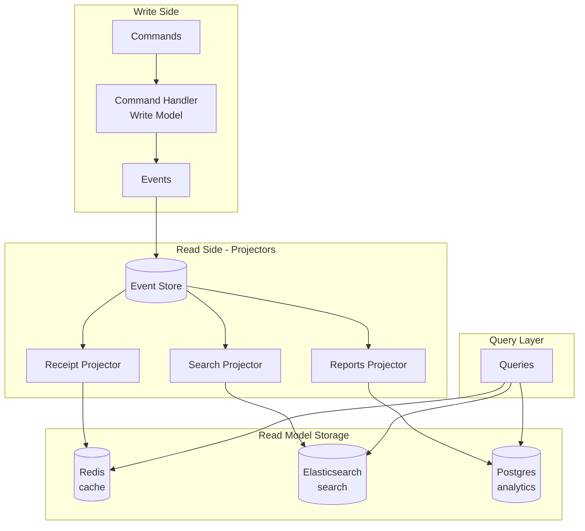
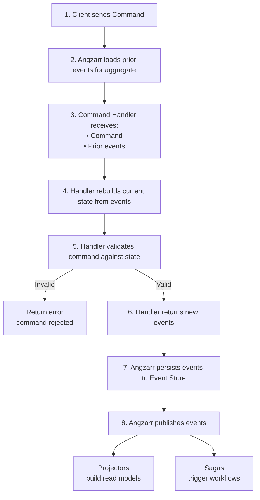

# CQRS and Event Sourcing Concepts

This guide introduces the patterns underlying Angzarr. If you're already familiar with CQRS/ES, skip to the [implementation guides](#next-steps).

## Learning Resources

### Talks

- [CQRS and Event Sourcing](https://www.youtube.com/watch?v=JHGkaShoyNs) — Greg Young's foundational talk (2014)
- [Event Sourcing You are doing it wrong](https://www.youtube.com/watch?v=GzrZworHpIk) — David Schmitz on common pitfalls (2018)
- [A Decade of DDD, CQRS, Event Sourcing](https://www.youtube.com/watch?v=LDW0QWie21s) — Greg Young retrospective (2016)

### Articles

- [Event Sourcing pattern](https://learn.microsoft.com/en-us/azure/architecture/patterns/event-sourcing) — Microsoft Azure Architecture patterns
- [CQRS pattern](https://learn.microsoft.com/en-us/azure/architecture/patterns/cqrs) — Microsoft Azure Architecture patterns
- [Event Sourcing](https://martinfowler.com/eaaDev/EventSourcing.html) — Martin Fowler's overview
- [CQRS](https://martinfowler.com/bliki/CQRS.html) — Martin Fowler's overview

### Books

- [Domain-Driven Design](https://www.amazon.com/Domain-Driven-Design-Tackling-Complexity-Software/dp/0321125215) — Eric Evans (2003)
- [Implementing Domain-Driven Design](https://www.amazon.com/Implementing-Domain-Driven-Design-Vaughn-Vernon/dp/0321834577) — Vaughn Vernon (2013)
- [Versioning in an Event Sourced System](https://leanpub.com/esversioning) — Greg Young (free)

---

## Glossary

### Core Concepts

| Term | Definition |
|------|------------|
| **Aggregate** | A cluster of domain objects treated as a single unit for data changes. Has a root entity that controls access. |
| **Aggregate Root** | The entry point entity of an aggregate. All external references go through the root. Identified by a unique ID (typically UUID). |
| **Command** | A request to change state. Imperative mood: `CreateCustomer`, `AddLoyaltyPoints`. May be rejected. |
| **Event** | An immutable fact that something happened. Past tense: `CustomerCreated`, `LoyaltyPointsAdded`. Cannot be rejected—it already happened. |
| **Event Store** | Append-only database of events. The source of truth. Events are never modified or deleted. |
| **Event Sourcing** | Storing state as a sequence of events rather than current values. Current state is derived by replaying events. |
| **CQRS** | Command Query Responsibility Segregation. Separate models for reading and writing data. |

### Angzarr Components

| Term | Definition |
|------|------------|
| **Aggregate** | Service that processes commands for a domain. Validates against current state, emits events. Also called Command Handler in CQRS terminology. |
| **Projector** | Service that subscribes to events and builds read models (projections). Can be synchronous or asynchronous. |
| **Saga** | Service that subscribes to events and emits commands to other aggregates. Orchestrates multi-step workflows. |
| **Projection** | A read model built by a projector. Optimized for queries, denormalized. |
| **Snapshot** | Cached aggregate state at a point in time. Optimization to avoid replaying all events. |

### BDD Terms

| Term | Definition |
|------|------------|
| **Feature** | A capability of the system described in Gherkin. Groups related scenarios. |
| **Scenario** | A specific example of behavior. Given/When/Then structure. |
| **Given** | Preconditions—the state before the action. |
| **When** | The action being tested—typically a command. |
| **Then** | Expected outcomes—events emitted, state changes, errors. |
| **Step Definition** | Code that executes a Gherkin step. Maps natural language to implementation. |

### Event Book Terminology

Angzarr uses book/page metaphors for event containers:

| Term | Definition |
|------|------------|
| **EventBook** | Container for events related to an aggregate. Has a cover (metadata) and pages (events). |
| **Cover** | Metadata: domain name + aggregate root ID. |
| **Page** | Single event with sequence number, timestamp, type URL, and payload. |
| **CommandBook** | Container for commands. Similar structure to EventBook. |

---

## Terminology Comparison

Different communities use different terms for the same concepts. This table maps terminology across Domain-Driven Design (DDD), CQRS/Event Sourcing, and Angzarr:

| Concept | DDD | CQRS/ES | Angzarr | Description |
|---------|-----|---------|---------|-------------|
| State Container | **Aggregate** | Aggregate | Aggregate | Domain object cluster with consistency boundary; also called Command Handler |
| State Identifier | **Aggregate Root** | Entity | Cover.root (UUID) | Unique identity for aggregate instance |
| Domain Boundary | **Bounded Context** | Domain | Cover.domain | Logical separation where terms have specific meaning |
| Write Operation | **Command** | Command | CommandBook/CommandPage | Intent to change state; imperative mood |
| State Change | **Domain Event** | Event | EventBook/EventPage | Immutable fact that happened; past tense |
| Command Processing | **Aggregate Method** | Command Handler | Aggregate (BusinessLogic) | Validates commands, produces events |
| Read Model | — | Projection | Projector output | Denormalized query-optimized view |
| Process Manager | — | Saga | Saga | Long-running workflow coordinator |
| Event Distribution | — | Event Bus | AMQP Bus | Event distribution mechanism |
| Event Persistence | **Repository** | Event Store | EventStore trait | Append-only event storage |
| Current State | **Entity State** | Aggregate State | Snapshot | Materialized state at point in time |
| State Version | — | Sequence | EventPage.sequence | Ordering of events within aggregate |
| Saga Side Effect | — | Saga Command | SagaOrigin | Command issued by saga to other aggregates |
| Application Layer | **Application Service** | Coordinator | BusinessCoordinator | Orchestrates use cases, handles infrastructure |
| Immutable Data | **Value Object** | — | Protobuf message | Identity-less, immutable data |

### Key Insight

Angzarr prefers single-word terms to keep technical vocabulary terse. We use **Aggregate** rather than "Command Handler" for the service that processes commands and emits events.

- **Angzarr term**: Aggregate (implemented as `BusinessLogic` gRPC service)
- **Also known as**: Command Handler (CQRS), Aggregate Root methods (DDD)

### Canonical References

**Domain-Driven Design:**
- [Domain-Driven Design Reference](https://www.domainlanguage.com/ddd/reference/) — Eric Evans' free summary (PDF)
- [Domain-Driven Design](https://www.amazon.com/Domain-Driven-Design-Tackling-Complexity-Software/dp/0321125215) — Eric Evans (2003), the original "Blue Book"
- [Implementing Domain-Driven Design](https://www.amazon.com/Implementing-Domain-Driven-Design-Vaughn-Vernon/dp/0321834577) — Vaughn Vernon (2013), the practical "Red Book"

**CQRS/Event Sourcing:**
- [CQRS Documents](https://cqrs.files.wordpress.com/2010/11/cqrs_documents.pdf) — Greg Young's foundational paper (PDF)
- [Event Sourcing](https://martinfowler.com/eaaDev/EventSourcing.html) — Martin Fowler's pattern description
- [Versioning in an Event Sourced System](https://leanpub.com/esversioning) — Greg Young (free ebook)

---

## Event Sourcing Explained

### Traditional State Storage

```
┌─────────────────────────────────────┐
│ customers table                     │
├─────────────────────────────────────┤
│ id: "cust-123"                      │
│ name: "Alice"                       │
│ email: "alice@example.com"          │
│ loyalty_points: 150                 │
│ updated_at: 2024-01-15 10:30:00     │
└─────────────────────────────────────┘

Problem: We only know current state.
- When did Alice join?
- How did she earn 150 points?
- What was her email before she changed it?
```

### Event Sourced Storage

```
┌─────────────────────────────────────────────────────────────┐
│ events table                                                │
├──────┬───────────────────────────┬──────────────────────────┤
│ seq  │ type                      │ data                     │
├──────┼───────────────────────────┼──────────────────────────┤
│ 0    │ CustomerCreated           │ {name: "Alice", ...}     │
│ 1    │ LoyaltyPointsAdded        │ {points: 100, reason...} │
│ 2    │ EmailChanged              │ {new_email: "..."}       │
│ 3    │ LoyaltyPointsAdded        │ {points: 75, reason...}  │
│ 4    │ LoyaltyPointsRedeemed     │ {points: 25, reason...}  │
└──────┴───────────────────────────┴──────────────────────────┘

Current state: replay events 0-4 → loyalty_points = 100 + 75 - 25 = 150

Benefits:
- Complete audit trail
- Time travel (state at any point)
- Debug by replaying
- Never lose information
```

### State Reconstruction

```
rebuild_state(events):
    state = empty_state()
    for event in events:
        state = apply(state, event)
    return state
```

With snapshots (optimization):

```
rebuild_state(events, snapshot):
    if snapshot:
        state = snapshot.state
        events = events[snapshot.sequence + 1:]
    else:
        state = empty_state()

    for event in events:
        state = apply(state, event)
    return state
```

### Idempotent State Reconstruction

**Critical**: Events must contain absolute state values (facts), not deltas (changes).

This ensures state reconstruction is idempotent—applying the same event twice produces the same result. This matters for:
- Replay from snapshots (no double-counting)
- Projection rebuilds
- Recovery scenarios

**Wrong (deltas):**

```
StockReserved { quantity: 20 }  // Delta: "reserve 20 more"
// Applying twice: reserved += 20 → 40 (incorrect)
```

```rust
// BAD: Using deltas
fn apply(state: &mut State, event: StockReserved) {
    state.reserved += event.quantity;  // Double-apply = wrong state
}
```

**Correct (facts):**

```
StockReserved { quantity: 20, new_reserved: 40, new_on_hand: 100 }
// Applying twice: reserved = 40 → 40 (correct)
```

```rust
// GOOD: Using facts (absolute values)
fn apply(state: &mut State, event: StockReserved) {
    state.reserved = event.new_reserved;  // Idempotent
    state.on_hand = event.new_on_hand;
}
```

**Event Design Rules:**

1. Every event that modifies state includes `new_<field>` with the absolute value after the event
2. `rebuild_state` uses assignment (`=`), never increment/decrement (`+=`/`-=`)
3. Maps/collections: use set/remove operations (idempotent), not add (not idempotent)

---

## CQRS Explained

CQRS separates the write model (commands/events) from read models (projections):



**Why separate?**

- Write model optimized for consistency (validate, sequence events)
- Read models optimized for specific query patterns
- Scale reads independently from writes
- Each projection can use the best storage for its purpose

---

## Command Flow in Angzarr



---

## Example: Customer Loyalty

### Commands (Requests)

```
CreateCustomer { name: "Alice", email: "alice@example.com" }
AddLoyaltyPoints { points: 100, reason: "signup_bonus" }
RedeemLoyaltyPoints { points: 25, reason: "discount_applied" }
```

### Events (Facts)

```
CustomerCreated { name: "Alice", email: "...", created_at: "..." }
LoyaltyPointsAdded { points: 100, new_balance: 100, reason: "..." }
LoyaltyPointsRedeemed { points: 25, new_balance: 75, reason: "..." }
```

### State (Derived)

```
CustomerState {
    name: "Alice",
    email: "alice@example.com",
    loyalty_points: 75,      // Current balance
    lifetime_points: 100,    // Never decreases
}
```

### Validation Rules

| Command | Precondition | Validation |
|---------|--------------|------------|
| CreateCustomer | Customer must not exist | Name and email required |
| AddLoyaltyPoints | Customer must exist | Points > 0 |
| RedeemLoyaltyPoints | Customer must exist | Points > 0, balance >= points |

---

## Next Steps

- [Command Handlers](command-handlers.md) — Implementing aggregates
- [Projectors](projectors.md) — Building read models
- [Sagas](sagas.md) — Cross-aggregate workflows
