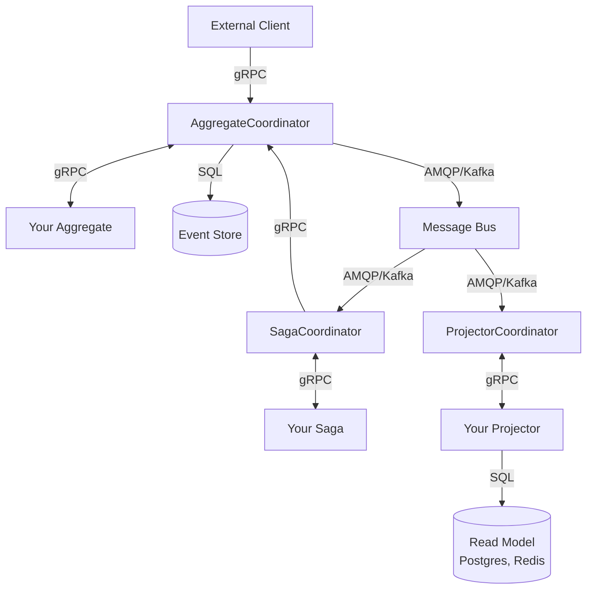
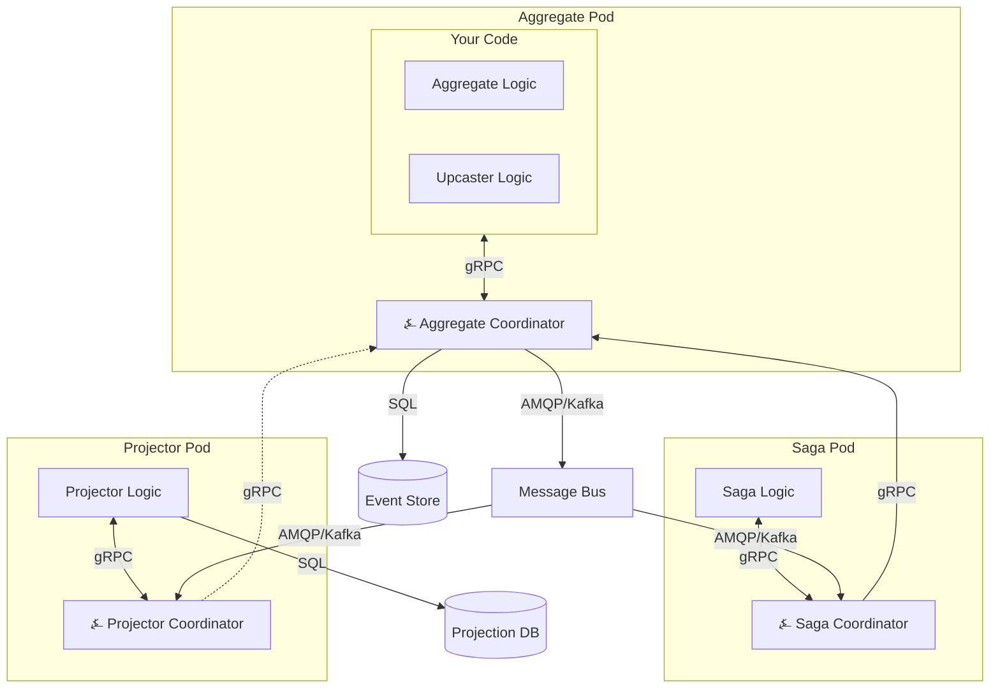
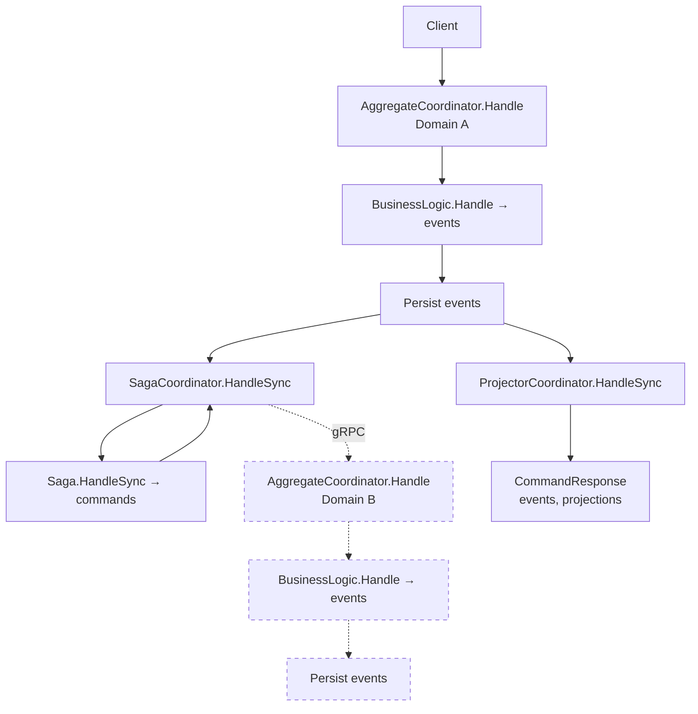

# Architecture

This document covers ⍼ Angzarr's core architectural concepts: event sourcing data model, coordinator pattern, deployment model, and synchronization modes.

---

## Event Sourcing Data Model

⍼ Angzarr stores aggregate history as an **EventBook**—the complete event stream for a single aggregate root:

| Component | Purpose |
|-----------|---------|
| **Cover** | Identity: domain, aggregate root ID, correlation ID |
| **Snapshot** | Point-in-time state for replay optimization |
| **EventPages** | Ordered sequence of domain events |

```protobuf file=../../proto/angzarr/types.proto start=docs:start:cover end=docs:end:cover
```

```protobuf file=../../proto/angzarr/types.proto start=docs:start:event_page end=docs:end:event_page
```

```protobuf file=../../proto/angzarr/types.proto start=docs:start:snapshot end=docs:end:snapshot
```

```protobuf file=../../proto/angzarr/types.proto start=docs:start:event_book end=docs:end:event_book
```

Commands follow the same pattern—a **CommandBook** contains one or more **CommandPages** targeting a single aggregate.

---

## Coordinator Pattern

⍼ Angzarr uses coordinators to route messages between external clients and your business logic. This separation keeps domain code focused while the framework handles:

- Event persistence and retrieval
- Optimistic concurrency via sequence numbers
- Snapshot management
- Event upcasting (schema evolution on read)
- Synchronous vs. asynchronous processing

### Component Types

| Coordinator | Routes | Purpose |
|-------------|--------|---------|
| **AggregateCoordinator** | Commands → Aggregates | Command handling, event persistence |
| **ProjectorCoordinator** | Events → Projectors | Read model updates, side effects |
| **SagaCoordinator** | Events → Sagas | Cross-domain command orchestration |
| **ProcessManagerCoordinator** | Events → PMs | Stateful multi-domain workflows |



---

## Sidecar Deployment

⍼ Angzarr runs as a sidecar container alongside your business logic. Each pod contains your code and the appropriate coordinator, communicating over localhost gRPC.



### Benefits

- **Minimal attack surface**: ~8MB distroless container, no shell, no package manager
- **No network exposure**: Sidecar communicates over localhost only
- **Horizontal scaling**: Follows your service scaling—no separate capacity planning
- **Local gRPC**: Eliminates network latency between logic and framework

---

## Synchronization Modes

⍼ Angzarr provides mechanisms for controlling [sync vs async communication](https://eda-visuals.boyney.io/visuals/sync-vs-async) — when results return to callers.

### SyncMode

```protobuf file=../../proto/angzarr/types.proto start=docs:start:sync_mode end=docs:end:sync_mode
```

| Mode | Projectors | Sagas | Use Case |
|------|------------|-------|----------|
| `NONE` | Async | Async | Fire-and-forget, eventual consistency |
| `SIMPLE` | Sync | Async | Read-after-write for single aggregate |
| `CASCADE` | Sync | Sync (recursive) | Synchronous cross-aggregate workflows |

### The Cascade Flow

When `sync_mode = CASCADE`, the framework orchestrates the complete cascade:



*The dashed Domain B represents the target aggregate—sagas bridge events from one domain to commands in another. The cascade recursively waits for the target aggregate's events before returning.*

**Warning**: `CASCADE` is expensive and does not provide ACID guarantees. Each step adds latency. Start with `NONE`, move to `SIMPLE` for read-after-write, reserve `CASCADE` for workflows requiring synchronous cross-aggregate coordination.

### Event Streaming

For observing events as they happen rather than waiting:

```protobuf file=../../proto/angzarr/stream.proto start=docs:start:event_stream_service end=docs:end:event_stream_service
```

Events are correlated via `correlation_id` on `Cover`, allowing clients to track causally-related events across aggregate boundaries.

---

## Pluggable Infrastructure

⍼ Angzarr abstracts storage and messaging behind adapter interfaces.

### Event Store Backends

| Backend | Status | Use Case |
|---------|--------|----------|
| SQLite | Tested | Local development, standalone mode |
| PostgreSQL | Tested | Production |
| Redis | Tested | High-throughput scenarios |
| Bigtable | Tested | GCP deployments, petabyte scale |
| DynamoDB | Tested | AWS deployments, serverless |
| immudb | Implemented | Immutable audit requirements |

### Message Bus Backends

⍼ Angzarr uses [publish/subscribe messaging](https://eda-visuals.boyney.io/visuals/publish-subscribe) to distribute events to sagas and projectors.

| Backend | Status | Use Case |
|---------|--------|----------|
| Channel (in-process) | Tested | Standalone mode |
| RabbitMQ/AMQP | Tested | Production |
| Kafka | Implemented | High-throughput streaming |
| GCP Pub/Sub | Implemented | GCP deployments |
| AWS SNS/SQS | Implemented | AWS deployments |

Configuration is declarative:

```yaml
# Production
storage:
  type: postgres
  connection_string: ${DATABASE_URL}

bus:
  type: amqp
  url: ${RABBITMQ_URL}

# Local development
storage:
  type: sqlite
  path: ./data/events.db

bus:
  type: channel
```

---

## Observability

Every command, saga, and projector execution is traced and metered at the coordinator level—your code requires zero observability boilerplate.

| Pipeline | Traced Spans | Metrics |
|----------|-------------|---------|
| Aggregate | `aggregate.handle`, `aggregate.execute` | `angzarr.command.duration` |
| Saga | `saga.orchestrate`, `orchestration.execute` | `angzarr.saga.duration` |
| Process Manager | `pm.orchestrate` | `angzarr.pm.duration` |
| Projector | `projector.handle` | `angzarr.projector.duration` |

Every span carries the `correlation_id`, so distributed traces follow commands through aggregate execution, saga fan-out, and downstream projections without manual context propagation.

When built with `--features otel`, the sidecar exports traces, metrics, and logs via OTLP to any compatible backend (Grafana, Datadog, AWS X-Ray, GCP Cloud Trace).

See [Observability](./operations/observability) for full details.

---

## Further Reading

For visual explanations of event-driven architecture concepts (events, messaging patterns, event sourcing, choreography vs orchestration, schema management):

- **[EDA Visuals](https://eda-visuals.boyney.io/)** by [@boyney123](https://twitter.com/boyney123) — Bite-sized diagrams explaining EDA concepts ([PDF download](https://eda-visuals.boyney.io/visuals/eda-visuals.pdf))

---

## Next Steps

- **[Components](./components/aggregate)** — Aggregate, saga, projector, process manager deep dives
- **[Getting Started](./getting-started)** — Set up your first aggregate
- **[Patterns](./reference/patterns)** — Advanced usage patterns
