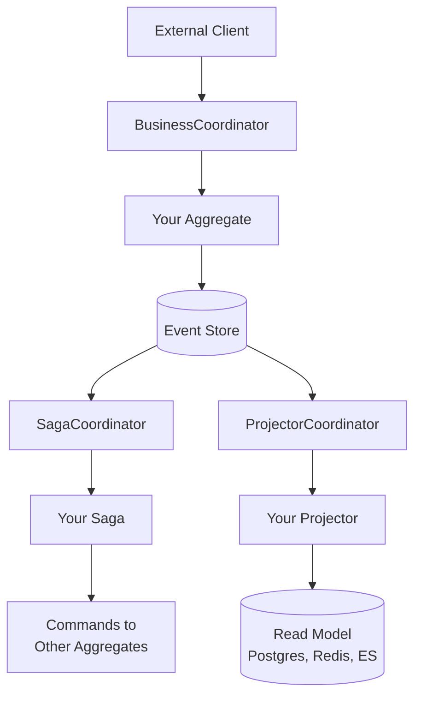
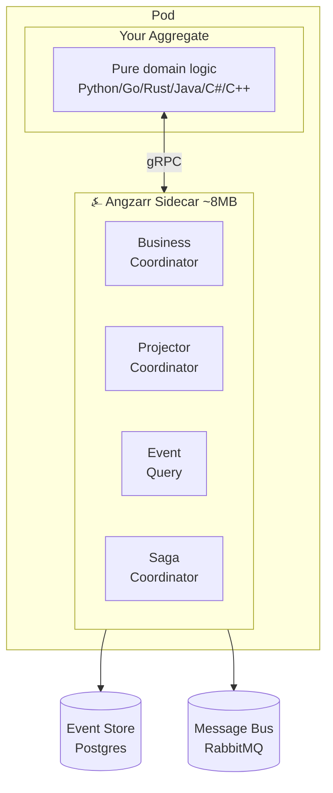
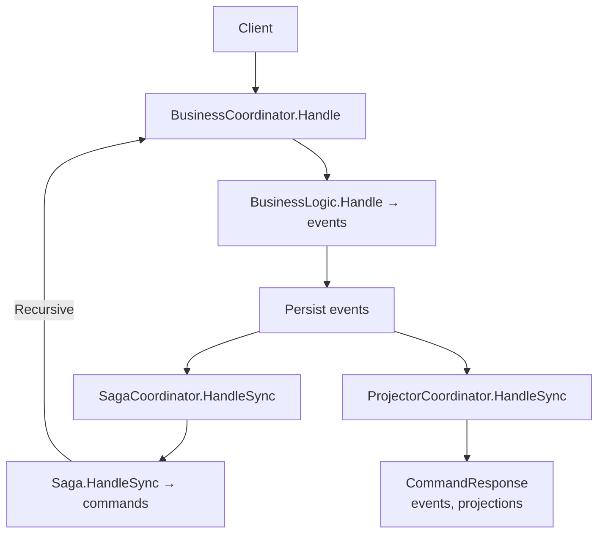

# Architecture

This document covers ⍼ Angzarr's core architectural concepts: event sourcing data model, coordinator pattern, deployment model, and synchronization modes.

---

## Event Sourcing Data Model

⍼ Angzarr stores aggregate history as an **EventBook**—the complete event stream for a single aggregate root:

| Component | Purpose |
|-----------|---------|
| **Cover** | Identity: domain, aggregate root ID, correlation ID |
| **Snapshot** | Point-in-time state for replay optimization |
| **EventPages** | Ordered sequence of domain events |

```protobuf
message Cover {
  string domain = 2;
  UUID root = 1;
  string correlation_id = 3;  // Workflow correlation
}

message EventPage {
  uint32 sequence = 1;
  google.protobuf.Timestamp created_at = 3;
  google.protobuf.Any event = 4;
}

message Snapshot {
  uint32 sequence = 2;
  google.protobuf.Any state = 3;
}

message EventBook {
  Cover cover = 1;
  Snapshot snapshot = 2;
  repeated EventPage pages = 3;
}
```

Commands follow the same pattern—a **CommandBook** contains one or more **CommandPages** targeting a single aggregate.

---

## Coordinator Pattern

⍼ Angzarr uses coordinators to route messages between external clients and your business logic. This separation keeps domain code focused while the framework handles:

- Event persistence and retrieval
- Optimistic concurrency via sequence numbers
- Snapshot management
- Event upcasting (schema evolution on read)
- Synchronous vs. asynchronous processing

### Component Types

| Coordinator | Routes | Purpose |
|-------------|--------|---------|
| **BusinessCoordinator** | Commands → Aggregates | Command handling, event persistence |
| **ProjectorCoordinator** | Events → Projectors | Read model updates, side effects |
| **SagaCoordinator** | Events → Sagas | Cross-domain command orchestration |
| **ProcessManagerCoordinator** | Events → PMs | Stateful multi-domain workflows |



---

## Sidecar Deployment

⍼ Angzarr runs as a sidecar container alongside your business logic. Each pod contains your service and an Angzarr instance communicating over localhost gRPC.



### Benefits

- **Minimal attack surface**: ~8MB distroless container, no shell, no package manager
- **No network exposure**: Sidecar communicates over localhost only
- **Horizontal scaling**: Follows your service scaling—no separate capacity planning
- **Local gRPC**: Eliminates network latency between logic and framework

---

## Synchronization Modes

⍼ Angzarr provides two mechanisms for controlling when results return to callers.

### SyncMode

```protobuf
enum SyncMode {
  SYNC_MODE_NONE = 0;     // Async: fire and forget
  SYNC_MODE_SIMPLE = 1;   // Sync projectors only
  SYNC_MODE_CASCADE = 2;  // Full sync: projectors + saga cascade
}
```

| Mode | Projectors | Sagas | Use Case |
|------|------------|-------|----------|
| `NONE` | Async | Async | Fire-and-forget, eventual consistency |
| `SIMPLE` | Sync | Async | Read-after-write for single aggregate |
| `CASCADE` | Sync | Sync (recursive) | Synchronous cross-aggregate workflows |

### The Cascade Flow

When `sync_mode = CASCADE`, the framework orchestrates the complete cascade:



**Warning**: `CASCADE` is expensive and does not provide ACID guarantees. Each step adds latency. Start with `NONE`, move to `SIMPLE` for read-after-write, reserve `CASCADE` for workflows requiring synchronous cross-aggregate coordination.

### Gateway Streaming

For observing events as they happen rather than waiting:

```protobuf
service CommandGateway {
  rpc ExecuteStream(CommandBook) returns (stream EventBook);
  rpc ExecuteStreamResponseCount(ExecuteStreamCountRequest) returns (stream EventBook);
  rpc ExecuteStreamResponseTime(ExecuteStreamTimeRequest) returns (stream EventBook);
}
```

Events are correlated via `correlation_id` on `Cover`, allowing clients to track causally-related events across aggregate boundaries.

---

## Pluggable Infrastructure

⍼ Angzarr abstracts storage and messaging behind adapter interfaces.

### Event Store Backends

| Backend | Status | Use Case |
|---------|--------|----------|
| SQLite | Tested | Local development, standalone mode |
| PostgreSQL | Tested | Production |
| Redis | Tested | High-throughput scenarios |
| EventStoreDB | Implemented | Event-native storage |
| immudb | Implemented | Immutable audit requirements |

### Message Bus Backends

| Backend | Status | Use Case |
|---------|--------|----------|
| Channel (in-process) | Tested | Standalone mode |
| RabbitMQ/AMQP | Tested | Production |
| Kafka | Implemented | High-throughput streaming |
| GCP Pub/Sub | Implemented | GCP deployments |
| AWS SNS/SQS | Implemented | AWS deployments |

Configuration is declarative:

```yaml
# Production
storage:
  type: postgres
  connection_string: ${DATABASE_URL}

bus:
  type: amqp
  url: ${RABBITMQ_URL}

# Local development
storage:
  type: sqlite
  path: ./data/events.db

bus:
  type: channel
```

---

## Observability

Every command, saga, and projector execution is traced and metered at the coordinator level—your code requires zero observability boilerplate.

| Pipeline | Traced Spans | Metrics |
|----------|-------------|---------|
| Aggregate | `aggregate.handle`, `aggregate.execute` | `angzarr.command.duration` |
| Saga | `saga.orchestrate`, `orchestration.execute` | `angzarr.saga.duration` |
| Process Manager | `pm.orchestrate` | `angzarr.pm.duration` |
| Projector | `projector.handle` | `angzarr.projector.duration` |

Every span carries the `correlation_id`, so distributed traces follow commands through aggregate execution, saga fan-out, and downstream projections without manual context propagation.

When built with `--features otel`, the sidecar exports traces, metrics, and logs via OTLP to any compatible backend (Grafana, Datadog, AWS X-Ray, GCP Cloud Trace).

See [Observability](./operations/observability) for full details.

---

## Next Steps

- **[Components](./components/aggregate)** — Aggregate, saga, projector, process manager deep dives
- **[Getting Started](./getting-started)** — Set up your first aggregate
- **[Patterns](./reference/patterns)** — Advanced usage patterns
