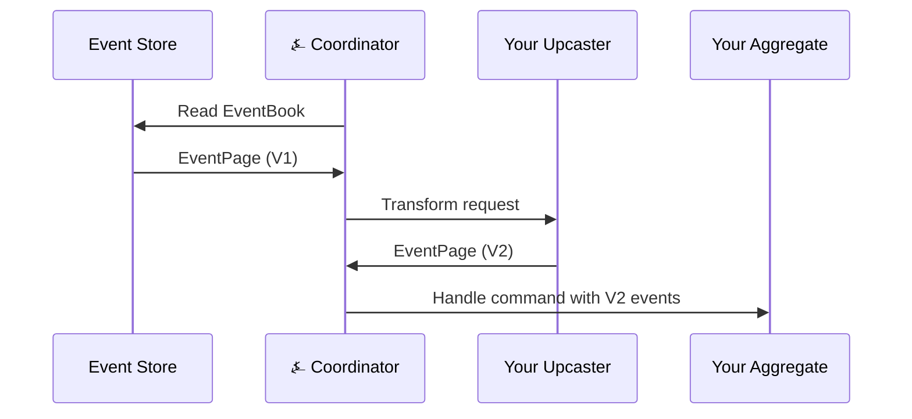

import Tabs from '@theme/Tabs';
import TabItem from '@theme/TabItem';

# Components Overview

⍼ Angzarr provides five component types for building event-sourced systems. Each serves a distinct role in the CQRS/ES architecture.

---

## Component Comparison

| Component | Input | Output | State | Use Case |
|-----------|-------|--------|-------|----------|
| **[Aggregate](/components/aggregate)** | Commands | Events | Via events | Domain logic, consistency boundary |
| **[Saga](/components/saga)** | Events (single domain) | Commands | Stateless | Cross-domain translation |
| **[Projector](/components/projector)** | Events (single domain preferred) | Side effects | Local only | Read models, external systems |
| **[Process Manager](/components/process-manager)** | Events (multi-domain) | Commands | Own event stream | Stateful multi-domain workflows |
| **[Upcaster](#upcaster)** | Old events | New events | None | Schema evolution |

---

## When to Use What

### Aggregate
Use when you need to:
- Validate commands against current state
- Enforce business invariants
- Maintain a consistency boundary

**Every domain has exactly one aggregate.**

### Saga
Use when you need to:
- Translate events from domain A into commands for domain B
- React to events without maintaining state
- Keep cross-domain coordination simple

**Sagas subscribe to ONE domain only.** For multi-domain subscription, use a Process Manager.

### Projector
Use when you need to:
- Build read models (query-optimized views)
- Write to external systems (search, cache, analytics)

**Projectors never emit commands.** They only observe. Prefer single-domain projectors; multi-domain is possible but often signals incorrect domain boundaries.

### Process Manager
Use when you need to:
- Coordinate workflows spanning multiple domains
- Maintain workflow state across events
- Implement state machines with timeouts

**Process Managers are their own aggregate**, keyed by correlation ID.

### Upcaster
Use when you need to:
- Migrate event schemas without rewriting history
- Transform old event versions on read
- Evolve your domain model gradually

---

## Saga vs Projector vs Process Manager

| Aspect | Saga | Projector | Process Manager |
|--------|------|-----------|-----------------|
| **Output** | Commands | Side effects | Commands |
| **State** | None | Local (in-memory) | Own event stream |
| **Domain subscription** | Single | Single (prefer) | Multiple |
| **Receives correlation ID** | Yes (propagates) | Yes (observes) | Yes (aggregate root) |
| **Failure impact** | Workflow incomplete | Stale read models | Workflow incomplete |
| **Timeouts** | No | No | Yes |

**Rule of thumb:** Start with sagas. Upgrade to Process Manager when you need state tracking or multi-domain input. Use projectors for read models.

---

## Upcaster

Upcasters handle [schema management](https://eda-visuals.boyney.io/visuals/schema-management) by transforming old event versions to current versions when reading from the event store. This enables schema evolution without rewriting historical events.

### How It Works

Upcasters run in the **aggregate pod**, alongside your aggregate logic. The coordinator orchestrates the transformation:



The stored event remains unchanged (V1). The upcaster transforms it to V2 on read, so your aggregate only sees current-version events.

### Example: Name Field Split

V1 events had a single `name` field. V2 splits into `first_name` and `last_name`:

<Tabs groupId="language">
<TabItem value="python" label="Python" default>

```python
from angzarr_client import Upcaster

class PlayerRegisteredV1ToV2(Upcaster):
    def can_upcast(self, event_type: str, version: int) -> bool:
        return event_type == "PlayerRegistered" and version == 1

    def upcast(self, event: dict) -> dict:
        name_parts = event["name"].split(" ", 1)
        return {
            "first_name": name_parts[0],
            "last_name": name_parts[1] if len(name_parts) > 1 else "",
            "email": event["email"],
        }
```

</TabItem>
<TabItem value="go" label="Go">

```go
type PlayerRegisteredV1ToV2 struct{}

func (u *PlayerRegisteredV1ToV2) CanUpcast(eventType string, version int) bool {
    return eventType == "PlayerRegistered" && version == 1
}

func (u *PlayerRegisteredV1ToV2) Upcast(event map[string]interface{}) map[string]interface{} {
    name := event["name"].(string)
    parts := strings.SplitN(name, " ", 2)

    lastName := ""
    if len(parts) > 1 {
        lastName = parts[1]
    }

    return map[string]interface{}{
        "first_name": parts[0],
        "last_name":  lastName,
        "email":      event["email"],
    }
}
```

</TabItem>
<TabItem value="rust" label="Rust">

```rust
impl Upcaster for PlayerRegisteredV1ToV2 {
    fn can_upcast(&self, event_type: &str, version: u32) -> bool {
        event_type == "PlayerRegistered" && version == 1
    }

    fn upcast(&self, event: Value) -> Value {
        let name = event["name"].as_str().unwrap_or("");
        let parts: Vec<&str> = name.splitn(2, ' ').collect();
        json!({
            "first_name": parts.get(0).unwrap_or(&""),
            "last_name": parts.get(1).unwrap_or(&""),
            "email": event["email"],
        })
    }
}
```

</TabItem>
<TabItem value="java" label="Java">

```java
public class PlayerRegisteredV1ToV2 implements Upcaster {
    @Override
    public boolean canUpcast(String eventType, int version) {
        return "PlayerRegistered".equals(eventType) && version == 1;
    }

    @Override
    public Map<String, Object> upcast(Map<String, Object> event) {
        String name = (String) event.get("name");
        String[] parts = name.split(" ", 2);

        Map<String, Object> result = new HashMap<>();
        result.put("first_name", parts[0]);
        result.put("last_name", parts.length > 1 ? parts[1] : "");
        result.put("email", event.get("email"));
        return result;
    }
}
```

</TabItem>
<TabItem value="csharp" label="C#">

```csharp
public class PlayerRegisteredV1ToV2 : IUpcaster
{
    public bool CanUpcast(string eventType, int version)
    {
        return eventType == "PlayerRegistered" && version == 1;
    }

    public Dictionary<string, object> Upcast(Dictionary<string, object> @event)
    {
        var name = (string)@event["name"];
        var parts = name.Split(' ', 2);

        return new Dictionary<string, object>
        {
            ["first_name"] = parts[0],
            ["last_name"] = parts.Length > 1 ? parts[1] : "",
            ["email"] = @event["email"]
        };
    }
}
```

</TabItem>
<TabItem value="cpp" label="C++">

```cpp
class PlayerRegisteredV1ToV2 : public Upcaster {
public:
    bool can_upcast(const std::string& event_type, int version) const override {
        return event_type == "PlayerRegistered" && version == 1;
    }

    nlohmann::json upcast(const nlohmann::json& event) const override {
        std::string name = event["name"];
        size_t space_pos = name.find(' ');

        std::string first_name = (space_pos != std::string::npos)
            ? name.substr(0, space_pos) : name;
        std::string last_name = (space_pos != std::string::npos)
            ? name.substr(space_pos + 1) : "";

        return {
            {"first_name", first_name},
            {"last_name", last_name},
            {"email", event["email"]}
        };
    }
};
```

</TabItem>
</Tabs>

### Configuration

Enable upcasting via config or environment:

```yaml
upcaster:
  enabled: true
  # Optional: separate address (defaults to client logic address)
  address: "localhost:50053"
```

Or via environment variables:
- `ANGZARR_UPCASTER_ENABLED=true`
- `ANGZARR_UPCASTER_ADDRESS=localhost:50053` (optional)

### Key Points

- **Stored events remain unchanged** — immutability preserved
- **Transformation happens on read** — lazy migration
- **Chain upcasters** for multi-version jumps (V1 → V2 → V3)
- **Upcasters run in the aggregate pod** — potentially separate gRPC server from your aggregate

---

## Next Steps

- **[Aggregates](/components/aggregate)** — Command handling and event emission
- **[Sagas](/components/saga)** — Cross-domain coordination
- **[Projectors](/components/projector)** — Building read models
- **[Process Managers](/components/process-manager)** — Stateful orchestration
- **[CloudEvents](/components/cloudevents)** — Publishing events to external systems
- **[Framework Projectors](/components/framework-projectors)** — Built-in operational projectors
