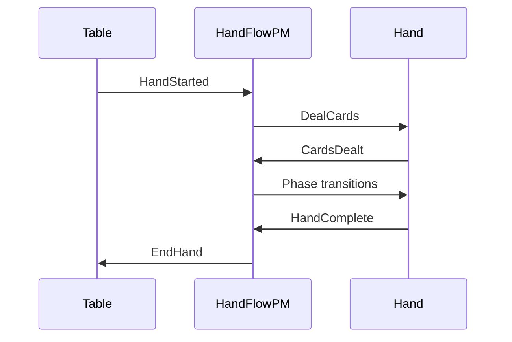

import Tabs from '@theme/Tabs';
import TabItem from '@theme/TabItem';

# Process Managers

A **process manager** coordinates multi-domain workflows with state tracking. Unlike stateless sagas, process managers maintain their own event stream keyed by correlation ID, enabling complex orchestration patterns.

---

## When to Use Process Managers

| Use Case | Saga | Process Manager |
|----------|------|-----------------|
| Single event → single command | ✓ | |
| Fan-out to multiple domains | ✓ | |
| Multi-step workflow with state | | ✓ |
| Events from multiple domains | | ✓ |
| State machine transitions | | ✓ |
| Timeouts and retries | | ✓ |

### Warning: Process Manager Anti-Patterns

**Over-reliance on process managers is a foot-gun.** If you find yourself:

- Putting significant business logic in a PM
- Building PMs with large, complex state
- Creating PMs for workflows within a single domain
- Reaching for PMs as a first solution

**Your domain factoring is probably wrong.**

Process managers should be **lightweight state machines** coordinating across domains—not business logic containers. They answer "what phase are we in?" and "what happens next?", not "how do we calculate X?"

| Symptom | Likely Problem |
|---------|----------------|
| PM has complex validation logic | Logic belongs in domain aggregate |
| PM state mirrors aggregate state | Redundant—query the aggregate |
| PM handles single-domain workflow | Use saga or aggregate instead |
| PM event stream grows large | Too much responsibility—split domains |

**Rule of thumb:** If a PM does more than track phases and dispatch commands, reconsider your architecture. The PM's job is orchestration, not computation.

---

## Example: Hand Flow PM

The HandFlowPM orchestrates poker hand phases across table and hand domains:



### State Definition

<Tabs groupId="language">
<TabItem value="python" label="Python" default>

```python file=examples/python/pmg-hand-flow/hand_flow_pm.py start=docs:start:pm_state end=docs:end:pm_state
```

</TabItem>
<TabItem value="go" label="Go">

```go file=examples/go/pmg-hand-flow/main.go start=docs:start:pm_state end=docs:end:pm_state
```

</TabItem>
<TabItem value="rust" label="Rust">

```rust file=examples/rust/pmg-hand-flow/src/main.rs start=docs:start:pm_state end=docs:end:pm_state
```

</TabItem>
<TabItem value="java" label="Java">

```java file=examples/java/pmg-hand-flow/src/main/java/dev/angzarr/examples/pmghandflow/HandFlowPM.java start=docs:start:pm_state end=docs:end:pm_state
```

</TabItem>
<TabItem value="csharp" label="C#">

```csharp file=examples/csharp/Pmg/HandFlow/HandFlowPM.cs start=docs:start:pm_state end=docs:end:pm_state
```

</TabItem>
<TabItem value="cpp" label="C++">

```cpp file=examples/cpp/pmg-hand-flow/src/hand_flow_pm.cpp start=docs:start:pm_state end=docs:end:pm_state
```

</TabItem>
</Tabs>

### Handler Implementation

<Tabs groupId="language">
<TabItem value="python" label="Python" default>

```python file=examples/python/pmg-hand-flow/hand_flow_pm.py start=docs:start:pm_handler end=docs:end:pm_handler
```

</TabItem>
<TabItem value="go" label="Go">

```go file=examples/go/pmg-hand-flow/main.go start=docs:start:pm_handler end=docs:end:pm_handler
```

</TabItem>
<TabItem value="rust" label="Rust">

```rust file=examples/rust/pmg-hand-flow/src/main.rs start=docs:start:pm_handler end=docs:end:pm_handler
```

</TabItem>
<TabItem value="java" label="Java">

```java file=examples/java/pmg-hand-flow/src/main/java/dev/angzarr/examples/pmghandflow/HandFlowPM.java start=docs:start:pm_handler end=docs:end:pm_handler
```

</TabItem>
<TabItem value="csharp" label="C#">

```csharp file=examples/csharp/Pmg/HandFlow/HandFlowPM.cs start=docs:start:pm_handler end=docs:end:pm_handler
```

</TabItem>
<TabItem value="cpp" label="C++">

```cpp file=examples/cpp/pmg-hand-flow/src/hand_flow_pm.cpp start=docs:start:pm_handler end=docs:end:pm_handler
```

</TabItem>
</Tabs>

---

## Correlation ID

Process managers use the **correlation ID** as their aggregate root:

```protobuf
message Cover {
  string domain = 2;
  UUID root = 1;
  string correlation_id = 3;  // PM's identity
}
```

All events in a workflow share the same correlation ID, allowing the PM to:
- Receive events from multiple domains
- Maintain workflow state across events
- Track progress through the state machine

---

## State Persistence

PM state is stored as events in the PM's own event stream:

```
PM Event Stream (correlation_id = "hand-abc-123"):
  [0] WorkflowStarted { hand_id: "...", phase: "awaiting_deal" }
  [1] PhaseTransitioned { from: "awaiting_deal", to: "dealing" }
  [2] PhaseTransitioned { from: "dealing", to: "blinds" }
  [3] WorkflowCompleted { winner_id: "..." }
```

On restart, the PM rebuilds state by replaying its own events.

---

## Rejection Handling

When a PM-issued command is rejected, the PM receives a Notification before the source aggregate:

```
1. PM issues DealCards → Hand rejects (invalid_player_count)
       │
       ▼
2. PM receives Notification first
   - Can update workflow state (mark step failed)
   - Can decide to retry or abort
       │
       ▼
3. Source aggregate receives Notification
   - Emits compensation events
```

<Tabs groupId="language">
<TabItem value="python" label="Python" default>

```python
@rejected("hand", "DealCards")
def handle_deal_rejected(self, state: HandFlowState, notification: Notification):
    # Update workflow state
    return WorkflowFailed(
        hand_id=state.hand_id,
        reason=f"Deal failed: {notification.rejection_reason}",
        step="deal_cards",
    )
```

</TabItem>
</Tabs>

---

## Timeouts

PMs can schedule timeouts for player actions:

```python
def handle_action_required(self, event: ActionRequired, state: HandFlowState):
    # Schedule timeout
    return [ScheduleTimeout(
        correlation_id=state.correlation_id,
        seconds=30,
        timeout_event=PlayerTimedOut(player_id=event.player_id),
    )]

def handle_player_timed_out(self, event: PlayerTimedOut, state: HandFlowState):
    # Auto-fold on timeout
    return [Fold(hand_id=state.hand_id, player_id=event.player_id)]
```

---

## PM vs Saga

| Aspect | Saga | Process Manager |
|--------|------|-----------------|
| **State** | Stateless | Stateful (own event stream) |
| **Identity** | None | correlation_id |
| **Input domains** | Single | Multiple |
| **Persistence** | No | Yes (workflow events) |
| **Timeouts** | No | Yes |
| **Complexity** | Low | Higher |

**Rule of thumb**: Start with sagas. Upgrade to PM when you need state tracking or multi-domain input.

---

## Next Steps

- **[Sagas](/components/saga)** — Simpler stateless coordination
- **[Why Poker](/examples/why-poker#5-process-manager-orchestration)** — PM patterns in poker
- **[Testing](/operations/testing)** — Testing PMs with Gherkin
