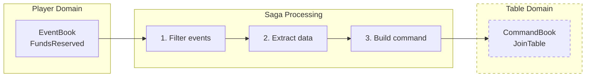

import Tabs from '@theme/Tabs';
import TabItem from '@theme/TabItem';

# Sagas

A **saga** is a [message translator](https://eda-visuals.boyney.io/visuals/message-translator-pattern) that bridges [bounded contexts](https://eda-visuals.boyney.io/visuals/messages-between-bounded-context). When an event occurs in one domain, a saga reacts by issuing commands to another domain.

Sagas are the bridge between domains. Each domain has its own aggregate, but aggregates don't communicate directly. Instead, sagas listen to events from one domain and generate commands for other domains.

---

## Single Domain Subscription

**Sagas should subscribe to ONE domain.**

Multi-domain subscription creates:
- Ordering ambiguity (which event triggers first?)
- Duplicate processing
- Race conditions

If you need multi-domain subscription, use a **[Process Manager](/components/process-manager)**.

---

## Saga Pattern

Every saga follows this pattern:

1. **Receive** EventBook with domain events
2. **Filter** for events this saga cares about
3. **Extract** data needed to build commands
4. **Create** CommandBooks targeting other aggregates
5. **Return** commands (which Angzarr dispatches)



*The dashed domain represents any target domain—sagas always bridge from one domain to another.*

---

## Example: Table-Hand Saga

When a table starts a hand, issue a DealCards command to the hand domain:

<Tabs groupId="language">
<TabItem value="python" label="Python" default>

```python file=examples/python/table/saga-hand/main.py start=docs:start:saga_handler end=docs:end:saga_handler
```

</TabItem>
<TabItem value="go" label="Go">

```go file=examples/go/table/saga-hand/main.go start=docs:start:saga_handler end=docs:end:saga_handler
```

</TabItem>
<TabItem value="rust" label="Rust">

```rust file=examples/rust/table/saga-hand/src/main.rs start=docs:start:saga_handler end=docs:end:saga_handler
```

</TabItem>
<TabItem value="java" label="Java">

```java file=examples/java/table/saga-hand/src/main/java/dev/angzarr/examples/table/sagahand/TableHandRouter.java start=docs:start:saga_handler end=docs:end:saga_handler
```

</TabItem>
<TabItem value="csharp" label="C#">

```csharp file=examples/csharp/Table/SagaHand/TableHandSaga.cs start=docs:start:saga_handler end=docs:end:saga_handler
```

</TabItem>
<TabItem value="cpp" label="C++">

```cpp file=examples/cpp/table/saga-hand/src/table_hand_saga.cpp start=docs:start:saga_handler end=docs:end:saga_handler
```

</TabItem>
</Tabs>

### EventRouter Registration

<Tabs groupId="language">
<TabItem value="python" label="Python" default>

```python file=examples/python/table/saga-hand/main.py start=docs:start:event_router end=docs:end:event_router
```

</TabItem>
<TabItem value="go" label="Go">

```go file=examples/go/table/saga-hand/main.go start=docs:start:event_router end=docs:end:event_router
```

</TabItem>
<TabItem value="rust" label="Rust">

```rust file=examples/rust/table/saga-hand/src/main.rs start=docs:start:event_router end=docs:end:event_router
```

</TabItem>
<TabItem value="java" label="Java">

```java file=examples/java/table/saga-hand/src/main/java/dev/angzarr/examples/table/sagahand/TableHandRouter.java start=docs:start:event_router end=docs:end:event_router
```

</TabItem>
<TabItem value="csharp" label="C#">

```csharp file=examples/csharp/Table/SagaHand/TableHandSaga.cs start=docs:start:event_router end=docs:end:event_router
```

</TabItem>
<TabItem value="cpp" label="C++">

```cpp file=examples/cpp/table/saga-hand/src/table_hand_saga.cpp start=docs:start:event_router end=docs:end:event_router
```

</TabItem>
</Tabs>

---

## Splitter Pattern

When one event should trigger commands to **multiple different aggregates**, return multiple `CommandBook` entries — one per target aggregate root. This is the [splitter pattern](https://eda-visuals.boyney.io/visuals/splitter-pattern).

**Example:** When a table settles, distribute payouts to multiple players:

<Tabs groupId="language">
<TabItem value="python" label="Python" default>

```python file=examples/python/table/saga-hand/splitter_example.py start=docs:start:saga_splitter end=docs:end:saga_splitter
```

</TabItem>
<TabItem value="go" label="Go">

```go file=examples/go/table/saga-hand/splitter_example.go start=docs:start:saga_splitter end=docs:end:saga_splitter
```

</TabItem>
<TabItem value="rust" label="Rust">

```rust file=examples/rust/table/saga-hand/src/splitter_example.rs start=docs:start:saga_splitter end=docs:end:saga_splitter
```

</TabItem>
<TabItem value="java" label="Java">

```java file=examples/java/table/saga-hand/src/main/java/dev/angzarr/examples/table/sagahand/SplitterExample.java start=docs:start:saga_splitter end=docs:end:saga_splitter
```

</TabItem>
<TabItem value="csharp" label="C#">

```csharp file=examples/csharp/Table/SagaHand/SplitterExample.cs start=docs:start:saga_splitter end=docs:end:saga_splitter
```

</TabItem>
<TabItem value="cpp" label="C++">

```cpp file=examples/cpp/table/saga-hand/src/splitter_example.cpp start=docs:start:saga_splitter end=docs:end:saga_splitter
```

</TabItem>
</Tabs>

Each `CommandBook` targets a different aggregate root. The framework dispatches them independently — if one fails, others may still succeed (handle via compensation).

---

## Compensation Flow

When a saga command is rejected (e.g., table is full), Angzarr routes a **Notification** back to the source aggregate:

```
1. Player emits FundsReserved
       │
       ▼
2. Saga issues JoinTable → Table
       │
       ▼
3. Table rejects: "table_full"
       │
       ▼
4. Notification sent to Player
       │
       ▼
5. Player handles rejection → emits FundsReleased
```

The source aggregate decides how to compensate based on the rejection reason.

<Tabs groupId="language">
<TabItem value="python" label="Python" default>

```python
@rejected("table", "JoinTable")
def handle_join_rejected(state: PlayerState, notification: Notification) -> FundsReleased:
    # Release the funds that were reserved for this failed join
    return FundsReleased(
        amount=state.reserved_amount,
        reason=f"Join failed: {notification.rejection_reason}",
        new_available=state.bankroll,
        new_reserved=0,
    )
```

</TabItem>
<TabItem value="rust" label="Rust">

```rust
fn handle_join_rejected(
    state: &PlayerState,
    notification: &Notification,
) -> Result<FundsReleased, Status> {
    Ok(FundsReleased {
        amount: state.reserved_amount,
        reason: format!("Join failed: {}", notification.rejection_reason),
        new_available: state.bankroll,
        new_reserved: 0,
    })
}
```

</TabItem>
<TabItem value="go" label="Go">

```go
func handleJoinRejected(state *PlayerState, notification *Notification) (*FundsReleased, error) {
    return &FundsReleased{
        Amount:       state.ReservedAmount,
        Reason:       fmt.Sprintf("Join failed: %s", notification.RejectionReason),
        NewAvailable: state.Bankroll,
        NewReserved:  0,
    }, nil
}
```

</TabItem>
<TabItem value="java" label="Java">

```java
@Rejected(domain = "table", command = "JoinTable")
public FundsReleased handleJoinRejected(PlayerState state, Notification notification) {
    return FundsReleased.newBuilder()
        .setAmount(state.getReservedAmount())
        .setReason("Join failed: " + notification.getRejectionReason())
        .setNewAvailable(state.getBankroll())
        .setNewReserved(0)
        .build();
}
```

</TabItem>
<TabItem value="csharp" label="C#">

```csharp
[Rejected("table", "JoinTable")]
public FundsReleased HandleJoinRejected(PlayerState state, Notification notification)
{
    return new FundsReleased
    {
        Amount = state.ReservedAmount,
        Reason = $"Join failed: {notification.RejectionReason}",
        NewAvailable = state.Bankroll,
        NewReserved = 0
    };
}
```

</TabItem>
<TabItem value="cpp" label="C++">

```cpp
FundsReleased handle_join_rejected(
    const PlayerState& state, const Notification& notification) {

    FundsReleased event;
    event.set_amount(state.reserved_amount());
    event.set_reason("Join failed: " + notification.rejection_reason());
    event.set_new_available(state.bankroll());
    event.set_new_reserved(0);
    return event;
}
```

</TabItem>
</Tabs>

:::tip Advanced Compensation
For complex scenarios (DLQ routing, escalation webhooks, RevocationResponse flags), see **[Error Recovery](/operations/error-recovery#saga-compensation)**.
:::

---

## Sequence Handling

**Sagas MUST set correct sequence numbers on commands.** The framework validates sequences for optimistic concurrency.

### Two-Phase Saga Flow

The saga coordinator uses a two-phase flow to provide target domain context:

```
Phase 1: Coordinator receives source event
         ↓
         Coordinator calls prepare handler to get destination covers
         ↓
         Coordinator fetches EventBooks for declared destinations
         ↓
Phase 2: Coordinator invokes your saga handler with:
         - Source event
         - Destination EventBooks (target domain states)
```

The `SagaContext` contains the **target domain(s)** aggregate states—not the source domain. This allows your saga to:
- Get correct sequence numbers for optimistic concurrency
- Make routing decisions based on target state
- Avoid stale sequence errors

```python
# SagaContext contains target domain state (table), not source (player)
# Fetched by coordinator before invoking your handler

target_seq = context.get_sequence("table", table_id)

# Use in command
CommandPage(sequence=target_seq, command=cmd_any)
```

Commands with incorrect sequences are rejected, triggering automatic retry with fresh state.

---

## Transactional Guarantees

CQRS/ES architectures **cannot provide distributed ACID transactions**. Instead:

1. **Design for success**: Saga commands should not fail under normal operation
2. **Handle exceptions**: Compensation flow handles the rare rejection cases
3. **Eventual consistency**: Accept that cross-domain operations settle over time

**If saga commands frequently fail, reconsider your domain boundaries.**

---

## Further Reading

- [Message Translator Pattern](https://eda-visuals.boyney.io/visuals/message-translator-pattern) — The pattern sagas implement
- [Messages between Bounded Context](https://eda-visuals.boyney.io/visuals/messages-between-bounded-context) — Cross-domain communication
- [Choreography vs Orchestration](https://eda-visuals.boyney.io/visuals/choreography-vs-orchestration) — Sagas use choreography; Process Managers use orchestration

---

## Next Steps

- **[Projectors](/components/projector)** — Building read models
- **[Process Managers](/components/process-manager)** — Stateful multi-domain coordination
- **[Error Recovery](/operations/error-recovery)** — DLQ, retry, compensation details
- **[Compensation Flow](/examples/why-poker#2-saga-compensation)** — Detailed compensation patterns
