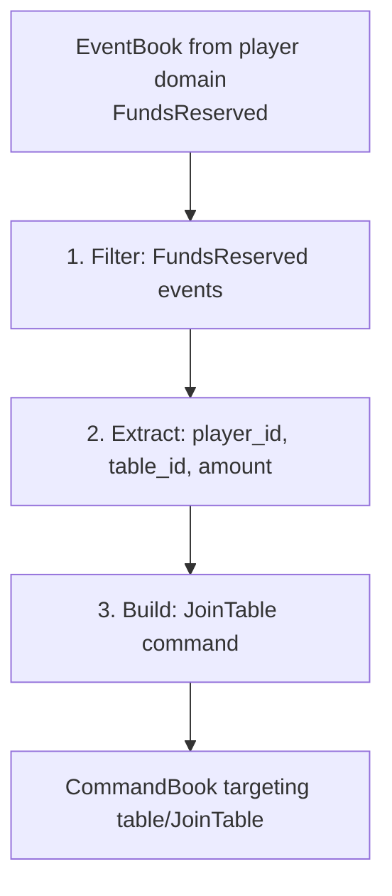

import Tabs from '@theme/Tabs';
import TabItem from '@theme/TabItem';

# Sagas

A **saga** is a [message translator](https://eda-visuals.boyney.io/visuals/message-translator-pattern) that bridges [bounded contexts](https://eda-visuals.boyney.io/visuals/messages-between-bounded-context). When an event occurs in one domain, a saga reacts by issuing commands to another domain.

Sagas are the bridge between domains. Each domain has its own aggregate, but aggregates don't communicate directly. Instead, sagas listen to events from one domain and generate commands for other domains.

---

## Single Domain Subscription

**Sagas should subscribe to ONE domain.**

Multi-domain subscription creates:
- Ordering ambiguity (which event triggers first?)
- Duplicate processing
- Race conditions

If you need multi-domain subscription, use a **[Process Manager](/components/process-manager)**.

---

## Saga Pattern

Every saga follows this pattern:

1. **Receive** EventBook with domain events
2. **Filter** for events this saga cares about
3. **Extract** data needed to build commands
4. **Create** CommandBooks targeting other aggregates
5. **Return** commands (which Angzarr dispatches)



---

## Example: Table-Player Saga

When a player reserves funds, issue a JoinTable command:

<Tabs groupId="language">
<TabItem value="python" label="Python" default>

```python
from angzarr_client import EventRouter
from proto.player_pb2 import FundsReserved
from proto.table_pb2 import JoinTable

def handle_funds_reserved(event: FundsReserved, context: SagaContext) -> list[CommandBook]:
    # Build JoinTable command for table domain
    cmd = JoinTable(
        player_id=event.player_id,
        buy_in=event.amount,
    )

    # Get target sequence from context
    target_seq = context.get_sequence("table", event.table_id)

    return [CommandBook(
        cover=Cover(domain="table", root=event.table_id),
        pages=[CommandPage(sequence=target_seq, command=pack_any(cmd))],
    )]

router = EventRouter("saga-table-player", "player")
    .sends("table", "JoinTable")
    .on("FundsReserved", handle_funds_reserved)
```

</TabItem>
<TabItem value="go" label="Go">

```go
func handleFundsReserved(event *FundsReserved, ctx *SagaContext) ([]*CommandBook, error) {
    cmd := &JoinTable{
        PlayerId: event.PlayerId,
        BuyIn:    event.Amount,
    }

    targetSeq := ctx.GetSequence("table", event.TableId)

    return []*CommandBook{{
        Cover: &Cover{Domain: "table", Root: event.TableId},
        Pages: []*CommandPage{{
            Sequence: targetSeq,
            Command:  packAny(cmd),
        }},
    }}, nil
}

router := angzarr.NewEventRouter("saga-table-player", "player").
    Sends("table", "JoinTable").
    On("FundsReserved", handleFundsReserved)
```

</TabItem>
<TabItem value="rust" label="Rust">

```rust
fn handle_funds_reserved(
    event: &FundsReserved,
    context: &SagaContext,
) -> Result<Vec<CommandBook>, Status> {
    let cmd = JoinTable {
        player_id: event.player_id.clone(),
        buy_in: event.amount,
    };

    let target_seq = context.get_sequence("table", &event.table_id);

    Ok(vec![CommandBook {
        cover: Some(Cover {
            domain: "table".into(),
            root: Some(event.table_id.clone()),
            ..Default::default()
        }),
        pages: vec![CommandPage {
            sequence: Some(Sequence::Num(target_seq)),
            command: Some(pack_any(&cmd)),
        }],
        ..Default::default()
    }])
}

let router = EventRouter::new("saga-table-player", "player")
    .sends("table", "JoinTable")
    .on::<FundsReserved>(handle_funds_reserved);
```

</TabItem>
<TabItem value="java" label="Java">

```java
public class TablePlayerSaga {
    @ReactsTo(FundsReserved.class)
    public List<CommandBook> handleFundsReserved(FundsReserved event, SagaContext context) {
        var cmd = JoinTable.newBuilder()
            .setPlayerId(event.getPlayerId())
            .setBuyIn(event.getAmount())
            .build();

        int targetSeq = context.getSequence("table", event.getTableId());

        return List.of(CommandBook.newBuilder()
            .setCover(Cover.newBuilder()
                .setDomain("table")
                .setRoot(event.getTableId()))
            .addPages(CommandPage.newBuilder()
                .setSequence(targetSeq)
                .setCommand(Any.pack(cmd)))
            .build());
    }
}
```

</TabItem>
<TabItem value="csharp" label="C#">

```csharp
public class TablePlayerSaga
{
    [ReactsTo(typeof(FundsReserved))]
    public IEnumerable<CommandBook> HandleFundsReserved(
        FundsReserved @event, SagaContext context)
    {
        var cmd = new JoinTable
        {
            PlayerId = @event.PlayerId,
            BuyIn = @event.Amount
        };

        var targetSeq = context.GetSequence("table", @event.TableId);

        yield return new CommandBook
        {
            Cover = new Cover { Domain = "table", Root = @event.TableId },
            Pages = { new CommandPage { Sequence = targetSeq, Command = Any.Pack(cmd) } }
        };
    }
}
```

</TabItem>
<TabItem value="cpp" label="C++">

```cpp
std::vector<CommandBook> handle_funds_reserved(
    const FundsReserved& event, const SagaContext& context) {

    JoinTable cmd;
    cmd.set_player_id(event.player_id());
    cmd.set_buy_in(event.amount());

    uint32_t target_seq = context.get_sequence("table", event.table_id());

    CommandBook book;
    book.mutable_cover()->set_domain("table");
    *book.mutable_cover()->mutable_root() = event.table_id();

    auto* page = book.add_pages();
    page->set_sequence(target_seq);
    page->mutable_command()->PackFrom(cmd);

    return {book};
}
```

</TabItem>
</Tabs>

---

## Compensation Flow

When a saga command is rejected (e.g., table is full), Angzarr routes a **Notification** back to the source aggregate:

```
1. Player emits FundsReserved
       │
       ▼
2. Saga issues JoinTable → Table
       │
       ▼
3. Table rejects: "table_full"
       │
       ▼
4. Notification sent to Player
       │
       ▼
5. Player handles rejection → emits FundsReleased
```

The source aggregate decides how to compensate based on the rejection reason.

<Tabs groupId="language">
<TabItem value="python" label="Python" default>

```python
@rejected("table", "JoinTable")
def handle_join_rejected(state: PlayerState, notification: Notification) -> FundsReleased:
    # Release the funds that were reserved for this failed join
    return FundsReleased(
        amount=state.reserved_amount,
        reason=f"Join failed: {notification.rejection_reason}",
        new_available=state.bankroll,
        new_reserved=0,
    )
```

</TabItem>
<TabItem value="rust" label="Rust">

```rust
fn handle_join_rejected(
    state: &PlayerState,
    notification: &Notification,
) -> Result<FundsReleased, Status> {
    Ok(FundsReleased {
        amount: state.reserved_amount,
        reason: format!("Join failed: {}", notification.rejection_reason),
        new_available: state.bankroll,
        new_reserved: 0,
    })
}
```

</TabItem>
<TabItem value="go" label="Go">

```go
func handleJoinRejected(state *PlayerState, notification *Notification) (*FundsReleased, error) {
    return &FundsReleased{
        Amount:       state.ReservedAmount,
        Reason:       fmt.Sprintf("Join failed: %s", notification.RejectionReason),
        NewAvailable: state.Bankroll,
        NewReserved:  0,
    }, nil
}
```

</TabItem>
<TabItem value="java" label="Java">

```java
@Rejected(domain = "table", command = "JoinTable")
public FundsReleased handleJoinRejected(PlayerState state, Notification notification) {
    return FundsReleased.newBuilder()
        .setAmount(state.getReservedAmount())
        .setReason("Join failed: " + notification.getRejectionReason())
        .setNewAvailable(state.getBankroll())
        .setNewReserved(0)
        .build();
}
```

</TabItem>
<TabItem value="csharp" label="C#">

```csharp
[Rejected("table", "JoinTable")]
public FundsReleased HandleJoinRejected(PlayerState state, Notification notification)
{
    return new FundsReleased
    {
        Amount = state.ReservedAmount,
        Reason = $"Join failed: {notification.RejectionReason}",
        NewAvailable = state.Bankroll,
        NewReserved = 0
    };
}
```

</TabItem>
<TabItem value="cpp" label="C++">

```cpp
FundsReleased handle_join_rejected(
    const PlayerState& state, const Notification& notification) {

    FundsReleased event;
    event.set_amount(state.reserved_amount());
    event.set_reason("Join failed: " + notification.rejection_reason());
    event.set_new_available(state.bankroll());
    event.set_new_reserved(0);
    return event;
}
```

</TabItem>
</Tabs>

:::tip Advanced Compensation
For complex scenarios (DLQ routing, escalation webhooks, RevocationResponse flags), see **[Error Recovery](/operations/error-recovery#saga-compensation)**.
:::

---

## Sequence Handling

**Sagas MUST set correct sequence numbers on commands.** The framework validates sequences for optimistic concurrency.

The `SagaContext` provides target aggregate states:

```python
# Get next sequence for target aggregate
target_seq = context.get_sequence("table", table_id)

# Use in command
CommandPage(sequence=target_seq, command=cmd_any)
```

Commands with incorrect sequences are rejected, triggering automatic retry with fresh state.

---

## Transactional Guarantees

CQRS/ES architectures **cannot provide distributed ACID transactions**. Instead:

1. **Design for success**: Saga commands should not fail under normal operation
2. **Handle exceptions**: Compensation flow handles the rare rejection cases
3. **Eventual consistency**: Accept that cross-domain operations settle over time

**If saga commands frequently fail, reconsider your domain boundaries.**

---

## Further Reading

- [Message Translator Pattern](https://eda-visuals.boyney.io/visuals/message-translator-pattern) — The pattern sagas implement
- [Messages between Bounded Context](https://eda-visuals.boyney.io/visuals/messages-between-bounded-context) — Cross-domain communication
- [Choreography vs Orchestration](https://eda-visuals.boyney.io/visuals/choreography-vs-orchestration) — Sagas use choreography; Process Managers use orchestration

---

## Next Steps

- **[Projectors](/components/projector)** — Building read models
- **[Process Managers](/components/process-manager)** — Stateful multi-domain coordination
- **[Error Recovery](/operations/error-recovery)** — DLQ, retry, compensation details
- **[Compensation Flow](/examples/why-poker#2-saga-compensation)** — Detailed compensation patterns
