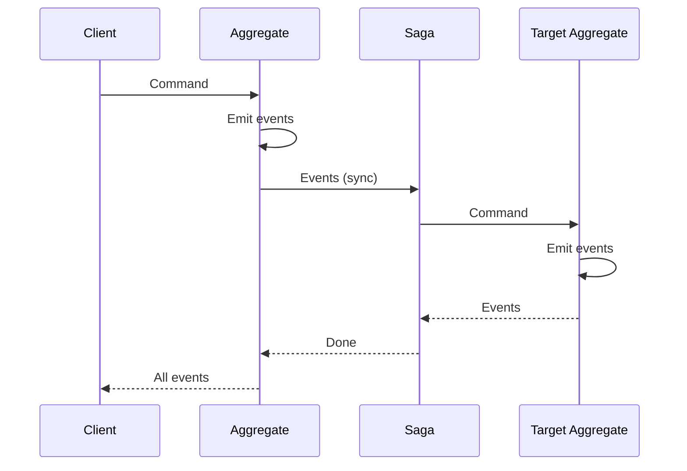
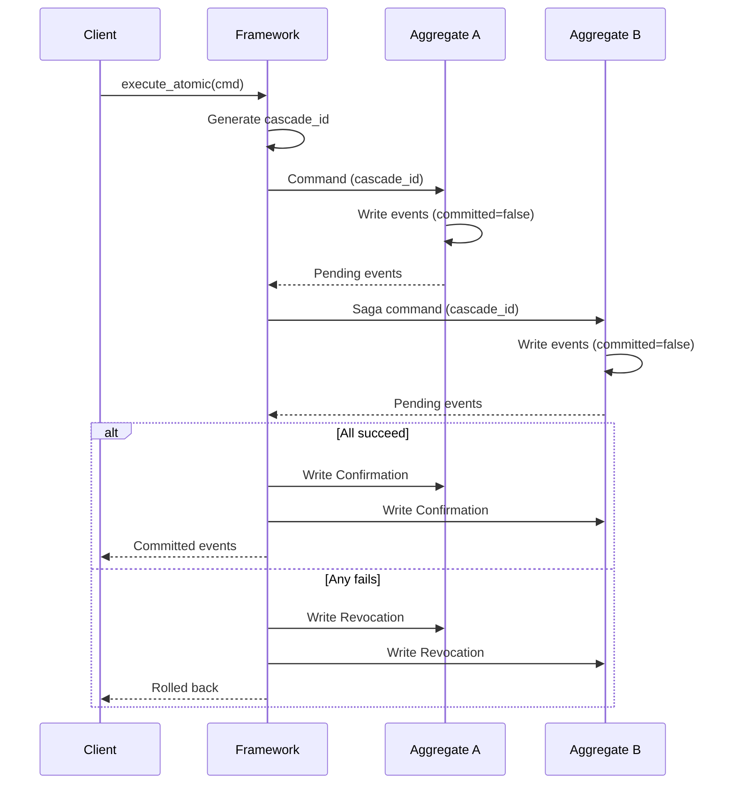

import Tabs from '@theme/Tabs';
import TabItem from '@theme/TabItem';

# Cascade Execution

Synchronous saga execution with optional atomic commit/rollback. Execute a command and wait for all triggered sagas to complete before returning.

---

## The Problem

Event sourcing with sagas is naturally asynchronous: commands emit events, sagas react to events, and results arrive eventually. But sometimes you need immediate feedback:

- **User-facing operations** that need instant confirmation
- **Validation workflows** that must complete before responding
- **Multi-aggregate transactions** that should succeed or fail together

Traditional solutions (distributed transactions, 2PC databases) are complex and often unavailable across service boundaries. Cascade execution provides synchronous semantics while preserving event sourcing's append-only, auditable model.

---

## Execution Modes

Angzarr provides three execution modes, controlled by `SyncMode`:

| Mode | Behavior | Use Case |
|------|----------|----------|
| `ASYNC` | Fire and forget to bus | Default, highest throughput |
| `SIMPLE` | Wait for projectors only | Read-your-writes consistency |
| `CASCADE` | Wait for projectors + sagas + PMs | Immediate response, full coordination |

### Choosing Your Mode

```
Do you need immediate response?
    |
    +- NO → ASYNC (default)
    |       Highest throughput, compensation on failure
    |
    +- YES → Do you need saga results?
             |
             +- NO → SIMPLE
             |       Sync projectors only
             |
             +- YES → CASCADE
                      Full sync: projectors + sagas + PMs
```

---

## CASCADE Mode

CASCADE executes the full coordination tree synchronously:



### Error Modes

When a saga or downstream command fails, `CascadeErrorMode` controls the response:

| Mode | On Failure | When to Use |
|------|------------|-------------|
| `FAIL_FAST` | Stop immediately, return error | Default, most operations |
| `CONTINUE` | Collect all errors, return at end | Batch validation |
| `COMPENSATE` | Track commands, execute reverse on failure | Undo partial work |
| `DEAD_LETTER` | Send to DLQ, continue | Best-effort with alerting |

---

## Atomic Transactions (2PC)

For operations requiring atomicity across aggregates, CASCADE can be combined with two-phase commit semantics.

### The Difference

| Aspect | CASCADE | CASCADE + 2PC |
|--------|---------|---------------|
| Event visibility | Immediate | After confirmation |
| On failure | Compensate (reverse commands) | Rollback (events hidden) |
| Concurrency | No protection | Field-level locking |
| Recovery | Manual | Timeout-based |

### How It Works



### Storage Model

Events include two fields for 2PC:

| Field | Type | Purpose |
|-------|------|---------|
| `committed` | bool | `false` = pending, needs confirmation |
| `cascade_id` | string | Groups related pending events |

Uncommitted events are invisible to other operations until confirmed. If rolled back, they become NoOp at read time.

### Framework Events

| Event | Purpose |
|-------|---------|
| `Confirmation` | Marks sequences as committed |
| `Revocation` | Marks sequences as rolled back (hidden) |
| `Compensate` | Triggers client compensation handler |
| `NoOp` | Placeholder for filtered events |

### Read-Time Transformation

The coordinator transforms events at read time:

| Event State | Transformed To |
|-------------|----------------|
| Committed | Pass through |
| Uncommitted + Confirmed | Pass through |
| Uncommitted + Revoked | NoOp |
| Uncommitted (other cascade) | NoOp |
| Framework event | NoOp |

Storage never changes. Only the view seen by business logic is filtered.

---

## Field-Level Locking

2PC provides optimistic field-level locking. Uncommitted events lock the fields they modify.

```
1. Load events, identify uncommitted
2. Compute locked fields from uncommitted events
3. Compare with incoming command's fields
4. Overlap → reject with ABORTED
```

Non-overlapping commands proceed. Only conflicting fields block.

### Example

```
Aggregate: Inventory(sku="ABC", qty=100, reserved=0)

Cascade 1: Reserve 10 units
  - Pending events: InventoryReserved{qty_delta=-10, reserved_delta=+10}
  - Locked fields: [qty, reserved]

Cascade 2: Update description
  - Fields touched: [description]
  - No overlap → proceeds

Cascade 3: Reserve 5 units
  - Fields touched: [qty, reserved]
  - Overlaps with Cascade 1 → ABORTED
```

---

## Timeout Recovery

A background cleanup job handles stale cascades:

```rust
impl CascadeReaper {
    async fn cleanup_stale_cascades(&self) {
        let threshold = Utc::now() - self.timeout;
        let stale = self.storage.query_stale_cascades(&threshold).await;

        for cascade_id in stale {
            let participants = self.storage.query_cascade_participants(&cascade_id).await;
            for participant in participants {
                self.write_revocation(&participant, &cascade_id, "timeout").await;
            }
        }
    }
}
```

Stale cascades are uncommitted events older than the timeout with no Confirmation or Revocation.

---

## Process Manager 2PC

Process managers can serve as 2PC coordinators for async workflows:

| Execution | Coordinator | Lock Window |
|-----------|-------------|-------------|
| Synchronous | Framework | Milliseconds |
| Async | Process Manager | Workflow duration |

The PM emits `CascadeCommit` or `CascadeRollback` based on workflow outcome. The framework distributes Confirmation/Revocation to all participants.

:::warning Long Locks
Async PM 2PC locks fields for the entire workflow duration. Not suitable for high-throughput hot aggregates.
:::

---

## Usage

### Standard CASCADE

```rust
// Existing: sync with immediate commits per step
let events = executor.execute_with_cascade(cmd).await?;
```

### Atomic CASCADE (2PC)

```rust
// New: sync with deferred commits
let events = executor.execute_atomic(cmd).await?;
```

### With Error Mode

```rust
let events = executor.execute_cascade_with_error_mode(
    cmd,
    CascadeErrorMode::Compensate
).await?;
```

---

## When to Use What

| Scenario | Recommended Mode |
|----------|------------------|
| Most workflows | ASYNC |
| Fire-and-forget notifications | ASYNC |
| High-throughput hot paths | ASYNC |
| UI needs immediate feedback | CASCADE |
| Multi-step wizard with validation | CASCADE |
| Financial transaction (user-facing) | CASCADE + 2PC |
| Background job requiring atomicity | ASYNC + PM 2PC |

---

## See Also

- [Graceful Failure](./compensation) — Compensation patterns
- [Error Recovery](../operations/error-recovery) — DLQ, retries, escalation
- [Saga Component](../components/saga) — Building sagas
- [Process Manager](../components/process-manager) — Stateful coordination
