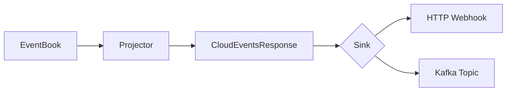

# CloudEvents Integration

Your events, wrapped in the format every webhook consumer already understands.

---

## The Standard

[CloudEvents 1.0](https://cloudevents.io/) is a specification for describing event data in a common way. It defines a standard envelope that external systems can parse without knowing your internal schema.

:::note Author's Note
The author's direct experience with CloudEvents is limited, but appreciates what they represent: an open standard, developed transparently, solving a real interoperability problem. When in doubt, prefer open standards over proprietary formats.
:::

When your poker platform needs to notify:
- A payment processor about deposits
- A responsible gaming service about player activity
- A third-party analytics platform about hand outcomes
- A regulatory reporting system about AML events

CloudEvents is [widely adopted](https://cloudevents.io/#adopters) across cloud providers and event platforms—Azure Event Grid, Knative, Serverless.com, and others. Using a standard envelope means less custom integration work.

---

## What Gets Published

Events flow through your projector, which decides what to publish:



You control the transformation. Not every internal event needs external publication.

---

## The CloudEvent Envelope

```json title="illustrative - CloudEvent envelope"
{
  "specversion": "1.0",
  "id": "hand:abc123:42",
  "type": "io.angzarr.poker.hand.complete",
  "source": "angzarr/hand",
  "time": "2024-01-15T10:30:00Z",
  "datacontenttype": "application/json",
  "subject": "abc123",
  "correlationid": "session-xyz-789",
  "data": {
    "hand_id": "abc123",
    "winner_id": "player-456",
    "pot": 15000,
    "winning_hand": "flush"
  }
}
```

| Field | Default | Override |
|-------|---------|----------|
| `id` | `{domain}:{root_id}:{sequence}` | Custom |
| `source` | `angzarr/{domain}` | Custom |
| `subject` | Aggregate root ID | Custom |
| `correlationid` | From Cover | Auto |

---

## Building CloudEvents in a Projector

OO-style projector that filters sensitive fields and publishes public versions:

```python file=examples/python/prj-cloudevents/cloudevents_projector.py start=docs:start:cloudevents_oo end=docs:end:cloudevents_oo
```

Router-style alternative with explicit handler registration:

```python file=examples/python/prj-cloudevents/cloudevents_projector.py start=docs:start:cloudevents_router end=docs:end:cloudevents_router
```

Return `None` to skip publishing. Return a CloudEvent for publication.

---

## Sink Configuration

### HTTP Sink

```bash title="illustrative - HTTP sink config"
CLOUDEVENTS_SINK=http
CLOUDEVENTS_HTTP_ENDPOINT=https://webhook.example.com/events
CLOUDEVENTS_HTTP_TIMEOUT=30
CLOUDEVENTS_BATCH_SIZE=100
```

Events POST as `application/cloudevents-batch+json`. The framework handles:
- Batching for efficiency
- Retries with exponential backoff (100ms → 5s, 5 attempts)
- Retry on 429, 5xx; no retry on 4xx

### Kafka Sink

```bash title="illustrative - Kafka sink config"
CLOUDEVENTS_SINK=kafka
CLOUDEVENTS_KAFKA_BROKERS=localhost:9092
CLOUDEVENTS_KAFKA_TOPIC=game-events
CLOUDEVENTS_KAFKA_SASL_USERNAME=...
CLOUDEVENTS_KAFKA_SASL_PASSWORD=...
```

Events publish with:
- Message key: `subject` field (for ordering)
- Idempotent producer enabled
- Acks: `all`

### Both

```bash title="illustrative - dual sink config"
CLOUDEVENTS_SINK=both
```

Publish to HTTP and Kafka simultaneously.

---

## Use Cases in Gaming

| Event | External Consumer | Why |
|-------|-------------------|-----|
| `PlayerRegistered` | KYC/AML service | Verification workflow |
| `LargeDeposit` | Responsible gaming | Spending alerts |
| `HandComplete` | Analytics platform | Game metrics |
| `SuspiciousActivity` | Fraud detection | Real-time alerts |
| `SessionEnded` | Regulatory reporting | Compliance logs |

---

## Extension Attributes

Add custom metadata to events:

```python title="illustrative - custom extensions"
CloudEvent(
    type="io.angzarr.poker.suspicious_activity",
    payload=Any.pack(alert),
    extensions={
        "playerid": player_id,
        "alertlevel": "high",
        "jurisdiction": "nevada",
    },
)
```

Extension keys are automatically lowercased per CloudEvents spec.

The `correlationid` extension is added automatically from the Cover's correlation ID.

---

## Filtering and Transformation

Your projector controls what gets published:

```python title="illustrative - event filtering"
@handles("PlayerActed")
def on_player_acted(self, event: PlayerActed) -> CloudEventsResponse:
    # Only publish all-ins for drama tracking
    if event.action_type == ActionType.ALL_IN:
        return CloudEventsResponse(events=[
            CloudEvent(
                type="io.angzarr.poker.all_in",
                payload=Any.pack(AllInEvent(
                    hand_id=event.hand_id,
                    player_id=event.player_id,
                    amount=event.amount,
                )),
            )
        ])
    return CloudEventsResponse(events=[])
```

Internal events stay internal. External consumers see only what you choose to publish.

---

## See Also

- [Components: CloudEvents](../components/cloudevents) — Implementation details
- [Projections](./projections) — Building the projector
- [Observability](./observability) — Tracing events across systems
