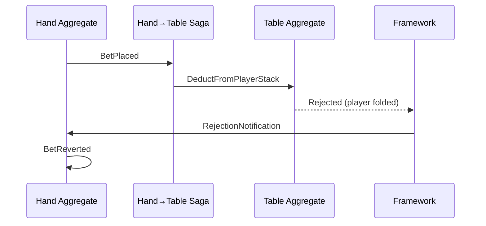

# Graceful Failure

The player's bet was accepted. The pot updated. Then the hand discovered they'd already folded. Now what?

---

## The Problem

Distributed systems fail in the middle. A saga issues a command, the target aggregate rejects it, and now the source needs to know—and respond.

Traditional solutions—two-phase commit, distributed transactions—are complex, slow, and often unavailable across service boundaries. Event sourcing offers a different approach: let failures happen, record them, and compensate.

---

## How Compensation Works

When a saga issues a command that gets rejected:

```
1. Hand emits BetPlaced event
2. Saga (Hand→Table) receives event, issues DeductFromPot → Table
3. Table rejects: "Player already folded"
4. Framework sends RejectionNotification directly to Hand aggregate
5. Hand's @rejected handler emits compensation event: BetReverted
```

The audit trail shows exactly what happened: the attempt, the rejection, and the recovery.

---

## The Flow



The rejection notification bypasses the saga entirely. The framework routes it directly to the source aggregate using the return address stamped on the original command. The saga is stateless—it doesn't need to know about rejections. The source aggregate decides how to compensate.

---

## Handling Rejections

Register handlers for specific rejection scenarios:

```python
@rejected("table", "DeductFromPlayerStack")
def handle_deduction_rejected(
    state: HandState,
    notification: RejectionNotification
) -> BetReverted:
    return BetReverted(
        hand_id=state.hand_id,
        player_id=state.current_actor,
        amount=notification.rejected_command.amount,
        reason=notification.rejection_reason,
    )
```

The framework routes rejections to the appropriate handler based on the rejected command's domain and type.

---

## Compensation in Poker

Different failures require different responses:

| Scenario | Compensation |
|----------|--------------|
| Player disconnects mid-action | Auto-fold, return to action queue |
| Insufficient chips for blind | Sit out, notify table |
| Invalid bet amount | Reject action, prompt retry |
| Table closed during hand | Refund all pots, end hand |
| Timer expired | Auto-check or auto-fold |

The aggregate decides the business response. The framework ensures the notification arrives.

---

## RevocationResponse Options

When handling a rejection, you can specify additional actions:

```python
@rejected("player", "ReserveFunds")
def handle_reserve_failed(state, notification):
    if notification.rejection_reason == "insufficient_balance":
        return RevocationResponse(
            events=[PlayerSatOut(reason="insufficient_funds")],
            emit_system_revocation=False,
        )
    else:
        return RevocationResponse(
            events=[JoinTableFailed(reason=notification.rejection_reason)],
            send_to_dead_letter_queue=True,
            escalate=True,  # Alert floor manager
        )
```

| Flag | Effect |
|------|--------|
| `emit_system_revocation` | Emit `SagaCompensationFailed` event |
| `send_to_dead_letter_queue` | Route to DLQ for manual review |
| `escalate` | Trigger configured webhook (floor manager alert) |
| `abort` | Stop saga chain, propagate error |

---

## Multi-Step Compensation

Complex workflows may require compensating multiple steps:

```python
# Player tried to join table but verification failed
@rejected("verification", "VerifyPlayer")
def handle_verification_failed(state: TableState, notification):
    # Already reserved their seat and took their buy-in
    # Need to undo both
    return [
        SeatReleased(seat=state.pending_seat),
        BuyInRefunded(player_id=state.pending_player, amount=state.pending_buyin),
        JoinRejected(player_id=state.pending_player, reason="verification_failed"),
    ]
```

Each compensation event is recorded. The audit trail shows the full sequence: attempt, failure, recovery.

---

## Why This Matters for Gaming

Regulated gaming requires demonstrable fairness:

- Every player action must be recorded
- Every rejection must be explained
- Every compensation must be traceable

When a regulator asks "why did this player lose their bet?", the event history shows:
1. The bet was placed
2. The deduction was attempted
3. The deduction was rejected (reason: player had folded)
4. The bet was reverted
5. The player was notified

No silent failures. No unexplained state changes.

---

## See Also

- [Error recovery operations](../operations/error-recovery) — DLQ, retries, and escalation
- [Saga component](../components/saga) — Building sagas
- [Why Poker](../examples/why-poker) — Full example with compensation flows
