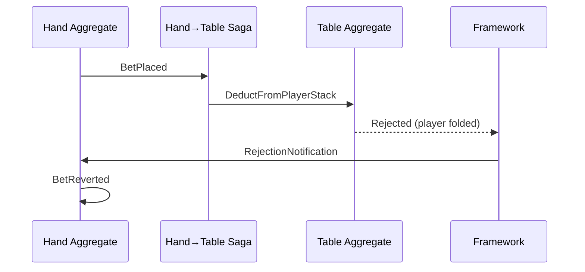

# Graceful Failure

The player's bet was accepted. The pot updated. Then the hand discovered they'd already folded. Now what?

---

## The Problem

Distributed systems fail in the middle. A saga issues a command, the target aggregate rejects it, and now the source needs to know—and respond.

Traditional solutions—two-phase commit, distributed transactions—are complex, slow, and often unavailable across service boundaries. Event sourcing offers a different approach: let failures happen, record them, and compensate.

---

## How Compensation Works

When a saga issues a command that gets rejected:

```text title="illustrative - compensation flow"
1. Hand emits BetPlaced event
2. Saga (Hand→Table) receives event, issues DeductFromPot → Table
3. Table rejects: "Player already folded"
4. Framework sends RejectionNotification directly to Hand aggregate
5. Hand's @rejected handler emits compensation event: BetReverted
```

The audit trail shows exactly what happened: the attempt, the rejection, and the recovery.

---

## The Flow



The rejection notification bypasses the saga entirely. The framework routes it directly to the source aggregate using the return address stamped on the original command. The saga is stateless—it doesn't need to know about rejections. The source aggregate decides how to compensate.

---

## Handling Rejections

Register handlers for specific rejection scenarios:

```python file=examples/python/player/agg/rejected.py start=docs:start:rejected_handler end=docs:end:rejected_handler
```

The framework routes rejections to the appropriate handler based on the rejected command's domain and type.

---

## Compensation in Poker

Different failures require different responses:

| Scenario | Compensation |
|----------|--------------|
| Player disconnects mid-action | Auto-fold, return to action queue |
| Insufficient chips for blind | Sit out, notify table |
| Invalid bet amount | Reject action, prompt retry |
| Table closed during hand | Refund all pots, end hand |
| Timer expired | Auto-check or auto-fold |

The aggregate decides the business response. The framework ensures the notification arrives.

---

## RevocationResponse Options

When handling a rejection, you can specify additional actions:

:::info Illustrative Example
The following shows the RevocationResponse pattern. Your handlers will use
your domain's specific events and rejection reasons.
:::

```python title="illustrative - RevocationResponse options"
@rejected(domain="player", command="ReserveFunds")
def handle_reserve_failed(self, notification: Notification):
    rejection = RejectionNotification()
    notification.payload.Unpack(rejection)

    if rejection.rejection_reason == "insufficient_balance":
        # Return event directly—framework auto-applies it
        return PlayerSatOut(reason="insufficient_funds")
    else:
        # Delegate to framework for DLQ/escalation
        return delegate_to_framework(
            reason=rejection.rejection_reason,
            send_to_dead_letter=True,
            escalate=True,  # Alert floor manager
        )
```

| Flag | Effect |
|------|--------|
| `emit_system_revocation` | Emit `SagaCompensationFailed` event |
| `send_to_dead_letter_queue` | Route to DLQ for manual review |
| `escalate` | Trigger configured webhook (floor manager alert) |
| `abort` | Stop saga chain, propagate error |

---

## Multi-Step Compensation

Complex workflows may require compensating multiple steps:

:::info Illustrative Example
The following shows multi-step compensation patterns. Your implementation
will define domain-specific events for each compensating action.
:::

```python title="illustrative - multi-step compensation"
# Player tried to join table but verification failed
@rejected(domain="verification", command="VerifyPlayer")
def handle_verification_failed(self, notification: Notification):
    # Already reserved their seat and took their buy-in
    # Need to undo both—return multiple events as a tuple
    return (
        SeatReleased(seat=self.state.pending_seat),
        BuyInRefunded(player_id=self.state.pending_player, amount=self.state.pending_buyin),
        JoinRejected(player_id=self.state.pending_player, reason="verification_failed"),
    )
```

Each compensation event is recorded. The audit trail shows the full sequence: attempt, failure, recovery.

---

## Why This Matters

Regulated industries require demonstrable fairness:

- Every player action must be recorded
- Every rejection must be explained
- Every compensation must be traceable

When a regulator asks "why did this player lose their bet?", the event history shows:
1. The bet was placed
2. The deduction was attempted
3. The deduction was rejected (reason: player had folded)
4. The bet was reverted
5. The player was notified

No silent failures. No unexplained state changes.

---

## Revocation vs Compensate

The framework provides two mechanisms for undoing events:

| Mechanism | Original Event | Client Code | Use Case |
|-----------|----------------|-------------|----------|
| **Revocation** | Hidden (becomes NoOp) | None needed | Full undo, clean state |
| **Compensate** | Visible | Handler implements inverse | Partial undo, business logic |

### Revocation (Framework-Only)

Revocation hides the original event at read time. No client code required.

```text title="Revocation flow"
1. Framework writes Revocation { sequences: [5, 6], reason: "timeout" }
2. At read time, events 5 and 6 become NoOp
3. Business logic never sees the original events
```

Use revocation when:
- Full undo is needed, "never happened" semantics
- No business logic required for the undo
- Events came from a failed cascade or timeout

### Compensate (Client-Implemented)

Compensate keeps the original event visible and routes to a client handler. The handler emits inverse events.

```text title="Compensate flow"
1. Framework writes Compensate { sequences: [5], reason: "order_cancelled" }
2. Framework routes to client's compensation handler
3. Handler receives original event, emits inverse (e.g., InventoryReleased)
4. Both original and compensation events visible in stream
```

Use compensate when:
- Business logic must decide how to undo
- Partial undo based on context
- Explicit audit trail required (both events visible)
- Third-party notifications or side effects need reversal

### Example: Compensation Handler

```python title="illustrative - compensation handler registration"
@compensate("InventoryReserved")
def compensate_reservation(self, original_event, reason):
    # Original event remains visible
    # Emit inverse event
    return InventoryReleased(
        sku=original_event.sku,
        qty=original_event.qty,
        reason=reason,
    )
```

### Read-Time Behavior

| Event Type | At Read Time |
|------------|--------------|
| Revocation marker | NoOp |
| Revoked event | NoOp |
| Compensate marker | NoOp |
| Compensated event | **Visible** (key difference) |

---

## See Also

- [Cascade Execution](./cascade) — Atomic transactions and 2PC
- [Error recovery operations](../operations/error-recovery) — DLQ, retries, and escalation
- [Saga component](../components/saga) — Building sagas
- [Why Poker](../examples/why-poker) — Full example with compensation flows
