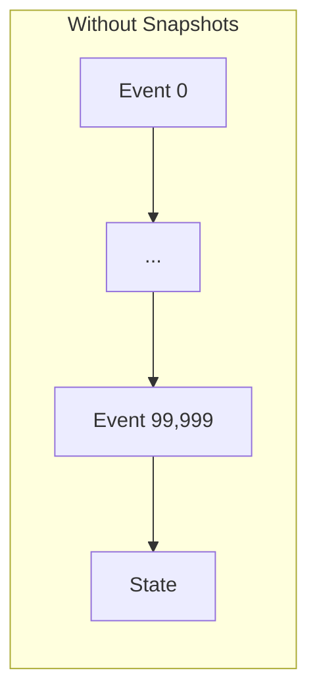
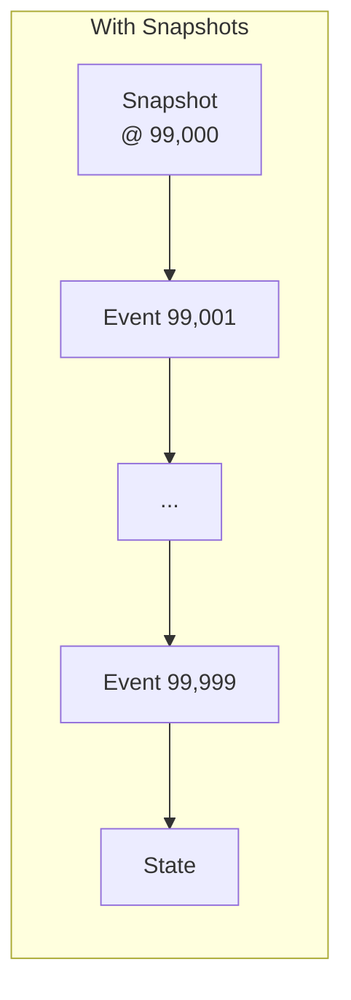
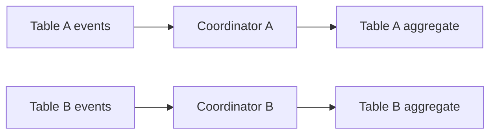

# Performance at Scale

An aggregate with a hundred thousand events. State rebuilt in fifty milliseconds.

---

## The Challenge

Event sourcing rebuilds state by replaying events. A player who's been active for years might have tens of thousands of events. Replaying them on every command would be prohibitive.

The framework provides three mechanisms: snapshots, async processing, and merge strategies.

---

## Snapshots

Snapshots cache aggregate state at intervals, eliminating the need to replay from the beginning:





Without: replay 100,000 events. With: replay 999 events.

### Automatic Snapshotting

The coordinator creates snapshots based on configuration:

```yaml
snapshot:
  interval: 1000      # Snapshot every 1000 events
  min_events: 100     # Don't snapshot if fewer than 100 events since last
```

### Manual Snapshotting

Trigger snapshots programmatically for long-running aggregates:

```python
# After a significant operation
if state.event_count % 500 == 0:
    request_snapshot()
```

### Snapshot Storage

Snapshots store the serialized state alongside position metadata:

```
┌─────────────────────────────────────┐
│ Snapshot                            │
├─────────────────────────────────────┤
│ aggregate_id: "player-abc"          │
│ sequence: 99000                     │
│ state: <serialized PlayerState>     │
│ created_at: 2024-01-15T10:30:00Z    │
└─────────────────────────────────────┘
```

On command arrival, the coordinator:
1. Loads the most recent snapshot
2. Replays events after that sequence
3. Applies the command to reconstructed state

---

## Sync vs Async Modes

Trade consistency for throughput:

| Mode | Behavior | Use Case |
|------|----------|----------|
| **Async** (default) | Command returns immediately | High throughput, eventual consistency |
| **Sync** | Command waits for projectors | Read-after-write needed |

Sync mode is specified per-command by the caller:

```python
# Async (default): fire-and-forget, high throughput
send_command(PlayerAction(action=FOLD))

# Sync: wait for projectors before returning
result = send_command(
    DepositFunds(amount=1000),
    sync_mode=SyncMode.SYNC_MODE_SIMPLE,
)
# Projections guaranteed updated when this returns
```

Projectors are unaware of sync mode—they just project. The framework decides whether to wait for them based on the command request.

---

## Merge Strategies

When concurrent commands arrive for the same aggregate, the framework must decide how to handle sequence conflicts:

```protobuf
enum MergeStrategy {
  MERGE_COMMUTATIVE = 0;       // Retry with fresh state (default)
  MERGE_STRICT = 1;            // Reject immediately
  MERGE_AGGREGATE_HANDLES = 2; // Let aggregate decide
  MERGE_MANUAL = 3;            // Send to DLQ
}
```

### MERGE_COMMUTATIVE (Default)

Retry the command with the latest state. Works for most operations where the outcome doesn't depend on exact timing.

```
Command A (seq 5) ─┐
                   ├─→ Both expect seq 5
Command B (seq 5) ─┘

A succeeds (seq 5 → 6)
B retries with seq 6 → succeeds (seq 6 → 7)
```

### MERGE_STRICT

Reject if sequence doesn't match. Use for operations that must not be retried.

```
Command A (seq 5) succeeds
Command B (seq 5) → Rejected: sequence mismatch
```

### MERGE_AGGREGATE_HANDLES

The aggregate receives both the expected and actual state, deciding how to proceed:

```python
def handle_with_merge(
    cmd: PlaceBet,
    expected_state: HandState,
    actual_state: HandState
) -> MergeResult:
    if actual_state.phase != expected_state.phase:
        return MergeResult.reject("Hand phase changed")
    return MergeResult.proceed(compute_event(cmd, actual_state))
```

---

## Performance Patterns for Poker

| Component | Pattern | Why |
|-----------|---------|-----|
| Hand aggregate | MERGE_STRICT | Action order matters |
| Player aggregate | MERGE_COMMUTATIVE | Deposits can retry |
| Table aggregate | Snapshots @ 100 | Many events per session |
| Leaderboard projector | Async | Can lag behind |
| Balance projector | Sync | Visible immediately |

---

## Benchmarking Guidance

Measure what matters for your domain:

```python
# Command latency
start = time.time()
result = send_command(PlayerAction(...))
latency = time.time() - start
# Target: < 10ms for player actions

# State rebuild time
start = time.time()
state = rebuild_state(event_book)
rebuild_time = time.time() - start
# Target: < 50ms even with 100k events (with snapshots)

# Projection lag
event_time = event.timestamp
projection_time = projection.last_updated
lag = projection_time - event_time
# Target: < 100ms for async, 0 for sync
```

---

## Scaling Horizontally

Aggregates partition by ID. Each aggregate instance handles one root:



No cross-aggregate coordination needed. Scale by adding coordinator instances.

---

## See Also

- [Architecture](../architecture) — How coordinators manage aggregates
- [Observability](./observability) — Monitoring performance
- [Operations: Infrastructure](../operations/infrastructure) — Deployment patterns
