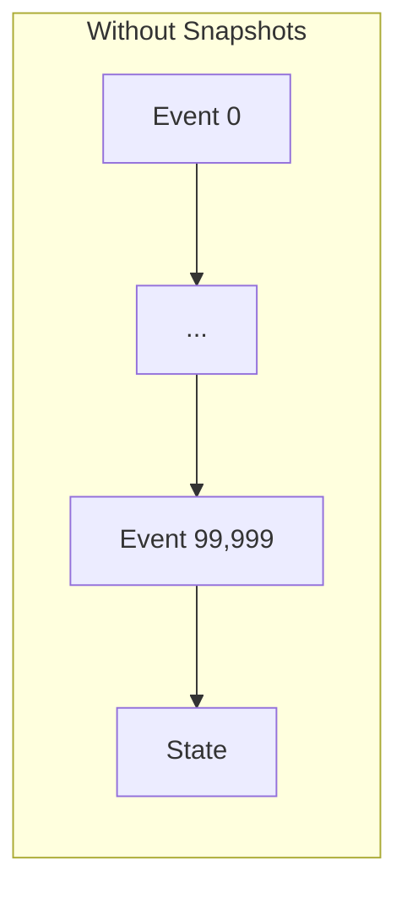
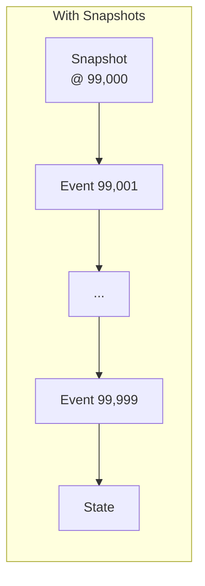
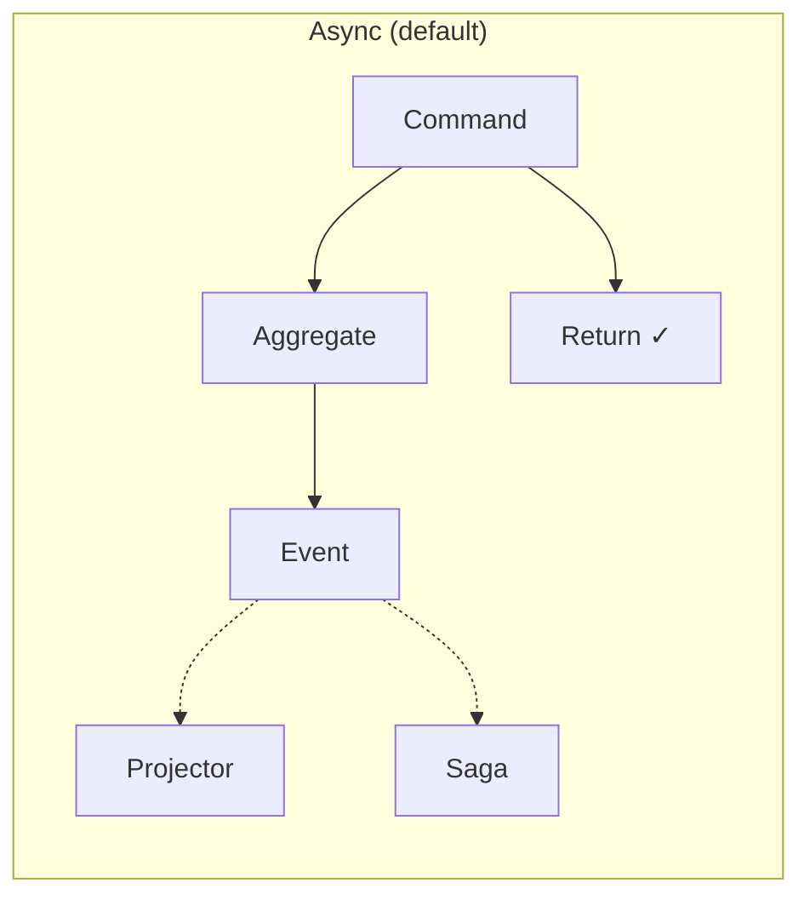
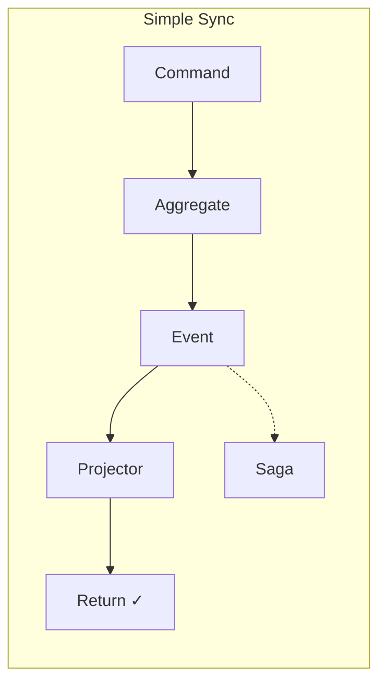
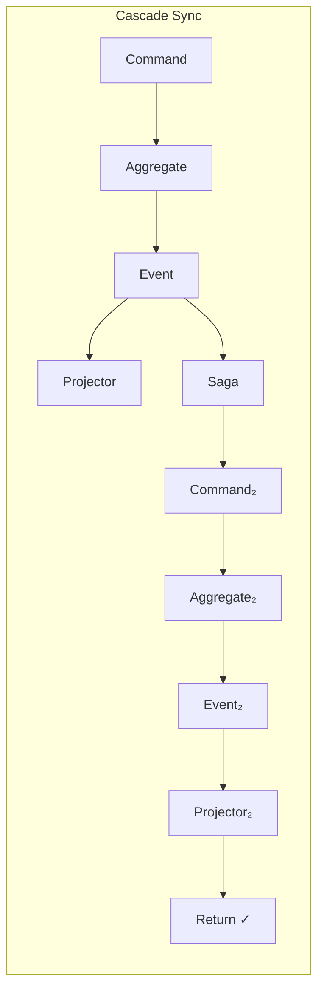
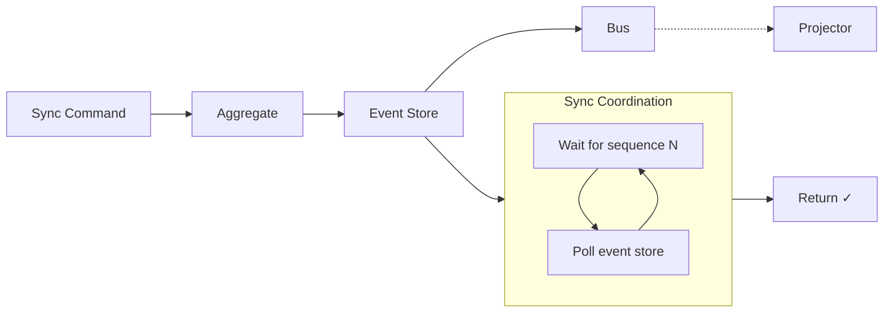
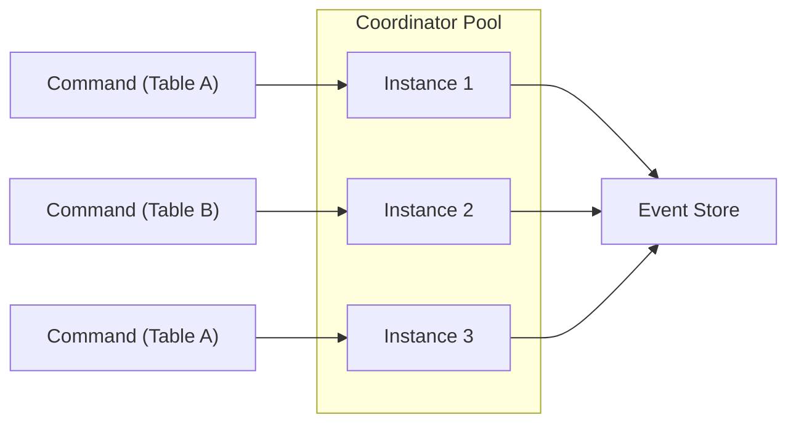
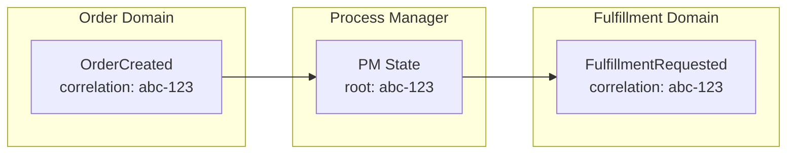

# Performance at Scale

An aggregate with a hundred thousand events. State rebuilt in fifty milliseconds.

---

## The Challenge

Event sourcing rebuilds state by replaying events. A player who's been active for years might have tens of thousands of events. Replaying them on every command would be prohibitive.

The framework provides three mechanisms: snapshots, async processing, and merge strategies.

---

## Snapshots

Snapshots cache aggregate state at intervals, eliminating the need to replay from the beginning:





Without: replay 100,000 events. With: replay 999 events.

### Client-Driven Snapshotting

The aggregate handler decides when to snapshot by including state in the EventBook:

```python title="illustrative - client-driven snapshotting"
def handle_command(cmd, event_book):
    state = build_state(event_book)
    event = compute(cmd, state)

    # Include snapshot state when appropriate
    new_state = apply_event(state, event)
    if should_snapshot(event_book, new_state):
        event_book.snapshot.state = Any.pack(new_state)

    return event_book

def should_snapshot(event_book, state):
    # Snapshot every 1000 events
    return len(event_book.pages) > 0 and state.event_count % 1000 == 0
```

The framework persists the snapshot automatically when the handler provides state. The aggregate owns the decision logic—snapshot after N events, after certain event types, or based on state size.

### On Command Arrival

The coordinator:
1. Loads the most recent snapshot (if any)
2. Replays events after that sequence
3. Applies the command to reconstructed state
4. Persists the snapshot if the handler included state

---

## Synchronicity Modes

**Prefer async.** Sync modes exist for the cases where you genuinely need them, but they work against the grain of event-sourced systems. CQRS achieves scale by decoupling writes from reads—sync modes reintroduce that coupling.

That said, sync modes have legitimate uses: user-facing flows where read-after-write consistency matters, or integration points where downstream systems expect synchronous semantics. Use them surgically, not as a default.

Trade consistency for throughput with three modes:

| Mode | Behavior | Use Case |
|------|----------|----------|
| **Async** (default) | Command returns immediately | High throughput, eventual consistency |
| **Simple** | Wait for projectors only | Read-after-write for local domain |
| **Cascade** | Wait for projectors + saga commands | Cross-domain consistency (expensive) |







Sync mode is specified per-command by the caller:

```python title="illustrative - sync mode selection"
# Async (default): fire-and-forget, high throughput
send_command(PlayerAction(action=FOLD))

# Simple sync: wait for projectors in this domain
result = send_command(
    DepositFunds(amount=1000),
    sync_mode=SyncMode.SYNC_MODE_SIMPLE,
)
# Local projections guaranteed updated

# Cascade sync: wait for full saga chain to complete
result = send_command(
    CompleteOrder(order_id=order_id),
    sync_mode=SyncMode.SYNC_MODE_CASCADE,
)
# All downstream domains have processed and projected
```

### When to Use Each

| Mode | Latency | Consistency | Example |
|------|---------|-------------|---------|
| Async | Lowest | Eventual | Player folds, leaderboard updates |
| Simple | Medium | Local read-after-write | Deposit shows in balance immediately |
| Cascade | Highest | Cross-domain | Order completion triggers fulfillment, inventory reserved |

Cascade sync follows the entire event chain: if Order → Fulfillment → Inventory, the original command won't return until Inventory's projectors complete. Use sparingly—the latency cost compounds with each hop.

Projectors and sagas are unaware of sync mode—they just process events. The framework decides whether to wait based on the command request.

### How Sync Recovery Works

Sync modes cannot simply wait for events to arrive on the bus. Events may be in-flight, delayed, or arrive out of order. To guarantee consistency, the framework **polls the event store directly**:



When a sync command completes, the coordinator knows the resulting event's sequence number. Rather than trusting the bus to deliver events in time, it:

1. Records the expected sequence for each downstream component
2. Polls the event store until those sequences appear in projector checkpoints
3. Only then returns to the caller

This bypasses the bus entirely for consistency—the event store is the source of truth.

### Why CASCADE Is Expensive

CASCADE compounds this cost at every hop:

| Hops | Operations | Example |
|------|------------|---------|
| 1 | 1 aggregate + N projectors polled | Simple sync |
| 2 | 2 aggregates + 2×N projectors polled | Order → Fulfillment |
| 3 | 3 aggregates + 3×N projectors polled | Order → Fulfillment → Inventory |

Each hop adds:
- **Event store load**: Polling queries multiply with depth
- **Latency**: Sequential waits through the saga chain
- **Coordination overhead**: Tracking sequences across domains

:::warning
CASCADE sync can easily 10× your event store read load compared to async. Profile carefully before using in hot paths. If you find yourself needing CASCADE frequently, consider whether your domain boundaries are correct—tightly coupled sync requirements often indicate domains that should be merged.
:::

---

## Merge Strategies

When concurrent commands arrive for the same aggregate, the framework must decide how to handle sequence conflicts:

```protobuf file=proto/angzarr/types.proto start=docs:start:merge_strategy end=docs:end:merge_strategy
```

### MERGE_COMMUTATIVE (Default)

When sequences mismatch, commutative merge compares **state at expected sequence** vs **state at actual sequence** to detect which fields changed. If those fields don't overlap with what the incoming command modifies, the command proceeds—the operations commute.

#### Algorithm

1. Command arrives expecting sequence N, but aggregate is at sequence M
2. Replay state at N (what the command assumed)
3. Replay state at M (current reality)
4. Diff the two states → fields changed by intervening events
5. Determine which fields the command would modify
6. If disjoint → proceed; if overlap → retry with fresh state

```text title="illustrative - disjoint fields (proceed)"
Player State @ seq 5:           Player State @ seq 6:
  bankroll: 1000                  bankroll: 1000        (unchanged)
  display_name: "Alice"           display_name: "Ace"   (changed)

Command B: DepositFunds(500) arrives expecting seq 5, aggregate at seq 6

Intervening changes: {display_name}
Command B modifies:  {bankroll}

Intersection: ∅ → disjoint → proceed without retry
```

Compare to a true conflict:

```text title="illustrative - overlapping fields (retry)"
Player State @ seq 5:           Player State @ seq 6:
  bankroll: 1000                  bankroll: 1500        (changed)

Command B: WithdrawFunds(200) arrives expecting seq 5, aggregate at seq 6

Intervening changes: {bankroll}
Command B modifies:  {bankroll}

Intersection: {bankroll} → overlap → must retry with seq 6 state
```

#### Why State Comparison

Comparing states (not events) is essential. Events describe *what happened*, but states describe *what matters*. Two events might both mention `bankroll` in their payload, but if one was a no-op or the values converged, the states may still be identical. State comparison catches the actual semantic conflict.

#### Replay RPC

The aggregate must implement a `Replay` RPC that returns state given an EventBook:

```rust title="illustrative - Replay RPC"
async fn replay(&self, events: &EventBook) -> Result<Any, Status> {
    let state = build_state_from_events(events);
    Ok(Any::pack(&state))
}
```

The framework calls this twice per conflict check—once for expected sequence, once for actual. States are then diffed using protobuf field-level comparison.

#### Graceful Degradation

If `Replay` is unimplemented or fails, commutative merge degrades to STRICT behavior: any sequence mismatch triggers retry. This is conservative—better to retry unnecessarily than risk incorrect merges.

#### Field Wildcards

When the framework cannot determine which fields a command modifies, it assumes `*` (all fields). This forces retry on any sequence mismatch. To enable fine-grained commutativity, annotate commands with their field dependencies.

#### Caller Retry Flow

When fields overlap (or STRICT mode), the framework returns `FAILED_PRECONDITION` with sequence information. **The caller is responsible for retry**:

```text title="illustrative - caller retry flow"
1. Send command expecting sequence N
2. Receive FAILED_PRECONDITION: "expected N, aggregate at M"
3. Fetch current events for the aggregate
4. Evaluate: do intervening events invalidate our intent?
5. If still valid: rebuild command with sequence M, retry
6. If invalid: abort or adjust business logic
```

The framework does not automatically return the intervening events—the caller must fetch them. This is intentional: the caller needs to evaluate whether the command still makes business sense given what happened. A blind retry could produce incorrect results.

```python title="illustrative - retry with refetch"
result = send_command(cmd, sequence=5)
if result.is_precondition_failed():
    # Fetch what happened since our last read
    events = query_events(domain, root, after_sequence=5)

    # Business decision: does our intent still hold?
    if events_invalidate_our_action(events):
        return Error("Action no longer valid")

    # Rebuild with current sequence
    new_sequence = events[-1].sequence + 1
    result = send_command(cmd, sequence=new_sequence)
```

### MERGE_STRICT

Reject if sequence doesn't match. Use for operations that must not be retried.

```text title="illustrative - strict rejection"
Command A (seq 5) succeeds
Command B (seq 5) → Rejected: sequence mismatch
```

### MERGE_AGGREGATE_HANDLES

The aggregate receives both the expected and actual state, deciding how to proceed:

```python title="illustrative - aggregate merge handler"
def handle_with_merge(
    cmd: PlaceBet,
    expected_state: HandState,
    actual_state: HandState
) -> MergeResult:
    if actual_state.phase != expected_state.phase:
        return MergeResult.reject("Hand phase changed")
    return MergeResult.proceed(compute_event(cmd, actual_state))
```

---

## Performance Patterns for Poker

| Component | Pattern | Why |
|-----------|---------|-----|
| Hand aggregate | MERGE_STRICT | Action order matters |
| Player aggregate | MERGE_COMMUTATIVE | Deposits can retry |
| Table aggregate | Snapshots @ 100 | Many events per session |
| Leaderboard projector | Async | Can lag behind |
| Balance projector | Simple sync | Visible immediately |
| Order completion | Cascade sync | Fulfillment must be ready |

---

## Benchmarking Guidance

Measure what matters for your domain:

```python title="illustrative - performance benchmarking"
# Command latency
start = time.time()
result = send_command(PlayerAction(...))
latency = time.time() - start
# Target: < 10ms for player actions

# State rebuild time
start = time.time()
state = rebuild_state(event_book)
rebuild_time = time.time() - start
# Target: < 50ms even with 100k events (with snapshots)

# Projection lag
event_time = event.timestamp
projection_time = projection.last_updated
lag = projection_time - event_time
# Target: < 100ms for async, 0 for sync
```

---

## Scaling Horizontally

Aggregate instances are stateless between requests. Each instance can handle any root—the coordinator loads the appropriate EventBook and re-initializes state on every command:



Any coordinator instance handles any root. The event store is the single source of truth—instances don't cache state across requests. This enables:

- **Horizontal scaling**: Add instances based on command throughput
- **No sticky routing**: Load balancer distributes freely
- **No cross-instance coordination**: Optimistic concurrency via sequence numbers

Scale by adding coordinator instances. The event store becomes the bottleneck at extreme scale—every command reads the aggregate's event history and writes new events. [Snapshots](#snapshots) reduce read amplification by caching state at intervals, but writes remain sequential per aggregate root.

---

## Process Managers and Correlation IDs

When workflows span multiple domains, **correlation IDs become aggregate roots** in process managers. The PM is itself an aggregate—its root is the correlation ID identifying the cross-domain process.



The correlation ID (`abc-123`) flows through all events in the workflow. The PM:

1. Receives events from multiple domains filtered by correlation ID
2. Maintains its own event-sourced state (keyed by correlation ID)
3. Emits **commands** or **facts** to other domains, preserving the correlation ID

### Commands vs Facts

Sagas and PMs can emit either:

| Output | Validation | Can Reject | Use Case |
|--------|------------|------------|----------|
| **Command** | Goes through aggregate validation | Yes | Request an action that may fail |
| **Fact** | Injected directly, bypasses validation | No | Assert external reality the aggregate must accept |

Facts represent things that have already happened—the aggregate cannot reject reality. Examples:

- "The hand says it's your turn" → Player aggregate must accept this
- "Payment processor confirmed charge" → Order aggregate must record it
- "Tournament system assigned seating" → Table aggregate must honor it

```python title="illustrative - command vs fact emission"
# Saga emitting a command (can be rejected)
yield Command(domain="player", type=DeductChips(amount=100))

# Saga emitting a fact (cannot be rejected)
yield Fact(domain="player", type=TurnAssigned(hand_id=hand_id))
```

See **[Commands vs Facts](/features/facts)** for idempotency handling, external system integration, and detailed examples.

This enables complex orchestration patterns:

| Pattern | Description |
|---------|-------------|
| **Saga** | Stateless domain translation (no PM needed) |
| **Choreography** | Domains react to events independently |
| **Orchestration** | PM coordinates sequence, handles failures |

PMs scale the same way as aggregates—each correlation ID is independent. A PM instance can handle any correlation ID; the event store partitions by root.

:::note
Sagas are stateless translators (one domain → one domain). When you need to correlate events across multiple domains or maintain workflow state, use a process manager. The correlation ID is your aggregate root.
:::

---

## See Also

- [Architecture](../architecture) — How coordinators manage aggregates
- [Commands vs Facts](./facts) — When to use facts over commands
- [Observability](./observability) — Monitoring performance
- [Operations: Infrastructure](../operations/infrastructure) — Deployment patterns
