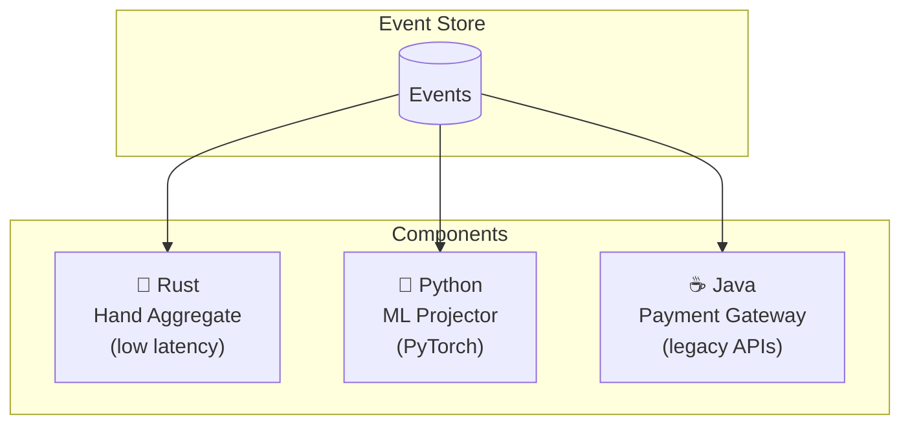

# Polyglot Architecture

Your Python team writes the ML projector. Your Rust team writes the latency-critical aggregate. Your Java team maintains the legacy integration. Same events. Same behavior.

---

## The Promise

Six languages. One event stream. Identical behavior verified by the same test suite.

| Language | Client Library | Typical Use |
|----------|----------------|-------------|
| Python | `angzarr-client` | ML projectors, analytics, scripting |
| Rust | `angzarr-client` | High-performance aggregates |
| Go | `github.com/angzarr/client` | Microservices, infrastructure |
| Java | `dev.angzarr:client` | Enterprise integrations |
| C# | `Angzarr.Client` | .NET ecosystems |
| C++ | header-only | Embedded, performance-critical |

Any language with gRPC support works. These six have thin client libraries that reduce boilerplate.

---

## Proto as Contract

The secret is Protocol Buffers. Your data model—commands, events, state—lives in `.proto` files:

```protobuf
// Shared across all languages
message PlayerActed {
  string hand_id = 1;
  string player_id = 2;
  ActionType action = 3;
  int64 amount = 4;
}

enum ActionType {
  FOLD = 0;
  CHECK = 1;
  CALL = 2;
  RAISE = 3;
  ALL_IN = 4;
}
```

Generate bindings for each language. The types are the contract.

---

## Same Behavior, Verified

All six implementations share the same Gherkin specifications:

```gherkin
# examples/features/player.feature
Scenario: Player deposits funds
  Given a registered player with $100 balance
  When they deposit $50
  Then their balance is $150
  And a FundsDeposited event is recorded
```

Each language runs these scenarios against its implementation. If the tests pass, behavior is identical.

---

## Example: Poker Platform



- **Rust**: Hand aggregate handles the hot path—player actions during live play. Microsecond latency matters.
- **Python**: ML projector consumes events for model training and real-time predictions. PyTorch integration is natural.
- **Java**: Payment gateway integration speaks to legacy banking APIs. The team already knows the ecosystem.

Each component:
- Receives the same events
- Uses the same proto types
- Deploys independently
- Tests against shared Gherkin specs

---

## Gradual Migration

Start with one language. Add others as needed.

```
Month 1: Python prototype
         └── Prove the architecture

Month 3: Rust for hot path
         └── Performance requirements emerge

Month 6: Java for banking integration
         └── Existing team, existing code

Month 12: All three in production
          └── Each optimized for its role
```

No big bang. No coordinated rewrites. Components evolve at their own pace.

---

## Team Autonomy

Different teams, different strengths:

| Team | Expertise | Responsibility |
|------|-----------|----------------|
| Core platform | Rust | Hand/table aggregates |
| Data science | Python | ML projectors, analytics |
| Integrations | Java | Payment, KYC, legacy APIs |
| Mobile API | Go | Edge services, caching |

Teams choose their tools. The event stream is the integration point.

---

## Client Library Comparison

Each library follows the same patterns:

import Tabs from '@theme/Tabs';
import TabItem from '@theme/TabItem';

<Tabs groupId="language">
<TabItem value="python" label="Python" default>

```python
@command_handler(PlayerAction)
def handle_action(cmd: PlayerAction, state: HandState, seq: int):
    if not state.is_player_turn(cmd.player_id):
        raise CommandRejectedError("Not your turn")
    return ActionRecorded(...)
```

</TabItem>
<TabItem value="rust" label="Rust">

```rust
fn handle_action(cmd: PlayerAction, state: &HandState) -> Result<ActionRecorded> {
    if !state.is_player_turn(&cmd.player_id) {
        return Err(CommandRejectedError::new("Not your turn"));
    }
    Ok(ActionRecorded { ... })
}
```

</TabItem>
<TabItem value="go" label="Go">

```go
func HandleAction(cmd *PlayerAction, state *HandState) (*ActionRecorded, error) {
    if !state.IsPlayerTurn(cmd.PlayerId) {
        return nil, angzarr.NewCommandRejectedError("Not your turn")
    }
    return &ActionRecorded{...}, nil
}
```

</TabItem>
<TabItem value="java" label="Java">

```java
public ActionRecorded handle(PlayerAction cmd, HandState state) {
    if (!state.isPlayerTurn(cmd.getPlayerId())) {
        throw CommandRejectedError.invalidArgument("Not your turn");
    }
    return ActionRecorded.newBuilder()...build();
}
```

</TabItem>
</Tabs>

Same pattern. Same semantics. Different syntax.

---

## The Framework Doesn't Care

Behind the gRPC endpoint, Angzarr sees:
- A proto request
- A proto response

Whether your handler is Python, Rust, Java, or anything else—the framework doesn't know or care. It sends commands, receives events, manages persistence.

Your code is a black box that speaks proto.

---

## See Also

- [SDKs](../sdks) — Language-specific documentation
- [Small footprint](./small-footprint) — Why handlers stay simple
- [Getting started](../getting-started) — Pick a language and begin
