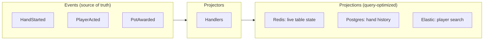

# Query-Optimized Projections

The table UI needs millisecond updates. The analytics team needs hand histories in a data warehouse. The mobile app needs a different shape entirely.

One event stream. Many projections. Each optimized for its purpose.

---

## The Concept

A **projection** is a query-optimized view built from events. It's the "read side" of CQRS—derived data structured for fast retrieval, not for recording history.



The event store is the source of truth. Projections are disposable views—rebuild any of them by replaying events.

---

## Why Multiple Projections?

Different consumers have different needs:

| Consumer | Needs | Projection |
|----------|-------|------------|
| Table UI | Real-time state, low latency | Redis cache |
| Hand history | Complete replay, searchable | Postgres with indexes |
| Player search | Full-text, fuzzy matching | Elasticsearch |
| Analytics | Aggregations, time series | Data warehouse |
| Mobile app | Minimal payload, denormalized | Custom API cache |

One event stream serves all of them. Each projection uses the storage that fits its query pattern.

---

## Projector Handlers

A projector subscribes to events and updates its storage:

```python
@projector("table-state")
class TableStateProjector:
    def __init__(self, redis: Redis):
        self.redis = redis

    @handles("PlayerSeated")
    def on_player_seated(self, event: PlayerSeated):
        self.redis.hset(
            f"table:{event.table_id}",
            f"seat:{event.seat}",
            json.dumps({"player_id": event.player_id, "stack": event.stack})
        )

    @handles("PlayerActed")
    def on_player_acted(self, event: PlayerActed):
        self.redis.hset(
            f"table:{event.table_id}",
            "last_action",
            json.dumps({"player": event.player_id, "action": event.action_type})
        )
```

The projector receives events, transforms them, and writes to its target storage. No business logic—just data transformation.

---

## Sync vs Async

| Mode | Use Case | Behavior |
|------|----------|----------|
| **Async** (default) | Analytics, indexing | Fire-and-forget, eventually consistent |
| **Sync** | Read-after-write | Command waits for projectors to complete |

Projectors just project—they don't know or care about sync mode. The **caller** specifies sync mode when sending commands:

```python
# Default: async, returns immediately
send_command(DepositFunds(amount=1000))

# Sync: framework waits for projectors, returns their results
send_command(
    DepositFunds(amount=1000),
    sync_mode=SyncMode.SYNC_MODE_SIMPLE,
)
```

The framework decides whether to return projection results to the caller. The projector code is identical either way.

---

## Rebuilding Projections

Projections are disposable—in theory. Schema change? Bug fix? Rebuild:

```bash
# Clear and rebuild from event history
angzarr projection rebuild --projector=hand-history --from=0
```

The event store is immutable. The projection is derived. You can always reconstruct.

### A Note on "Disposable"

Small projections rebuild in seconds. Large projections—years of transaction history, millions of events—can take hours and cost real money in compute and storage I/O.

Architects should plan accordingly:
- **Retention policies**: Do you need every event forever, or can older data age out?
- **Incremental rebuilds**: Can you rebuild from a checkpoint rather than from zero?
- **Backup projections**: For critical read models, consider snapshotting the projection itself
- **Cost modeling**: Estimate rebuild time and cost before assuming "we'll just rebuild"

For large projections, it may be cheaper to maintain and migrate them than to rebuild from scratch. "Disposable" means you *can* rebuild, not that you *should*.

---

## Position Tracking

The framework tracks each projector's position in the event stream:

```
Projector: hand-history
Domain: hand
Last processed: sequence 45,832
Status: caught up
```

On restart, the projector resumes from its last position. No events missed, no duplicates.

---

## Example: Hand History for Poker

```python
@projector("hand-history")
class HandHistoryProjector:
    def __init__(self, db: Database):
        self.db = db

    @handles("HandStarted")
    def on_hand_started(self, event: HandStarted):
        self.db.execute("""
            INSERT INTO hands (hand_id, table_id, started_at, blinds)
            VALUES (?, ?, ?, ?)
        """, [event.hand_id, event.table_id, event.timestamp, event.blinds])

    @handles("PlayerActed")
    def on_player_acted(self, event: PlayerActed):
        self.db.execute("""
            INSERT INTO actions (hand_id, player_id, action, amount, sequence)
            VALUES (?, ?, ?, ?, ?)
        """, [event.hand_id, event.player_id, event.action, event.amount, event.seq])

    @handles("HandComplete")
    def on_hand_complete(self, event: HandComplete):
        self.db.execute("""
            UPDATE hands
            SET winner_id = ?, final_pot = ?, completed_at = ?
            WHERE hand_id = ?
        """, [event.winner_id, event.pot, event.timestamp, event.hand_id])
```

Query the projection for fast reads:

```sql
-- Player's recent hands
SELECT * FROM hands WHERE player_id = ? ORDER BY completed_at DESC LIMIT 20;

-- Actions in a specific hand
SELECT * FROM actions WHERE hand_id = ? ORDER BY sequence;
```

---

## Multi-Domain Projectors

Projectors can subscribe to multiple domains when necessary:

```python
@projector("leaderboard")
@subscribes("player", ["PlayerRegistered", "FundsDeposited"])
@subscribes("hand", ["HandComplete"])
class LeaderboardProjector:
    @handles("HandComplete")
    def on_hand_complete(self, event: HandComplete):
        self.update_player_stats(event.winner_id, event.pot)
```

Use sparingly. Multi-domain projectors often indicate a domain boundary issue.

---

## Projection Patterns for Gaming

| Pattern | Use Case | Implementation |
|---------|----------|----------------|
| Live state | Table UI | Redis with pub/sub |
| Audit log | Compliance | Append-only Postgres |
| Analytics | Business intelligence | Snowflake/BigQuery |
| Search | Player lookup | Elasticsearch |
| Cache | API responses | Redis with TTL |

Each optimized for its query pattern. All derived from the same events.

---

## See Also

- [Projector component](../components/projector) — Implementation details
- [CloudEvents](./cloudevents) — Publishing events externally
- [Performance](./performance) — Scaling projections
