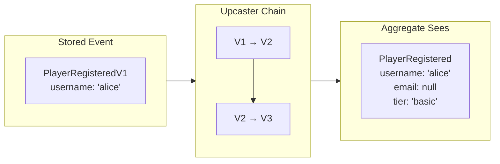

# Schema Evolution with Upcasting

Your event from 2019 still works in 2025. No migration scripts. No downtime.

---

## The Problem

Events are immutable. Once persisted, they cannot change. But schemas evolve: fields are added, types change, structures are reorganized.

Traditional migrations modify data in place—possible for current state, impossible for immutable history.

---

## The Solution: Transform at Read Time

Upcasters transform old events into new shapes when they're read, not when they're stored:



The original bytes remain untouched. The audit trail is immutable. But your aggregates always see the current schema.

---

## How It Works

Register upcasters that transform events from one type to the next:

```python title="illustrative - upcaster chain"
class PlayerUpcaster(Upcaster):
    name = "upcaster-player"
    domain = "player"

    @upcasts(PlayerRegisteredV1, PlayerRegisteredV2)
    def v1_to_v2(self, old: PlayerRegisteredV1) -> PlayerRegisteredV2:
        # V2 added email field
        return PlayerRegisteredV2(
            username=old.username,
            email=None,
        )

    @upcasts(PlayerRegisteredV2, PlayerRegistered)
    def v2_to_v3(self, old: PlayerRegisteredV2) -> PlayerRegistered:
        # Current version added tier field
        return PlayerRegistered(
            username=old.username,
            email=old.email,
            tier="basic",
        )
```

Version is encoded in the type name. The framework chains transformations: a V1 event transforms to V2, then to the current `PlayerRegistered`, arriving at your aggregate in the latest shape.

---

## Version Detection

The upcaster matches events by type URL suffix. Two common patterns:

### Package Versioning (Recommended)

Keep version in the proto package, not the type name. Cleaner organization, easier tooling:

```protobuf title="illustrative - package versioning"
// proto/myapp/v1/player.proto
package myapp.v1;
message PlayerRegistered { ... }

// proto/myapp/v2/player.proto
package myapp.v2;
message PlayerRegistered { ... }

// proto/myapp/player.proto (current)
package myapp;
message PlayerRegistered { ... }
```

Type URLs: `myapp.v1.PlayerRegistered` → `myapp.v2.PlayerRegistered` → `myapp.PlayerRegistered`

### Type Name Suffixes

Simpler for small schemas, but clutters the namespace:

```protobuf title="illustrative - type name suffixes"
message PlayerRegisteredV1 { ... }
message PlayerRegisteredV2 { ... }
message PlayerRegistered { ... }  // current
```

---

## Examples Across Languages

import Tabs from '@theme/Tabs';
import TabItem from '@theme/TabItem';

<Tabs groupId="language">
<TabItem value="python" label="Python" default>

```python
class PlayerUpcaster(Upcaster):
    name = "upcaster-player"
    domain = "player"

    @upcasts(FundsDepositedV1, FundsDeposited)
    def upcast_deposit(self, old: FundsDepositedV1) -> FundsDeposited:
        # V1 had raw int, current uses Currency
        return FundsDeposited(
            amount=Currency(amount=old.amount, currency_code="USD"),
        )
```

</TabItem>
<TabItem value="rust" label="Rust">

```rust
impl Upcaster for PlayerUpcaster {
    fn upcast(&self, event: &EventPage) -> EventPage {
        if event.type_url().ends_with("FundsDepositedV1") {
            let old: FundsDepositedV1 = event.unpack();
            let new = FundsDeposited {
                amount: Some(Currency {
                    amount: old.amount,
                    currency_code: "USD".into(),
                }),
            };
            return event.with_payload(new);
        }
        event.clone()
    }
}
```

</TabItem>
<TabItem value="go" label="Go">

```go
func (u *PlayerUpcaster) Upcast(event *pb.EventPage) *pb.EventPage {
    if strings.HasSuffix(event.TypeUrl(), "FundsDepositedV1") {
        old := &pb.FundsDepositedV1{}
        event.UnpackTo(old)
        return event.WithPayload(&pb.FundsDeposited{
            Amount: &pb.Currency{Amount: old.Amount, CurrencyCode: "USD"},
        })
    }
    return event
}
```

</TabItem>
</Tabs>

---

## Guidelines

### Keep Upcasters Pure

Upcasters should be pure functions: same input, same output. No database lookups, no external calls.

```python title="illustrative - pure vs impure upcasters"
# Good: pure transformation
def upcast(event):
    event["new_field"] = derive_from_existing(event["old_field"])
    return event

# Bad: external dependency
def upcast(event):
    event["user_name"] = db.lookup_user(event["user_id"])  # Don't do this
    return event
```

### Chain, Don't Skip

Always upcast to the next version, not directly to latest:

```python title="illustrative - chained vs skipped versions"
# Good: V1 → V2 → current
@upcasts(OrderCreatedV1, OrderCreatedV2)
def v1_to_v2(self, old): ...

@upcasts(OrderCreatedV2, OrderCreated)
def v2_to_current(self, old): ...

# Bad: skip versions
@upcasts(OrderCreatedV1, OrderCreated)
def v1_to_current(self, old): ...  # What about V2 events?
```

### Test with Real History

Your test suite should include events from every historical version:

```python title="illustrative - upcast chain test"
def test_upcast_chain():
    v1_event = load_fixture("player_registered_v1.json")
    v3_event = upcast_chain(v1_event)

    assert v3_event["email"] is None
    assert v3_event["tier"] == "basic"
```

---

## Deployment

Upcasters deploy with your application code. When you release a new version:

1. Add upcaster for old → new transformation
2. Deploy new code
3. Old events transform on read
4. New events persist in new format

No migration window. No downtime. Old and new events coexist seamlessly.

---

## See Also

- [SDK: Upcasters](../sdks) — Language-specific implementation details
- [Performance](./performance) — Snapshots reduce upcasting overhead
