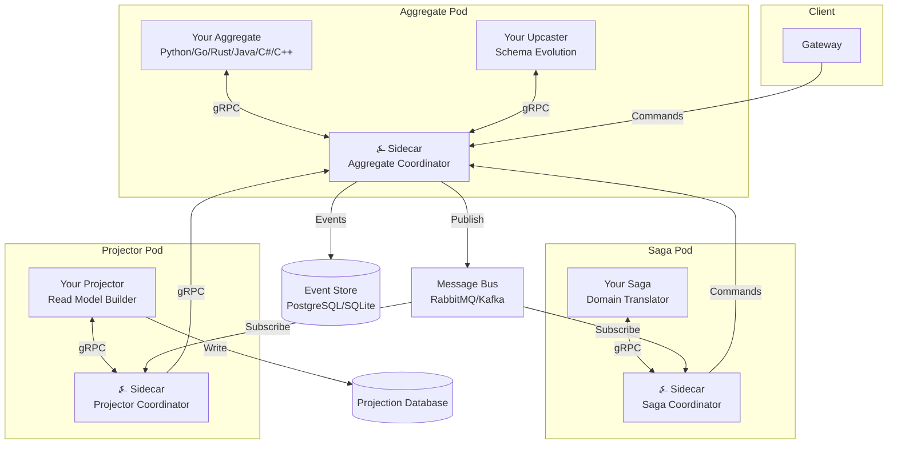

# Introduction

**⍼ Angzarr** is a polyglot CQRS/Event Sourcing framework. You write business logic in your preferred language—Python, Go, Rust, Java, C#, or C++—while the framework handles event persistence, saga coordination, projection management, and all the infrastructure complexity that typically derails CQRS/ES projects.

The symbol ⍼ (U+237C, "angzarr") has existed in Unicode since 2002 without a defined purpose. The right angle represents the origin point—your event store. The zigzag arrow represents events cascading through your system. We gave it meaning.

---

## The Problem

CQRS and Event Sourcing deliver real architectural benefits: complete audit history, temporal queries, independent read/write scaling, and natural alignment with domain-driven design. The implementation cost, however, remains steep.

⍼ Angzarr's original inspiration was **airline flight network repair after disruption**—when weather or mechanical issues cascade through a schedule, operations teams need to see exactly what happened, why decisions were made, and how to unwind partial recoveries. That domain's requirements (audit, state machines, cross-domain coordination, temporal queries) recur across industries: billing systems, insurance claims, logistics. In the author's experience, roughly **one-third of enterprise projects** exhibit these patterns. Yet most teams can't justify the infrastructure investment.

Teams attempting CQRS/ES consistently face:

- **Infrastructure gravity**: Event stores, message buses, projection databases, and their failure modes dominate early development. Business logic becomes entangled with persistence concerns.
- **Schema management**: Events are append-only and permanent. Schema evolution requires discipline that frameworks rarely enforce.
- **Operational complexity**: Snapshotting, projection rebuilds, idempotency, exactly-once delivery, and saga coordination demand specialized knowledge.
- **Language lock-in**: Most frameworks assume a single ecosystem. Organizations with mixed stacks maintain parallel implementations or force standardization.

---

## When ⍼ Angzarr Fits

⍼ Angzarr is **not** a do-everything framework. Your domain must fit these constraints:

| Requirement | Why It Matters |
|-------------|----------------|
| **Eventual consistency acceptable** | Events propagate asynchronously. If you need synchronous, strongly-consistent responses, traditional CRUD is simpler. |
| **Audit/validation important** | Event sourcing's overhead only pays off when you need to answer "what happened and why?" |
| **State reconstructable from events** | If your domain has external dependencies that can't be replayed, event sourcing won't help. |

### Probably NOT a Good Fit

- **Real-time games**: Latency-sensitive gameplay where milliseconds matter. Event sourcing adds overhead without proportional benefit.
- **Simple CRUD**: If your domain is "store this, retrieve that" without complex state transitions, use a database directly.
- **Strong consistency required**: Banking ledgers that must never show intermediate states. (Though event sourcing *can* work here with careful design.)

### The Poker Paradox

Yes, the example domain is a game. Poker works as an *example* because it exercises every pattern—but most games shouldn't use event sourcing in production. The author is developing a board game with ⍼ Angzarr, but primarily because **event logs make game flow understandable during development**, not because it's the optimal production architecture for games.

---

## The ⍼ Angzarr Approach

⍼ Angzarr inverts the typical framework relationship. Rather than providing libraries that applications import, Angzarr provides infrastructure that applications connect to via gRPC.

| You Define | You Implement | We Handle |
|------------|---------------|-----------|
| Commands in `.proto` | Aggregate handlers | Event persistence |
| Events in `.proto` | Projector handlers | Optimistic concurrency |
| Read models in `.proto` | Saga handlers | Snapshot management |
| | | Event upcasting |
| | | Event distribution |
| | | Saga coordination |
| | | Schema evolution |

Your business logic receives commands with full event history and emits events. No database connections. No message bus configuration. No retry logic. Pure domain logic.

---

## Architecture Preview

⍼ Angzarr stores aggregate history as an **EventBook**—the complete event stream for a single aggregate root: its identity (the Cover), an optional Snapshot for efficient replay, and ordered EventPages representing domain events.



Each component type runs in its own pod with an ⍼ Angzarr sidecar. Your code handles business logic; the sidecar handles persistence, messaging, and coordination.

---

## For Decision Makers

If you're evaluating Angzarr for your organization:

- **[PITCH.md](https://github.com/benjaminabbitt/angzarr/blob/main/PITCH.md)** — Complete architectural pitch (standalone document)
- **[Architecture](./architecture)** — Core concepts: data model, coordinators, sync modes
- **[Why Poker](./examples/why-poker)** — Why our example domain exercises every pattern

---

## For Developers

Ready to build:

- **[Getting Started](./getting-started)** — Prerequisites, installation, first aggregate
- **[Components](./components/aggregate)** — Aggregates, sagas, projectors, process managers
- **[Examples](./examples/aggregates)** — Code samples in all six languages

---

## Language Support

⍼ Angzarr supports any language with gRPC bindings. First-class examples are provided for:

| Language | Package | Example |
|----------|---------|---------|
| Python | `angzarr-client` | [examples/python/](https://github.com/benjaminabbitt/angzarr/tree/main/examples/python) |
| Go | `github.com/benjaminabbitt/angzarr/client` | [examples/go/](https://github.com/benjaminabbitt/angzarr/tree/main/examples/go) |
| Rust | `angzarr-client` | [examples/rust/](https://github.com/benjaminabbitt/angzarr/tree/main/examples/rust) |
| Java | `dev.angzarr:client` | [examples/java/](https://github.com/benjaminabbitt/angzarr/tree/main/examples/java) |
| C# | `Angzarr.Client` | [examples/csharp/](https://github.com/benjaminabbitt/angzarr/tree/main/examples/csharp) |
| C++ | header-only | [examples/cpp/](https://github.com/benjaminabbitt/angzarr/tree/main/examples/cpp) |

All implementations share the same Gherkin specifications, ensuring identical behavior across languages.

---

## Quick Example

The same handler across all six languages. Each follows the **guard → validate → compute** pattern:

import Tabs from '@theme/Tabs';
import TabItem from '@theme/TabItem';

<Tabs>
<TabItem value="python" label="Python" default>

```python
# examples/python/player/agg/handlers/player.py
@handles(player_proto.DepositFunds)
def deposit(self, cmd: player_proto.DepositFunds) -> player_proto.FundsDeposited:
    # Guard
    if not self.exists:
        raise CommandRejectedError("Player does not exist")

    # Validate
    amount = cmd.amount.amount if cmd.amount else 0
    if amount <= 0:
        raise CommandRejectedError("amount must be positive")

    # Compute
    new_balance = self.bankroll + amount
    return player_proto.FundsDeposited(
        amount=cmd.amount,
        new_balance=poker_types.Currency(amount=new_balance, currency_code="CHIPS"),
        deposited_at=now(),
    )
```

[View full source →](https://github.com/benjaminabbitt/angzarr/blob/main/examples/python/player/agg/handlers/player.py)

</TabItem>
<TabItem value="rust" label="Rust">

```rust
// examples/rust/player/agg/src/handlers/deposit.rs
fn guard(state: &PlayerState) -> CommandResult<()> {
    if !state.exists() {
        return Err(CommandRejectedError::new("Player does not exist"));
    }
    Ok(())
}

fn validate(cmd: &DepositFunds) -> CommandResult<i64> {
    let amount = cmd.amount.as_ref().map(|c| c.amount).unwrap_or(0);
    if amount <= 0 {
        return Err(CommandRejectedError::new("amount must be positive"));
    }
    Ok(amount)
}

fn compute(cmd: &DepositFunds, state: &PlayerState, amount: i64) -> FundsDeposited {
    let new_balance = state.bankroll + amount;
    FundsDeposited {
        amount: cmd.amount.clone(),
        new_balance: Some(Currency { amount: new_balance, currency_code: "CHIPS".into() }),
        deposited_at: Some(angzarr_client::now()),
    }
}
```

[View full source →](https://github.com/benjaminabbitt/angzarr/blob/main/examples/rust/player/agg/src/handlers/deposit.rs)

</TabItem>
<TabItem value="go" label="Go">

```go
// examples/go/player/agg/handlers/deposit.go
func guardDepositFunds(state PlayerState) error {
    if !state.Exists() {
        return angzarr.NewCommandRejectedError("Player does not exist")
    }
    return nil
}

func validateDepositFunds(cmd *examples.DepositFunds) (int64, error) {
    amount := int64(0)
    if cmd.Amount != nil {
        amount = cmd.Amount.Amount
    }
    if amount <= 0 {
        return 0, angzarr.NewCommandRejectedError("amount must be positive")
    }
    return amount, nil
}

func computeFundsDeposited(cmd *examples.DepositFunds, state PlayerState, amount int64) *examples.FundsDeposited {
    newBalance := state.Bankroll + amount
    return &examples.FundsDeposited{
        Amount:     cmd.Amount,
        NewBalance: &examples.Currency{Amount: newBalance, CurrencyCode: "CHIPS"},
    }
}
```

[View full source →](https://github.com/benjaminabbitt/angzarr/blob/main/examples/go/player/agg/handlers/deposit.go)

</TabItem>
<TabItem value="java" label="Java">

```java
// examples/java/player/agg/src/main/java/.../handlers/DepositHandler.java
public static FundsDeposited handle(DepositFunds cmd, PlayerState state) {
    // Guard
    if (!state.exists()) {
        throw Errors.CommandRejectedError.preconditionFailed("Player does not exist");
    }

    // Validate
    long amount = cmd.hasAmount() ? cmd.getAmount().getAmount() : 0;
    if (amount <= 0) {
        throw Errors.CommandRejectedError.invalidArgument("amount must be positive");
    }

    // Compute
    long newBalance = state.getBankroll() + amount;
    return FundsDeposited.newBuilder()
        .setAmount(cmd.getAmount())
        .setNewBalance(Currency.newBuilder().setAmount(newBalance).setCurrencyCode("CHIPS"))
        .build();
}
```

[View full source →](https://github.com/benjaminabbitt/angzarr/blob/main/examples/java/player/agg/src/main/java/dev/angzarr/examples/player/handlers/DepositHandler.java)

</TabItem>
<TabItem value="csharp" label="C#">

```csharp
// examples/csharp/Player/Agg/Handlers/DepositHandler.cs
public static FundsDeposited Handle(DepositFunds cmd, PlayerState state)
{
    // Guard
    if (!state.Exists)
        throw CommandRejectedError.PreconditionFailed("Player does not exist");

    // Validate
    var amount = cmd.Amount?.Amount ?? 0;
    if (amount <= 0)
        throw CommandRejectedError.InvalidArgument("amount must be positive");

    // Compute
    var newBalance = state.Bankroll + amount;
    return new FundsDeposited
    {
        Amount = cmd.Amount,
        NewBalance = new Currency { Amount = newBalance, CurrencyCode = "CHIPS" },
    };
}
```

[View full source →](https://github.com/benjaminabbitt/angzarr/blob/main/examples/csharp/Player/Agg/Handlers/DepositHandler.cs)

</TabItem>
<TabItem value="cpp" label="C++">

```cpp
// examples/cpp/player/agg/handlers/deposit_handler.cpp
examples::FundsDeposited handle_deposit(const examples::DepositFunds& cmd, const PlayerState& state) {
    // Guard
    if (!state.exists()) {
        throw angzarr::CommandRejectedError::precondition_failed("Player does not exist");
    }

    // Validate
    int64_t amount = cmd.has_amount() ? cmd.amount().amount() : 0;
    if (amount <= 0) {
        throw angzarr::CommandRejectedError::invalid_argument("amount must be positive");
    }

    // Compute
    int64_t new_balance = state.bankroll + amount;
    examples::FundsDeposited event;
    event.mutable_amount()->CopyFrom(cmd.amount());
    event.mutable_new_balance()->set_amount(new_balance);
    event.mutable_new_balance()->set_currency_code("CHIPS");
    return event;
}
```

[View full source →](https://github.com/benjaminabbitt/angzarr/blob/main/examples/cpp/player/agg/handlers/deposit_handler.cpp)

</TabItem>
</Tabs>

**No database code. No message bus code. Just business logic.**

---

## Next Steps

1. **Understand the concepts** — [CQRS & Event Sourcing](./concepts/cqrs-event-sourcing)
2. **See the architecture** — [Architecture](./architecture)
3. **Get hands-on** — [Getting Started](./getting-started)
