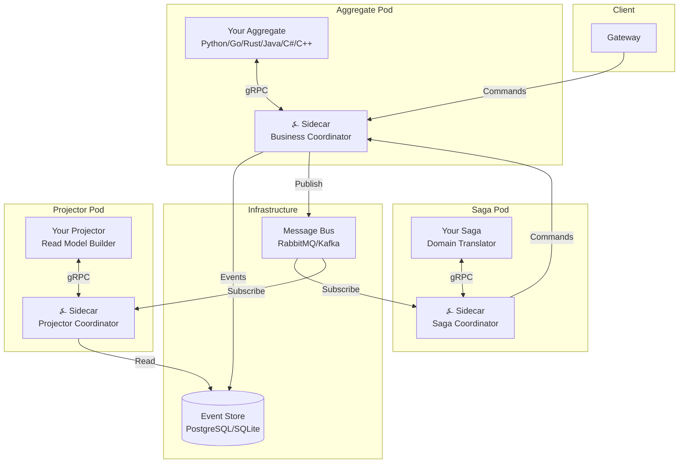

# Introduction

**⍼ Angzarr** is a polyglot CQRS/Event Sourcing framework. You write business logic in your preferred language—Python, Go, Rust, Java, C#, or C++—while the framework handles event persistence, saga coordination, projection management, and all the infrastructure complexity that typically derails CQRS/ES projects.

The symbol ⍼ (U+237C, "angzarr") has existed in Unicode since 2002 without a defined purpose. The right angle represents the origin point—your event store. The zigzag arrow represents events cascading through your system. We gave it meaning.

---

## The Problem

CQRS and Event Sourcing deliver real architectural benefits: complete audit history, temporal queries, independent read/write scaling, and natural alignment with domain-driven design. The implementation cost, however, remains steep.

⍼ Angzarr's original inspiration was **airline flight network repair after disruption**—when weather or mechanical issues cascade through a schedule, operations teams need to see exactly what happened, why decisions were made, and how to unwind partial recoveries. That domain's requirements (audit, state machines, cross-domain coordination, temporal queries) recur across industries: billing systems, insurance claims, logistics. In the author's experience, roughly **one-third of enterprise projects** exhibit these patterns. Yet most teams can't justify the infrastructure investment.

Teams attempting CQRS/ES consistently face:

- **Infrastructure gravity**: Event stores, message buses, projection databases, and their failure modes dominate early development. Business logic becomes entangled with persistence concerns.
- **Schema management**: Events are append-only and permanent. Schema evolution requires discipline that frameworks rarely enforce.
- **Operational complexity**: Snapshotting, projection rebuilds, idempotency, exactly-once delivery, and saga coordination demand specialized knowledge.
- **Language lock-in**: Most frameworks assume a single ecosystem. Organizations with mixed stacks maintain parallel implementations or force standardization.

---

## When ⍼ Angzarr Fits

⍼ Angzarr is **not** a do-everything framework. Your domain must fit these constraints:

| Requirement | Why It Matters |
|-------------|----------------|
| **Eventual consistency acceptable** | Events propagate asynchronously. If you need synchronous, strongly-consistent responses, traditional CRUD is simpler. |
| **Audit/validation important** | Event sourcing's overhead only pays off when you need to answer "what happened and why?" |
| **State reconstructable from events** | If your domain has external dependencies that can't be replayed, event sourcing won't help. |

### Probably NOT a Good Fit

- **Real-time games**: Latency-sensitive gameplay where milliseconds matter. Event sourcing adds overhead without proportional benefit.
- **Simple CRUD**: If your domain is "store this, retrieve that" without complex state transitions, use a database directly.
- **Strong consistency required**: Banking ledgers that must never show intermediate states. (Though event sourcing *can* work here with careful design.)

### The Poker Paradox

Yes, the example domain is a game. Poker works as an *example* because it exercises every pattern—but most games shouldn't use event sourcing in production. The author is developing a board game with ⍼ Angzarr, but primarily because **event logs make game flow understandable during development**, not because it's the optimal production architecture for games.

---

## The ⍼ Angzarr Approach

⍼ Angzarr inverts the typical framework relationship. Rather than providing libraries that applications import, Angzarr provides infrastructure that applications connect to via gRPC.

| You Define | You Implement | We Handle |
|------------|---------------|-----------|
| Commands in `.proto` | Aggregate handlers | Event persistence |
| Events in `.proto` | Projector handlers | Optimistic concurrency |
| Read models in `.proto` | Saga handlers | Snapshot management |
| | | Event upcasting |
| | | Event distribution |
| | | Saga coordination |
| | | Schema evolution |

Your business logic receives commands with full event history and emits events. No database connections. No message bus configuration. No retry logic. Pure domain logic.

---

## Architecture Preview

⍼ Angzarr models event-sourced aggregates as **books**. An EventBook contains the complete history of an aggregate: its identity (the Cover), an optional Snapshot for efficient replay, and ordered EventPages representing domain events.



Each component type runs in its own pod with an ⍼ Angzarr sidecar. Your code handles business logic; the sidecar handles persistence, messaging, and coordination.

---

## For Decision Makers

If you're evaluating Angzarr for your organization:

- **[PITCH.md](https://github.com/angzarr/angzarr/blob/main/PITCH.md)** — Complete architectural pitch (standalone document)
- **[Architecture](./architecture)** — Core concepts: book metaphor, coordinators, sync modes
- **[Why Poker](./examples/why-poker)** — Why our example domain exercises every pattern

---

## For Developers

Ready to build:

- **[Getting Started](./getting-started)** — Prerequisites, installation, first aggregate
- **[Components](./components/aggregate)** — Aggregates, sagas, projectors, process managers
- **[Examples](./examples/aggregates)** — Code samples in all six languages

---

## Language Support

⍼ Angzarr supports any language with gRPC bindings. First-class examples are provided for:

| Language | Package | Example |
|----------|---------|---------|
| Python | `angzarr-client` | [examples/python/](https://github.com/angzarr/angzarr/tree/main/examples/python) |
| Go | `github.com/angzarr/client-go` | [examples/go/](https://github.com/angzarr/angzarr/tree/main/examples/go) |
| Rust | `angzarr-client` | [examples/rust/](https://github.com/angzarr/angzarr/tree/main/examples/rust) |
| Java | `dev.angzarr:client` | [examples/java/](https://github.com/angzarr/angzarr/tree/main/examples/java) |
| C# | `Angzarr.Client` | [examples/csharp/](https://github.com/angzarr/angzarr/tree/main/examples/csharp) |
| C++ | header-only | [examples/cpp/](https://github.com/angzarr/angzarr/tree/main/examples/cpp) |

All implementations share the same Gherkin specifications, ensuring identical behavior across languages.

---

## Quick Example

A complete aggregate handler in ~50 lines:

```python
from angzarr_client import CommandRouter, errmsg
from proto.player_pb2 import RegisterPlayer, DepositFunds, PlayerRegistered, FundsDeposited
from state import PlayerState, build_state

def handle_register(state: PlayerState, cmd: RegisterPlayer) -> PlayerRegistered:
    # GUARD: check state preconditions
    if state.registered:
        raise CommandRejectedError(errmsg.ALREADY_REGISTERED)

    # VALIDATE: check command inputs
    if not cmd.username:
        raise CommandRejectedError(errmsg.USERNAME_REQUIRED)

    # COMPUTE: produce event
    return PlayerRegistered(
        username=cmd.username,
        initial_bankroll=cmd.initial_bankroll,
    )

def handle_deposit(state: PlayerState, cmd: DepositFunds) -> FundsDeposited:
    if not state.registered:
        raise CommandRejectedError(errmsg.NOT_REGISTERED)
    if cmd.amount <= 0:
        raise CommandRejectedError(errmsg.AMOUNT_POSITIVE)

    return FundsDeposited(
        amount=cmd.amount,
        new_bankroll=state.bankroll + cmd.amount,
    )

router = CommandRouter("player", build_state)
    .on("RegisterPlayer", handle_register)
    .on("DepositFunds", handle_deposit)
```

No database code. No message bus code. Just business logic.

---

## Next Steps

1. **Understand the concepts** — [CQRS & Event Sourcing](./concepts/cqrs-event-sourcing)
2. **See the architecture** — [Architecture](./architecture)
3. **Get hands-on** — [Getting Started](./getting-started)
