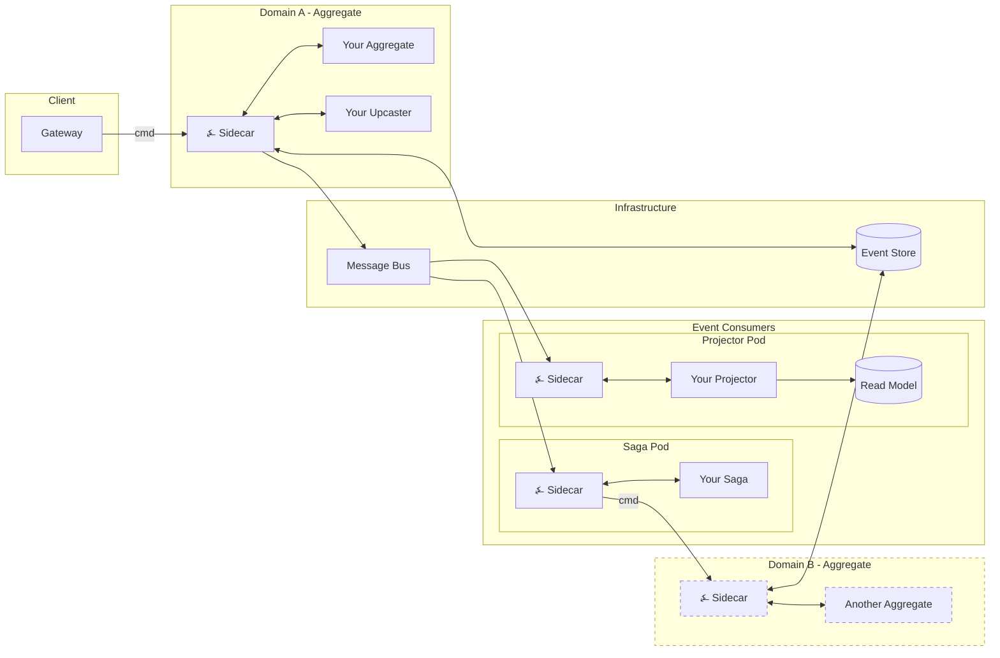

# Introduction to Angzarr

import Tabs from '@theme/Tabs';
import TabItem from '@theme/TabItem';

**⍼ Angzarr** is a polyglot framework for building event-sourced systems. You write business logic in any language with [gRPC support](https://grpc.io/docs/languages/)—the framework handles event persistence, saga coordination, projection management, and all the infrastructure complexity that typically derails CQRS/ES projects.

The symbol ⍼ (U+237C, "angzarr") has existed in Unicode since 2002 without a defined purpose. The right angle represents the origin point—your event store. The zigzag arrow represents events cascading through your system. We gave it meaning.

:::caution Project Status

This codebase uses **AI-generated code under human supervision**. The implementation has been reviewed, but with an emphasis on velocity over thoroughness.

This is not AI slop. The gRPC/protobuf definitions were hand-written and have evolved with heavy oversight. The architecture and code derive from an earlier human-written Go codebase—ported to Rust and used as the starting point—when the author switched for performance, binary size, and cleaner deployment mechanisms. Polyglot support has always been a core design goal—world domination requires meeting developers where they are. Architecturally, it's sound—the framework design reflects years of thinking about CQRS/ES patterns.

**Approaching production-ready, but not there yet.** The code is stabilizing and mostly working, but plan for additional testing and hardening before production deployment.

Contributors are welcome. There are a few rough edges, but mostly the project needs code review, test coverage expansion, and developers willing to build on it and report what breaks. If you're interested in CQRS/ES tooling and want to be an early adopter, jump in.

:::

---

## What Angzarr Provides

Angzarr inverts the typical framework relationship. Rather than providing libraries that applications import, Angzarr provides infrastructure that applications connect to via gRPC.

**Your data model lives in `.proto` files, not code.** Commands, events, and state are defined as Protocol Buffer messages—language-neutral, versionable, and shared across all implementations. This is what enables true polyglot support: the same event stream can be produced by a Rust aggregate and consumed by a Python projector.

| You Define | You Implement | We Handle |
|------------|---------------|-----------|
| Commands in `.proto` | Aggregate handlers | Event persistence |
| Events in `.proto` | Projector handlers | Optimistic concurrency |
| State in `.proto` | Saga handlers | Snapshot management |
| | | Event upcasting |
| | | Event distribution |
| | | Saga coordination |
| | | Schema evolution |

Your business logic receives commands with full event history and emits events. No database connections. No message bus configuration. No retry logic. Pure domain logic.

---

## Architecture Preview

⍼ Angzarr stores aggregate history as an **EventBook**—the complete event stream for a single aggregate root: its identity (the Cover), an optional Snapshot for efficient replay, and ordered EventPages representing domain events.


```mermaid
flowchart LR
    subgraph Client
        GW[Gateway]
    end

    subgraph AggPod[Domain A - Aggregate]
        AGG_COORD[⍼ Sidecar]
        AGG[Your Aggregate]
        UPC[Your Upcaster]
        AGG_COORD <--> AGG
        AGG_COORD <--> UPC
    end

    subgraph Infra[Infrastructure]
        ES[(Event Store)]
        BUS[Message Bus]
    end

    subgraph Consumers[Event Consumers]
        subgraph SagaPod[Saga Pod]
            SAGA_COORD[⍼ Sidecar]
            SAGA[Your Saga]
            SAGA_COORD <--> SAGA
        end

        subgraph PrjPod[Projector Pod]
            PRJ_COORD[⍼ Sidecar]
            PRJ[Your Projector]
            PRJ_DB[(Read Model)]
            PRJ_COORD <--> PRJ
            PRJ --> PRJ_DB
        end
    end

    subgraph AggPod2[Domain B - Aggregate]
        AGG_COORD2[⍼ Sidecar]
        AGG2[Another Aggregate]
        AGG_COORD2 <--> AGG2
    end

    GW -->|cmd| AGG_COORD
    AGG_COORD <--> ES
    AGG_COORD --> BUS
    BUS --> SAGA_COORD
    BUS --> PRJ_COORD
    SAGA_COORD -->|cmd| AGG_COORD2
    AGG_COORD2 <--> ES

    style AggPod2 stroke-dasharray: 5 5
    style AGG_COORD2 stroke-dasharray: 5 5
    style AGG2 stroke-dasharray: 5 5
```

*The dashed Domain B represents any additional domain(s)—sagas bridge events from one domain to commands in another. Real systems have multiple domains, each with its own aggregate.*

Each component type runs in its own pod with an ⍼ Angzarr sidecar. Your code handles business logic; the sidecar handles persistence, messaging, and coordination.

---

## Language Support

**Any language with gRPC support works.** Your business logic communicates with ⍼ Angzarr coordinators via gRPC—the framework doesn't care what's behind the endpoint. If your language appears on the [gRPC supported languages matrix](https://grpc.io/docs/languages/), you can use it with Angzarr. This includes C#, C++, Dart, Go, Java, Kotlin, Node.js, Objective-C, PHP, Python, Ruby, Rust, and more.

**Client libraries are optional and minimal.** For six languages (the top TIOBE languages), we provide thin client libraries that reduce boilerplate—protobuf packing/unpacking, state reconstruction, router registration. These libraries are intentionally kept lightweight; the real contract is just gRPC + protobuf. You can always work directly with the proto bindings if you prefer:

| Language | Client Library | Example |
|----------|----------------|---------|
| Python | `angzarr-client` | [examples/python/](https://github.com/benjaminabbitt/angzarr/tree/main/examples/python) |
| Go | `github.com/benjaminabbitt/angzarr/client` | [examples/go/](https://github.com/benjaminabbitt/angzarr/tree/main/examples/go) |
| Rust | `angzarr-client` | [examples/rust/](https://github.com/benjaminabbitt/angzarr/tree/main/examples/rust) |
| Java | `dev.angzarr:client` | [examples/java/](https://github.com/benjaminabbitt/angzarr/tree/main/examples/java) |
| C# | `Angzarr.Client` | [examples/csharp/](https://github.com/benjaminabbitt/angzarr/tree/main/examples/csharp) |
| C++ | header-only | [examples/cpp/](https://github.com/benjaminabbitt/angzarr/tree/main/examples/cpp) |

All six implementations share the same Gherkin specifications, ensuring identical behavior across languages.

---

## Quick Example

Two styles, same behavior: **Functional** (pure functions) and **OO** (class-based with decorators).

<Tabs groupId="style">
<TabItem value="functional" label="Functional" default>

Free functions following **guard → validate → compute**. Easy to unit test—call directly with state, assert on output.

<Tabs groupId="language">
<TabItem value="python" label="Python" default>

```python file=examples/python/player/agg/handlers/commands.py start=docs:start:deposit_guard end=docs:end:deposit_compute
```

</TabItem>
<TabItem value="rust" label="Rust">

```rust file=examples/rust/player/agg/src/handlers/deposit.rs start=docs:start:deposit_guard end=docs:end:deposit_compute
```

</TabItem>
<TabItem value="go" label="Go">

```go file=examples/go/player/agg/handlers/deposit.go start=docs:start:deposit_guard end=docs:end:deposit_compute
```

</TabItem>
<TabItem value="java" label="Java">

```java file=examples/java/player/agg/src/main/java/dev/angzarr/examples/player/handlers/DepositHandler.java start=docs:start:deposit_guard end=docs:end:deposit_compute
```

</TabItem>
<TabItem value="csharp" label="C#">

```csharp file=examples/csharp/Player/Agg/Handlers/DepositHandler.cs start=docs:start:deposit_guard end=docs:end:deposit_compute
```

</TabItem>
<TabItem value="cpp" label="C++">

```cpp file=examples/cpp/player/agg/handlers/deposit_handler.cpp start=docs:start:deposit_guard end=docs:end:deposit_compute
```

</TabItem>
</Tabs>

</TabItem>
<TabItem value="oo" label="OO">

Class-based handlers with decorator/annotation registration. State managed by base class.

<Tabs groupId="language-oo">
<TabItem value="python" label="Python" default>

```python file=examples/python/table/agg/handlers/table.py start=docs:start:oo_handlers end=docs:end:oo_handlers
```

</TabItem>
<TabItem value="rust" label="Rust">

```rust file=examples/rust/table/agg-oo/src/main.rs start=docs:start:oo_handlers end=docs:end:oo_handlers
```

</TabItem>
<TabItem value="go" label="Go">

```go file=examples/go/hand/agg/hand.go start=docs:start:oo_handlers end=docs:end:oo_handlers
```

</TabItem>
<TabItem value="java" label="Java">

```java file=examples/java/player/agg/src/main/java/dev/angzarr/examples/player/Player.java start=docs:start:deposit_oo end=docs:end:deposit_oo
```

</TabItem>
<TabItem value="csharp" label="C#">

```csharp file=examples/csharp/Player/Agg/Player.cs start=docs:start:deposit_oo end=docs:end:deposit_oo
```

</TabItem>
<TabItem value="cpp" label="C++">

```cpp file=examples/cpp/player/agg/src/player.cpp start=docs:start:oo_handlers end=docs:end:oo_handlers
```

</TabItem>
</Tabs>

</TabItem>
</Tabs>

**No database code. No message bus code. Just business logic.**

---

## For Decision Makers

If you're evaluating Angzarr for your organization:

- **[Technical Pitch](/pitch)** — Complete architectural pitch with detailed rationale
- **[Architecture](./architecture)** — Core concepts: data model, coordinators, sync modes
- **[Why Poker](./examples/why-poker)** — Why our example domain exercises every pattern

---

## For Developers

Ready to build:

- **[Getting Started](./getting-started)** — Prerequisites, installation, first aggregate
- **[Components](./components/aggregate)** — Aggregates, sagas, projectors, process managers
- **[Examples](./examples/aggregates)** — Code samples in all six languages

---

## Next Steps

1. **Understand the patterns** — [CQRS & Event Sourcing Explained](./patterns-explained)
2. **See the architecture** — [Architecture](./architecture)
3. **Get hands-on** — [Getting Started](./getting-started)
