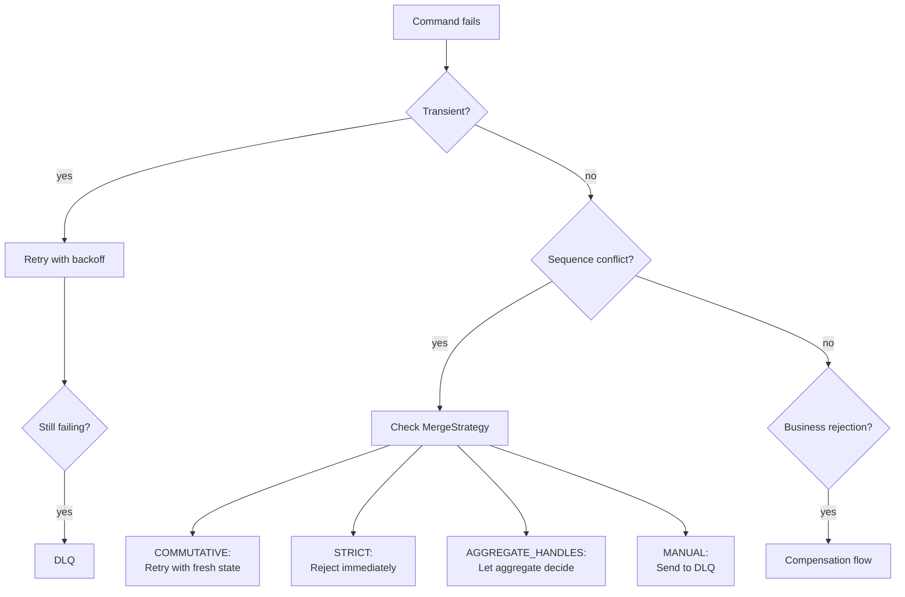

import Tabs from '@theme/Tabs';
import TabItem from '@theme/TabItem';

# Error Recovery

Angzarr provides layered error recovery: automatic retry for transient failures, dead letter queues for persistent failures, and compensation flows for saga rejections.

---

## Overview



---

## Retry with Backoff

Transient failures (network issues, temporary unavailability) are automatically retried with exponential backoff and jitter.

### Default Backoff Policies

| Context | Min Delay | Max Delay | Max Attempts | Jitter |
|---------|-----------|-----------|--------------|--------|
| Saga/PM commands | 10ms | 2s | 10 | Yes |
| gRPC connections | 100ms | 5s | 30 | Yes |

### Retryable vs Non-Retryable Errors

| gRPC Code | Meaning | Retryable? | Action |
|-----------|---------|------------|--------|
| `FAILED_PRECONDITION` | Sequence mismatch (stale client state) | Yes | Fetch fresh state, rebuild command |
| `ABORTED` | Sent to DLQ (MERGE_MANUAL) | No | Manual intervention required |
| `INVALID_ARGUMENT` | Bad command data | No | Fix command, resubmit |
| `NOT_FOUND` | Aggregate doesn't exist | No | Check aggregate ID |
| `INTERNAL` | Server error | No | Check server logs |

### Retry Flow

```
1. Command fails with FAILED_PRECONDITION
2. Error details contain current EventBook
3. Client extracts EventBook from error
4. Client rebuilds command with correct sequence
5. Client resubmits
6. Repeat until success or max attempts
```

<Tabs groupId="language">
<TabItem value="rust" label="Rust" default>

```rust
// Extract fresh state from sequence mismatch error
fn handle_sequence_error(status: &Status) -> Option<EventBook> {
    if status.code() == Code::FailedPrecondition {
        // EventBook is serialized in status details
        let details = status.details();
        if !details.is_empty() {
            return EventBook::decode(details).ok();
        }
    }
    None
}

// Retry loop with backoff
async fn execute_with_retry(
    mut command: CommandBook,
    client: &mut AggregateClient,
) -> Result<EventBook, Status> {
    let backoff = saga_backoff();
    let mut delays = backoff.build();

    loop {
        match client.execute(command.clone()).await {
            Ok(events) => return Ok(events),
            Err(status) if status.code() == Code::FailedPrecondition => {
                if let Some(delay) = delays.next() {
                    // Extract fresh state and rebuild command
                    if let Some(current) = handle_sequence_error(&status) {
                        command.pages[0].sequence = current.next_sequence;
                    }
                    tokio::time::sleep(delay).await;
                } else {
                    return Err(status); // Max retries exceeded
                }
            }
            Err(status) => return Err(status), // Non-retryable
        }
    }
}
```

</TabItem>
<TabItem value="python" label="Python">

```python
import grpc
from angzarr_client.proto import EventBook

def handle_sequence_error(error: grpc.RpcError) -> EventBook | None:
    """Extract fresh state from sequence mismatch error."""
    if error.code() == grpc.StatusCode.FAILED_PRECONDITION:
        details = error.trailing_metadata()
        for key, value in details:
            if key == "grpc-status-details-bin":
                return EventBook.FromString(value)
    return None

async def execute_with_retry(
    command: CommandBook,
    client: AggregateClient,
    max_attempts: int = 10,
) -> EventBook:
    """Execute command with exponential backoff retry."""
    delay = 0.01  # Start at 10ms

    for attempt in range(max_attempts):
        try:
            return await client.execute(command)
        except grpc.RpcError as e:
            if e.code() == grpc.StatusCode.FAILED_PRECONDITION:
                # Extract fresh state and rebuild
                if current := handle_sequence_error(e):
                    command.pages[0].sequence = current.next_sequence

                await asyncio.sleep(delay)
                delay = min(delay * 2, 2.0)  # Cap at 2s
            else:
                raise  # Non-retryable

    raise RuntimeError("Max retry attempts exceeded")
```

</TabItem>
<TabItem value="go" label="Go">

```go
import (
    "google.golang.org/grpc/codes"
    "google.golang.org/grpc/status"
    pb "github.com/angzarr/angzarr/proto/angzarr"
)

// handleSequenceError extracts fresh state from error details
func handleSequenceError(err error) *pb.EventBook {
    st, ok := status.FromError(err)
    if !ok || st.Code() != codes.FailedPrecondition {
        return nil
    }

    details := st.Details()
    for _, detail := range details {
        if eb, ok := detail.(*pb.EventBook); ok {
            return eb
        }
    }
    return nil
}

// executeWithRetry retries with exponential backoff
func executeWithRetry(
    ctx context.Context,
    command *pb.CommandBook,
    client pb.AggregateClient,
) (*pb.EventBook, error) {
    delay := 10 * time.Millisecond
    maxDelay := 2 * time.Second
    maxAttempts := 10

    for attempt := 0; attempt < maxAttempts; attempt++ {
        events, err := client.Execute(ctx, command)
        if err == nil {
            return events, nil
        }

        st, _ := status.FromError(err)
        if st.Code() == codes.FailedPrecondition {
            // Extract fresh state and rebuild
            if current := handleSequenceError(err); current != nil {
                command.Pages[0].Sequence = current.NextSequence
            }

            time.Sleep(delay)
            delay = min(delay*2, maxDelay)
        } else {
            return nil, err // Non-retryable
        }
    }

    return nil, fmt.Errorf("max retry attempts exceeded")
}
```

</TabItem>
</Tabs>

---

## Dead Letter Queue (DLQ)

Messages that cannot be processed after retries are routed to a dead letter queue for manual intervention.

### When Messages Go to DLQ

| Scenario | MergeStrategy | Result |
|----------|---------------|--------|
| Sequence mismatch | `MERGE_MANUAL` | Immediate DLQ |
| Event handler failed | Any | DLQ after retries |
| Payload retrieval failed | Any | DLQ |
| Max retries exceeded | `COMMUTATIVE` | DLQ |

### Topic Naming

DLQ topics are per-domain for isolation:

```
angzarr.dlq.{domain}
```

Examples:
- `angzarr.dlq.player` — Player domain failures
- `angzarr.dlq.hand` — Hand domain failures
- `angzarr.dlq.table` — Table domain failures

### Dead Letter Structure

```protobuf file=../../../proto/angzarr/types.proto start=docs:start:dead_letter end=docs:end:dead_letter
```

### DLQ Backends

| Backend | Topic Format | Use Case |
|---------|--------------|----------|
| Channel | In-memory | Standalone mode, testing |
| AMQP | `angzarr.dlq` exchange | RabbitMQ production |
| Kafka | `angzarr-dlq-{domain}` | Kafka production |
| Pub/Sub | `angzarr-dlq-{domain}` | GCP production |
| SNS/SQS | `angzarr-dlq-{domain}` | AWS production |

### Configuration

```yaml
dlq:
  backend: amqp  # none | channel | amqp | kafka | pubsub | sns_sqs
  amqp_url: "amqp://localhost:5672"
  # OR
  kafka_brokers: "localhost:9092"
  # OR
  aws_region: "us-east-1"
  aws_endpoint_url: "http://localhost:4566"  # LocalStack
```

### Processing DLQ Messages

Dead letters require manual review. Common actions:

1. **Fix and replay** — Correct the issue, resubmit command
2. **Skip** — Mark as handled without replay (data not critical)
3. **Compensate** — Emit compensating events manually
4. **Escalate** — Route to operations team

---

## Saga Compensation

When a saga-issued command is rejected, angzarr notifies the original aggregate so it can emit compensation events.

### Compensation Flow

```
1. Saga emits command to target aggregate
2. Target aggregate rejects (business rule violation)
3. Framework builds RejectionNotification
4. Framework sends Notification to source aggregate
5. Source aggregate emits compensation events
   OR
   Source aggregate returns RevocationResponse flags
```

### Notification vs Event

| Aspect | Notification | Event |
|--------|--------------|-------|
| Persisted? | No | Yes |
| Sequence? | No | Yes |
| Replay? | No | Yes |
| Purpose | Signaling | State change |

Notifications are ephemeral signals — they trigger behavior but aren't part of the event stream.

### RejectionNotification

```protobuf file=../../../proto/angzarr/types.proto start=docs:start:rejection_notification end=docs:end:rejection_notification
```

### Handling Rejections

The source aggregate registers rejection handlers using `@rejected` decorators. The framework dispatches based on the rejected command's domain and type — no if/else chains needed.

<Tabs groupId="language">
<TabItem value="python" label="Python" default>

**[`examples/python/player/agg/handlers/player.py`](https://github.com/benjaminabbitt/angzarr/blob/main/examples/python/player/agg/handlers/player.py)**

```python file=examples/python/player/agg/handlers/player.py start=docs:start:rejected_handler end=docs:end:rejected_handler
```

</TabItem>
<TabItem value="rust" label="Rust">

**[`examples/rust/player/agg/src/handlers/rejected.rs`](https://github.com/benjaminabbitt/angzarr/blob/main/examples/rust/player/agg/src/handlers/rejected.rs)**

```rust file=examples/rust/player/agg/src/handlers/rejected.rs start=docs:start:rejected_handler end=docs:end:rejected_handler
```

</TabItem>
<TabItem value="go" label="Go">

**[`examples/go/player/agg/handlers/revocation.go`](https://github.com/benjaminabbitt/angzarr/blob/main/examples/go/player/agg/handlers/revocation.go)**

```go file=examples/go/player/agg/handlers/revocation.go start=docs:start:rejected_handler end=docs:end:rejected_handler
```

</TabItem>
<TabItem value="java" label="Java">

**[`examples/java/player/agg/src/main/java/dev/angzarr/examples/player/Player.java`](https://github.com/benjaminabbitt/angzarr/blob/main/examples/java/player/agg/src/main/java/dev/angzarr/examples/player/Player.java)**

```java file=examples/java/player/agg/src/main/java/dev/angzarr/examples/player/Player.java start=docs:start:rejected_handler end=docs:end:rejected_handler
```

</TabItem>
<TabItem value="csharp" label="C#">

**[`examples/csharp/Player/Agg/Player.cs`](https://github.com/benjaminabbitt/angzarr/blob/main/examples/csharp/Player/Agg/Player.cs)**

```csharp file=examples/csharp/Player/Agg/Player.cs start=docs:start:rejected_handler end=docs:end:rejected_handler
```

</TabItem>
</Tabs>

### RevocationResponse Flags

When an aggregate cannot handle a rejection, it returns flags:

| Flag | Effect |
|------|--------|
| `emit_system_revocation` | Emit `SagaCompensationFailed` event to fallback domain |
| `send_to_dead_letter_queue` | Route to DLQ for manual review |
| `escalate` | Trigger webhook notification |
| `abort` | Stop saga chain, propagate error to caller |

### Configuration

```yaml
saga_compensation:
  fallback_domain: "system"                    # Domain for SagaCompensationFailed events
  fallback_emit_system_revocation: true        # Default when aggregate returns empty
  fallback_send_to_dlq: true
  fallback_escalate: false
  dead_letter_queue_url: "amqp://..."          # Optional DLQ URL
  escalation_webhook_url: "https://..."        # Optional webhook for alerts
```

---

## MergeStrategy and Conflicts

The `MergeStrategy` enum controls how sequence conflicts are handled:

| Strategy | Proto Value | Behavior on Conflict |
|----------|-------------|----------------------|
| `MERGE_COMMUTATIVE` | 0 (default) | `FAILED_PRECONDITION` — retryable with fresh state |
| `MERGE_STRICT` | 1 | `ABORTED` — immediate rejection, no retry |
| `MERGE_AGGREGATE_HANDLES` | 2 | Bypass validation — aggregate decides |
| `MERGE_MANUAL` | 3 | `ABORTED` + route to DLQ |

### When to Use Each

| Use Case | Strategy | Why |
|----------|----------|-----|
| Financial operations (balance checks) | `STRICT` | Must see current state |
| Counters, metrics | `COMMUTATIVE` | Order doesn't matter |
| CRDT-style operations | `AGGREGATE_HANDLES` | Aggregate merges conflicts |
| Auditable operations | `MANUAL` | Human review required |

### MERGE_MANUAL Flow

```
1. Command arrives with MERGE_MANUAL
2. Coordinator detects sequence mismatch
3. Command NOT executed
4. AngzarrDeadLetter created with SequenceMismatchDetails
5. Published to DLQ topic
6. Returns ABORTED status to caller
```

---

## Escalation

For critical failures, angzarr can trigger alerts via webhooks:

```yaml
saga_compensation:
  escalation_webhook_url: "https://ops.example.com/alerts"
```

Webhook payload:

```json
{
  "saga_name": "saga-table-player",
  "triggering_aggregate": {
    "domain": "table",
    "root": "550e8400-e29b-41d4-a716-446655440000"
  },
  "triggering_sequence": 5,
  "rejection_reason": "insufficient_funds",
  "compensation_reason": "Aggregate returned empty response",
  "occurred_at": "2024-01-15T10:30:00Z"
}
```

---

## Best Practices

### 1. Design for Idempotency

Handlers may be retried. Ensure repeated execution produces the same result.

```python
# BAD: Not idempotent
def apply_funds_deposited(state, event):
    state.balance += event.amount  # Adds again on retry!

# GOOD: Idempotent (events have absolute values)
def apply_funds_deposited(state, event):
    state.balance = event.new_balance  # Same result on retry
```

### 2. Use Appropriate MergeStrategy

```python
# Financial operations: STRICT
@merge_strategy(MergeStrategy.STRICT)
def handle_transfer(state, cmd):
    if cmd.amount > state.available:
        raise CommandRejectedError("insufficient_funds")

# Counters: COMMUTATIVE
@merge_strategy(MergeStrategy.COMMUTATIVE)
def handle_increment(state, cmd):
    return ValueIncremented(delta=cmd.delta)

# Audit-critical: MANUAL
@merge_strategy(MergeStrategy.MANUAL)
def handle_compliance_action(state, cmd):
    return ComplianceActionTaken(action=cmd.action)
```

### 3. Handle Notifications Explicitly

Don't ignore `RejectionNotification` — either compensate or escalate:

```python
def handle_rejection(state, rejection):
    if can_compensate(rejection):
        return build_compensation_event(rejection)
    else:
        return RevocationResponse(
            send_to_dead_letter_queue=True,
            escalate=True,
            reason="Cannot compensate automatically",
        )
```

### 4. Monitor DLQ Depth

Set up alerts for DLQ message accumulation:

```yaml
# Prometheus alert
- alert: DLQBacklog
  expr: dlq_messages_total > 100
  for: 5m
  labels:
    severity: warning
```

---

## Next Steps

- **[Patterns Reference](/reference/patterns)** — MergeStrategy, SyncMode details
- **[Sagas](/components/saga)** — Cross-domain coordination
- **[Payload Offloading](/operations/payload-offloading)** — Large message handling
