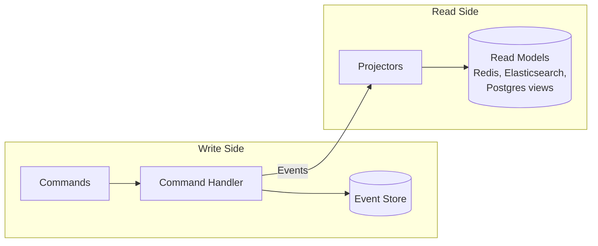

# CQRS & Event Sourcing Explained

This page explains the technical patterns underlying event-sourced systems. If you haven't read [Why Event Sourcing?](/), start there to understand the business motivation.

---

## Event Sourcing

Traditional systems store current state. Event sourcing stores the sequence of changes that produced it.

### Traditional State Storage

```
┌─────────────────────────────────────┐
│ players table                       │
├─────────────────────────────────────┤
│ id: "player-123"                    │
│ username: "Alice"                   │
│ bankroll: 1500                      │
│ updated_at: 2024-01-15 10:30:00     │
└─────────────────────────────────────┘

Problem: We only know current state.
- When did Alice register?
- How did she accumulate 1500?
- What was her bankroll before the last change?
```

### Event Sourced Storage

```
┌─────────────────────────────────────────────────────────────┐
│ events table                                                │
├──────┬───────────────────────────┬──────────────────────────┤
│ seq  │ type                      │ data                     │
├──────┼───────────────────────────┼──────────────────────────┤
│ 0    │ PlayerRegistered          │ {username: "Alice", ...} │
│ 1    │ FundsDeposited            │ {amount: 1000, ...}      │
│ 2    │ FundsReserved             │ {amount: 500, ...}       │
│ 3    │ FundsReleased             │ {amount: 500, ...}       │
│ 4    │ FundsDeposited            │ {amount: 500, ...}       │
└──────┴───────────────────────────┴──────────────────────────┘

Current state: replay events 0-4 → bankroll = 1000 - 500 + 500 + 500 = 1500

Benefits:
- Complete audit trail
- Time travel (state at any point)
- Debug by replaying
- Never lose information
```

### State Reconstruction

Current state is derived by replaying events:

```python
def rebuild_state(events):
    state = empty_state()
    for event in events:
        state = apply(state, event)
    return state
```

With snapshots (optimization for long event streams):

```python
def rebuild_state(events, snapshot):
    if snapshot:
        state = snapshot.state
        events = events[snapshot.sequence + 1:]
    else:
        state = empty_state()

    for event in events:
        state = apply(state, event)
    return state
```

### Immutability

Events are immutable facts. Once recorded, they cannot be changed or deleted. This is what makes the audit trail trustworthy—you can't rewrite history.

If you need to "undo" something, you emit a compensating event (e.g., `FundsRefunded` rather than deleting `FundsCharged`).

---

## CQRS

**Command Query Responsibility Segregation** separates the write model (commands/events) from read models (projections).



### Why Separate?

- **Write model** optimized for consistency (validate business rules, sequence events)
- **Read models** optimized for specific query patterns (dashboards, search, reports)
- **Scale independently**—read-heavy workloads don't compete with writes
- **Each projection can use the best storage** for its purpose (Elasticsearch for search, Redis for real-time, Postgres for reports)

### The Trade-off

Read models are **eventually consistent**. After a write, projections update asynchronously. For most domains, this latency (milliseconds to seconds) is acceptable. For domains requiring immediate consistency, additional patterns are needed.

---

## The Components

Event-sourced systems decompose into specialized components. Each has a single responsibility.

### Aggregates

The **command handler**. Receives commands, validates them against current state (rebuilt from events), and emits new events.

```
Command → Aggregate → Events
```

- Contains business logic and validation rules
- Enforces invariants (e.g., "can't withdraw more than available balance")
- May query external systems (APIs, projections, legacy systems) for decision-making
- Should never write to external systems—leave that to projectors
- Emits events as immutable facts
- One aggregate type per bounded context

[Learn more →](./components/aggregate)

### Projectors

The **read model builder**. Subscribes to events and maintains query-optimized views.

```
Events → Projector → Read Model (database, cache, search index)
```

- No business logic—just data transformation
- Can be rebuilt by replaying events
- Each projector serves a specific query need
- Can output to any storage (SQL, Redis, Elasticsearch, files)

[Learn more →](./components/projector)

### Sagas

The **domain translator**. Subscribes to events from one domain and emits commands to another.

```
Domain A Events → Saga → Domain B Commands
```

- Bridges bounded contexts
- Stateless—each event processed independently
- Handles cross-domain workflows (order completed → start fulfillment)
- Contains minimal logic—just field mapping

[Learn more →](./components/saga)

### Process Managers

The **stateful orchestrator**. Tracks long-running workflows across multiple domains.

```
Events (multiple domains) → Process Manager → Commands
```

- Maintains workflow state via correlation ID
- Handles complex multi-step processes
- Can implement compensation (rollback) logic
- Used sparingly—adds complexity

[Learn more →](./components/process-manager)

---

## Quick Reference

| Term | Definition |
|------|------------|
| **Event** | Immutable fact that something happened. Past tense: `OrderCreated`, `FundsDeposited`. |
| **Command** | Request to change state. Imperative: `CreateOrder`, `DepositFunds`. May be rejected. |
| **Aggregate** | Cluster of domain objects treated as a unit. Enforces business rules. |
| **Aggregate Root** | Entry point entity. All external references go through the root. Identified by ID. |
| **Event Store** | Append-only database of events. The source of truth. |
| **Projection** | Read-optimized view derived from events. Eventually consistent. |
| **Projector** | Component that builds projections from event streams. |
| **Saga** | Stateless service bridging events in one domain to commands in another. |
| **Process Manager** | Stateful workflow coordinator across multiple domains. |
| **Snapshot** | Cached aggregate state for replay optimization. |
| **Correlation ID** | Identifier linking related events across domains. |

[Full Glossary →](./glossary)

---

## Learning Resources

### Visual Guides

- [EDA Visuals](https://eda-visuals.boyney.io/) by [@boyney123](https://twitter.com/boyney123) — Bite-sized diagrams explaining EDA concepts ([PDF](https://eda-visuals.boyney.io/visuals/eda-visuals.pdf))
  - [What is Event Sourcing?](https://eda-visuals.boyney.io/visuals/what-is-eventsourcing)
  - [Commands vs Events](https://eda-visuals.boyney.io/visuals/commands-vs-events)
  - [Understanding Eventual Consistency](https://eda-visuals.boyney.io/visuals/eventual-consistency)
  - [Understanding Idempotency](https://eda-visuals.boyney.io/visuals/understanding-idempotency)

### Talks

- [CQRS and Event Sourcing](https://www.youtube.com/watch?v=JHGkaShoyNs) — Greg Young's foundational talk (2014)
- [Event Sourcing You are doing it wrong](https://www.youtube.com/watch?v=GzrZworHpIk) — David Schmitz on common pitfalls (2018)
- [A Decade of DDD, CQRS, Event Sourcing](https://www.youtube.com/watch?v=LDW0QWie21s) — Greg Young retrospective (2016)

### Articles

- [Event Sourcing pattern](https://learn.microsoft.com/en-us/azure/architecture/patterns/event-sourcing) — Microsoft Azure Architecture
- [CQRS pattern](https://learn.microsoft.com/en-us/azure/architecture/patterns/cqrs) — Microsoft Azure Architecture
- [Event Sourcing](https://martinfowler.com/eaaDev/EventSourcing.html) — Martin Fowler
- [CQRS](https://martinfowler.com/bliki/CQRS.html) — Martin Fowler

---

## Next Steps

- **[Introduction to Angzarr](./intro)** — The Angzarr framework
- **[Getting Started](./getting-started)** — Build your first event-sourced system
- **[Aggregates](./components/aggregate)** — Deep dive into command handling
