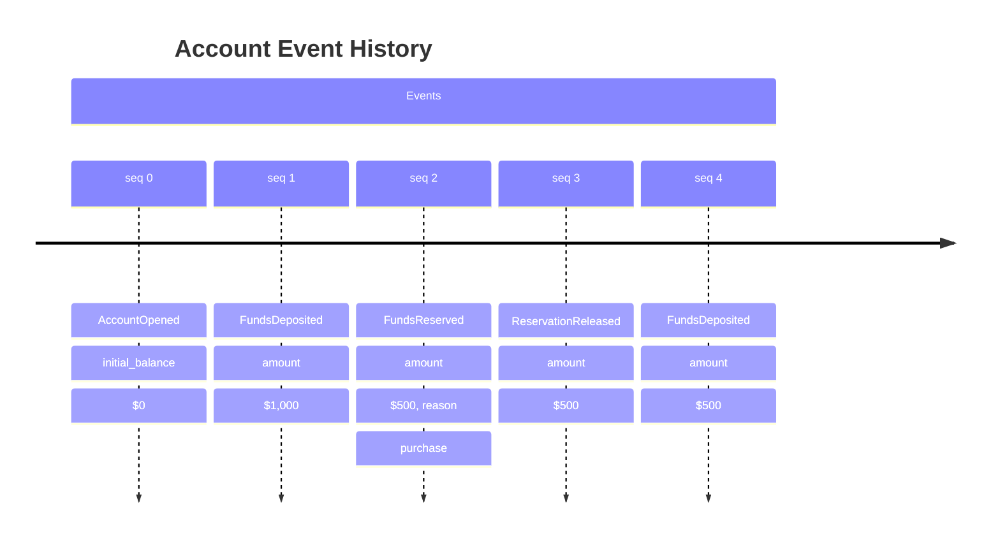

# When Things Go Wrong, Can You Prove What Happened?

It's 2am. Your phone buzzes.

A customer is disputing a $50,000 charge. Legal needs documentation by morning. The compliance team is asking for an audit trail. And somewhere in your system, the truth of what actually happened is... gone.

You check the database. It shows the current balance. But *how* did it get there? What was the sequence of events? Who approved what, and when? The logs are fragmented. The timestamps don't line up. You're left piecing together forensic evidence from system outputs that were never designed to tell you this story.

**This is the moment every engineering team dreads.** Not the outage you can fix in minutes—the dispute you can't resolve because your system only remembers where it ended up, not how it got there.

---

## Your Data Model Lies By Omission

Traditional databases store current state:

This tells you nothing. Was there a deposit of $2,000 followed by a $500 withdrawal? A refund? A correction? The current state *overwrote* the history that explains it.

Now imagine you stored the story instead:

Current state becomes a *derivation*: replay events 0-4 → balance = $1,500.

But now you can also answer:
- "What was the balance at 9:00am yesterday?"
- "Show me all transactions over $500"
- "When was this reservation released, and why?"

The audit trail isn't a separate system bolted on as an afterthought. The audit trail *is* the data model.

---

## Who Actually Needs This?

Not everyone does. Simple CRUD applications—"store this, retrieve that"—don't benefit from the added complexity. But certain domains have characteristics that make this approach transformative:

### High-Stakes Disputes

**Billing, Insurance, Trading**: When customers challenge charges, regulators request audits, or legal needs documentation, you need to prove what happened. Not guess—prove.

### Logistics & Supply Chain

**"Where was package #12345 at 3pm yesterday?"** Packages move through dozens of state transitions. Traditional systems store current location. Event-sourced systems store every scan, every handoff, every routing decision—queryable at any point in time.

### Compliance-Heavy Industries

**Healthcare, Finance, Gaming**: HIPAA mandates audit logs. AML regulations require transaction monitoring. When regulators ask "what did you know and when did you know it?"—you need a definitive answer.

### Complex State Machines

**Reservation Systems, Workflow Engines, Game State**: When state transitions frequently and the path matters as much as the destination, recording the journey provides operational visibility that current-state snapshots cannot.

---

## The Trade-Off

This approach isn't free. It adds architectural complexity.

| Benefit | Cost |
|---------|------|
| Complete audit trail | More storage (events accumulate) |
| Time-travel queries | Eventual consistency (not instant reads) |
| Debugging via replay | Learning curve for the team |
| Independent read scaling | More infrastructure to manage |

**Eventual consistency** is the key trade-off. After a write, read models update asynchronously. For most domains, this latency (milliseconds to seconds) is acceptable. For domains requiring synchronous, strongly-consistent responses, traditional approaches may be simpler.

---

## What ⍼ Angzarr Provides

If this pattern fits your domain, the next question is: how do you build it without drowning in infrastructure?

That's what ⍼ Angzarr solves.

You define your data model in Protocol Buffers. You write business logic in any language with gRPC support. The framework handles event persistence, optimistic concurrency, saga coordination, snapshot management, and event distribution—the infrastructure complexity that typically derails CQRS/ES projects.

**Your code focuses on business rules. The framework handles the plumbing.**

[Explore what Angzarr provides →](./features)

---

## Next Steps

- **[The Shape of the System](./features)** — What the framework handles, what you write
- **[Patterns Explained](./patterns-explained)** — Technical deep-dive: CQRS, Event Sourcing, aggregates, sagas
- **[Getting Started](./getting-started)** — Build your first event-sourced system
