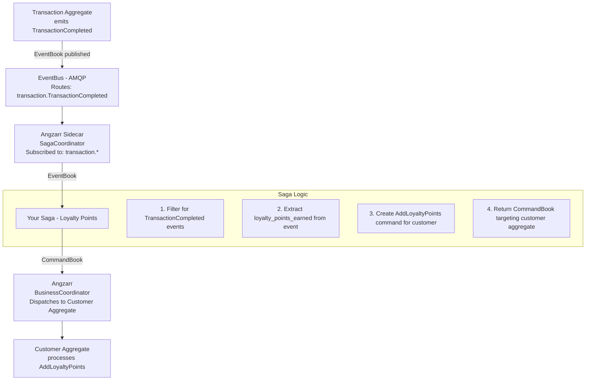
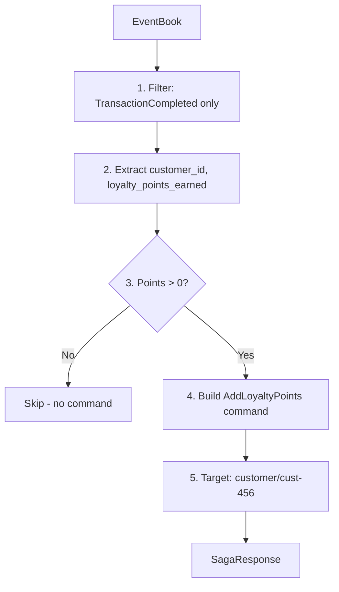
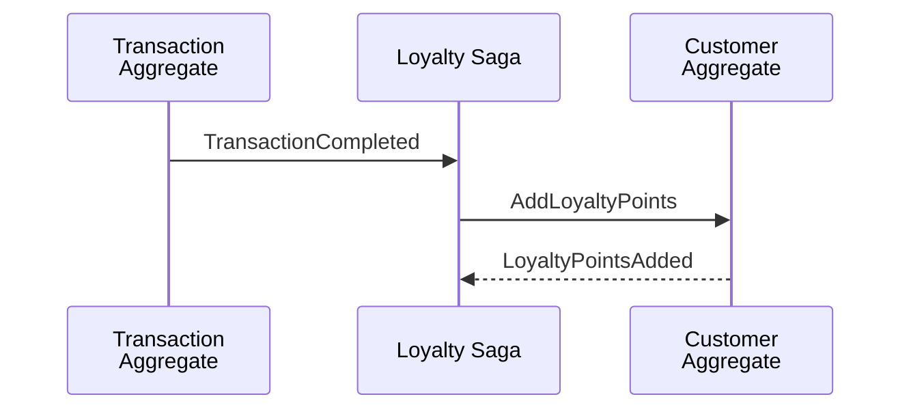
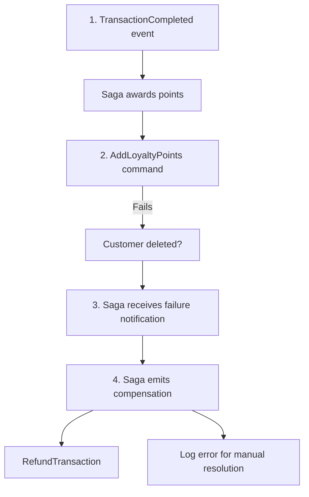

# Sagas

A **saga** orchestrates workflows that span multiple aggregates. When an event occurs in one domain, a saga can react by issuing commands to other domains, coordinating distributed transactions without tight coupling.

## Concepts

| Term | Definition |
|------|------------|
| **Saga** | A service that subscribes to events and emits commands to other aggregates. |
| **Choreography** | Decentralized coordination where services react to events independently. Sagas implement this pattern. |
| **Orchestration** | Centralized coordinator explicitly directs workflow steps. Alternative to choreography. |
| **Compensation** | Undo actions when a workflow fails partway through. "Semantic rollback." |
| **Saga Origin** | Metadata tracking which saga initiated a command, enabling compensation. |

---

## Component Responsibilities

### What Angzarr Provides

| Component | Responsibility |
|-----------|----------------|
| **SagaCoordinator** | Routes events to registered sagas based on topic subscriptions |
| **EventBus** | Delivers events from aggregates to saga coordinator via AMQP |
| **Command dispatch** | Executes commands emitted by sagas against target aggregates |
| **Compensation tracking** | (Planned) Track saga origins for rollback on failure |

### What You Provide

| Component | Responsibility |
|-----------|----------------|
| **Saga service** | gRPC server implementing the `Saga` interface |
| **Event filtering** | Decide which events trigger saga actions |
| **Command creation** | Build commands for other aggregates |
| **Compensation logic** | (If needed) Handle failures and rollback |

---

## Architecture



---

## gRPC Interface

Sagas implement the `Saga` service:

**[proto/angzarr/saga.proto](../proto/angzarr/saga.proto)**

```protobuf
// You implement this service
service Saga {
  // Handle events and produce commands for other aggregates
  rpc Handle (SagaRequest) returns (SagaResponse);
  // Retry with context when a command was rejected
  rpc HandleRetry (SagaRetryRequest) returns (SagaResponse);
}

// Request contains full context for command sequencing
message SagaRequest {
  SagaContext context = 1;
}

// Context provides events and target aggregate states
message SagaContext {
  EventBook events = 1;                          // Triggering events
  repeated DomainState target_domain_states = 2; // Current sequence for target aggregates
  Snapshot saga_state = 3;                       // Previous saga state (if any)
}

// Current sequence state for a domain/root combination
message DomainState {
  Cover cover = 1;
  uint32 sequence = 2;  // Current sequence (use in CommandPage.sequence)
}

message SagaResponse {
  repeated SagaCommand commands = 1;  // Commands to dispatch to other aggregates
  Snapshot new_state = 2;             // Optional new saga state to persist
}

message SagaCommand {
  Cover cover = 1;              // Target domain + aggregate root ID
  repeated CommandPage pages = 2;
  string correlation_id = 3;
}
```

### Using target_domain_states

The sidecar populates `target_domain_states` with the current sequence numbers for aggregates the saga might target. **Always use these sequences in your CommandPage** instead of hardcoding values:

```python
def get_target_sequence(context: SagaContext, domain: str, root: bytes) -> int:
    """Look up sequence for target domain/root. Returns 0 for new aggregates."""
    for state in context.target_domain_states:
        if state.cover.domain == domain and state.cover.root.value == root:
            return state.sequence
    return 0

# In your saga handler:
target_seq = get_target_sequence(context, "customer", customer_root)
command = SagaCommand(
    cover=Cover(domain="customer", root=customer_root),
    pages=[CommandPage(sequence=target_seq, command=cmd_any)],
    ...
)
```

This ensures commands use the correct sequence, avoiding "sequence mismatch" rejections.

---

## Saga Pattern

Every saga follows this pattern:

1. **Receive** EventBook with domain events
2. **Filter** for events this saga cares about
3. **Extract** data needed to build commands
4. **Create** CommandBooks targeting other aggregates
5. **Return** commands (which Angzarr dispatches)

**Input: EventBook**
```json
{
  "cover": { "domain": "transaction", "root": "txn-123" },
  "pages": [{
    "TransactionCompleted": {
      "customer_id": "cust-456",
      "final_total_cents": 9500,
      "loyalty_points_earned": 95
    }
  }]
}
```



**Output: SagaResponse**
```json
{
  "commands": [{
    "cover": { "domain": "customer", "root": "cust-456" },
    "pages": [{ "AddLoyaltyPoints": { "points": 95, "reason": "transaction:txn-123" } }],
    "saga_origin": { "saga_name": "loyalty_points" },
    "fact": true
  }]
}
```

---

## Example Implementation

### Loyalty Points Saga

Awards loyalty points to customers when transactions complete.

**Behavior:**
- Subscribes to `transaction` domain
- Filters for `TransactionCompleted` events
- Extracts `loyalty_points_earned` from event
- Emits `AddLoyaltyPoints` command to customer aggregate
- Skips if no points to award

**Implementations:**

| Language | File |
|----------|------|
| Rust | [examples/rust/saga-loyalty/src/lib.rs](../examples/rust/saga-loyalty/src/lib.rs) |
| Go | [examples/go/saga-loyalty/logic/loyalty.go](../examples/go/saga-loyalty/logic/loyalty.go) |
| Python | [examples/python/saga-loyalty/loyalty_saga.py](../examples/python/saga-loyalty/loyalty_saga.py) |

---

## Cross-Aggregate Coordination

Sagas enable loose coupling between aggregates:



**Key insight:** Transaction aggregate doesn't know about loyalty points. Customer aggregate doesn't know about transactions. The saga bridges them.

---

## Querying Other Aggregates

Sagas sometimes need data from aggregates other than the one that triggered them. For example, a fulfillment saga might need to check inventory levels before creating a shipment.

### Option 1: EventQuery (Recommended)

Query the **event store** directly via EventQuery:

```protobuf
service EventQuery {
  rpc GetEventBook (Query) returns (EventBook);
  rpc GetEvents (Query) returns (stream EventBook);  // Streams all matches
}

message Query {
  string domain = 1;           // Target domain (optional if using correlation_id)
  Uuid root = 2;               // Aggregate root ID (optional if using correlation_id)
  uint32 lower_bound = 3;      // Optional: start sequence (0 = from beginning)
  uint32 upper_bound = 4;      // Optional: end sequence (0 = unbounded)
  string correlation_id = 5;   // Query by correlation ID (cross-domain lookup)
}
```

#### Complete State Query (Preferred for Sagas)

**Query with `lower_bound=0` and `upper_bound=0` (or omit both) to get a complete picture of an aggregate's current state.** This is the preferred approach for sagas because:

1. **Snapshot optimization**: If a snapshot exists, it's returned along with only the events after the snapshot sequence
2. **No sequence tracking needed**: Saga doesn't need to know the current sequence number
3. **Always consistent**: Returns the complete state as of query time

The response contains:
- `snapshot`: Pre-computed state up to `snapshot.sequence` (if available)
- `pages`: Events after the snapshot (or all events if no snapshot)

```python
# Preferred: Query for complete state - let the system optimize
async def handle(self, event_book: EventBook) -> SagaResponse:
    order_placed = extract_event(event_book, "OrderPlaced")
    product_id = order_placed.product_id

    # Query with no bounds = complete picture
    # System returns snapshot + events after snapshot (if snapshot exists)
    # Or all events (if no snapshot)
    inventory_book = await self.event_query.get_event_book(
        Query(domain="inventory", root=to_uuid(product_id))
        # lower_bound and upper_bound default to 0
    )

    # Reconstruct state: start from snapshot (if present), then replay events
    if inventory_book.snapshot:
        stock = inventory_book.snapshot.state.stock_level
    else:
        stock = 0

    # Replay events after snapshot (or all events if no snapshot)
    for page in inventory_book.pages:
        if has_event(page, "StockAdded"):
            stock += page.event.quantity
        elif has_event(page, "StockReserved"):
            stock -= page.event.quantity

    if stock < order_placed.quantity:
        return SagaResponse(commands=[reject_order_command()])

    return SagaResponse(commands=[create_shipment_command()])
```

**Query Response Scenarios:**

| Scenario | `snapshot` | `pages` |
|----------|------------|---------|
| No snapshot exists | `None` | All events (0 to current) |
| Snapshot is current | Snapshot at seq N | Empty (no events after N) |
| Snapshot is stale | Snapshot at seq N | Events N+1 to current |

#### Range Query (For Specific Use Cases)

Use explicit bounds only when you need a specific event range (e.g., fetching events since last processed):

```python
# Range query: specific event window
# [lower_bound, upper_bound) - inclusive lower, exclusive upper
events = await self.event_query.get_event_book(
    Query(domain="inventory", root=product_id, lower_bound=5, upper_bound=10)
)
# Returns events 5, 6, 7, 8, 9 (no snapshot optimization)
```

**Note:** Range queries bypass snapshot optimization - they always return raw events.

#### Server Configuration

Snapshot optimization is **enabled by default** on EventQueryService. Complete state queries automatically return `snapshot + events_after_snapshot` when a snapshot exists.

To disable snapshots (for debugging or raw event replay):

```rust
// Disable snapshot optimization for raw event access
let query_service = EventQueryService::with_options(
    event_store,
    snapshot_store,
    false,  // disable snapshots
);
```

#### Query by Correlation ID

If you don't know the root ID but have the correlation ID, you can find all related events across domains:

```python
# Find all events related to a specific workflow
async def get_workflow_events(self, correlation_id: str) -> list[EventBook]:
    # GetEvents streams ALL matching EventBooks across all domains
    books = []
    async for book in self.event_query.get_events(
        Query(correlation_id=correlation_id)
    ):
        books.append(book)
    return books
```

This is useful when:
- A saga needs to inspect what happened in a previous workflow step
- Debugging/tracing a distributed transaction
- Building compensation logic that needs full context

**Advantages:**
- No separate read model to maintain
- Always consistent with event store (source of truth)
- Works with any aggregate if you have root ID or correlation ID
- Correlation ID queries work across all domains

**Considerations:**
- Requires replaying events to compute state
- For complex aggregates, consider caching computed state in saga
- Root ID or correlation ID must be included in triggering event or derivable

### Option 2: Projector Query

Query a projector's read model via HTTP/gRPC. Useful when:
- You need to search by non-ID fields
- The read model has pre-computed aggregations
- Multiple sagas need the same derived data

```python
# Query projector for inventory by SKU (not root ID)
inventory = await self.inventory_projector.get_by_sku(sku="WIDGET-001")
```

**Trade-off:** Projector data may lag behind the event store during high load.

### Choosing Between Options

| Scenario | Use EventQuery | Use Projector |
|----------|----------------|---------------|
| Know the aggregate root ID | ✓ | |
| Need to search by other fields | | ✓ |
| Need real-time consistency | ✓ | |
| Complex queries/aggregations | | ✓ |
| Minimal infrastructure | ✓ | |

---

## Command Properties

Commands emitted by sagas have special properties:

| Property | Purpose |
|----------|---------|
| `saga_origin` | Links command to triggering event for compensation |
| `fact` | When true, indicates the triggering event is committed—command should succeed |

### The `fact` Flag

When a saga reacts to a persisted event, that event is a **fact**—it cannot be undone. Commands derived from facts should also succeed:

```
TransactionCompleted is a FACT (already in event store)
    ↓
AddLoyaltyPoints should succeed (customer must exist)
    ↓
If customer aggregate rejects, something is wrong:
  - Bug in saga logic
  - Customer was deleted (shouldn't happen)
  - System inconsistency (needs investigation)
```

---

## Topic Subscriptions

Sagas declare which domains/events they care about:

```rust
impl Saga for LoyaltyPointsSaga {
    fn domains(&self) -> Vec<String> {
        vec!["transaction".to_string()]
    }
}
```

Unlike projectors, sagas typically filter to specific event types in their handler logic rather than relying on AMQP routing.

---

## Compensation (Planned)

When a saga-initiated command fails, compensation may be needed:



**Current status:** Saga origin tracking is in the protocol but compensation workflows are not yet implemented in the examples.

---

## BDD Specifications

Saga behavior is specified in Gherkin:

| Feature | File |
|---------|------|
| Loyalty points award | [examples/features/saga-loyalty.feature](../examples/features/saga-loyalty.feature) |

Example scenario:

```gherkin
Scenario: Award loyalty points when transaction completes
  Given a customer "cust-456" exists with 100 loyalty points
  And a transaction "txn-123" for customer "cust-456" with $50.00 total
  When the transaction is completed
  Then the saga emits an "AddLoyaltyPoints" command
  And the customer has 150 loyalty points
```

---

## Saga vs Projector

| Aspect | Projector | Saga |
|--------|-----------|------|
| **Output** | Read models (Projections) | Commands |
| **Side effects** | None (read-only) | Yes (modifies other aggregates) |
| **Coupling** | To events only | To events and target aggregates |
| **Failure impact** | Query returns stale data | Workflow incomplete |
| **Typical use** | Search indexes, reports, caches | Cross-aggregate workflows |

---

## Error Handling

| Scenario | Behavior |
|----------|----------|
| Saga throws exception | Event may be redelivered. Log error. |
| Command rejected by target | (Planned) Trigger compensation. Currently logged. |
| Target aggregate not found | Command fails. Saga may retry or compensate. |

Best practices:
- Make saga logic idempotent (may receive same event twice)
- Handle sequence conflict errors by fetching fresh state and retrying
- Log saga origin for debugging failed workflows
- Design for eventual consistency

---

## Sync vs Async Sagas

| Mode | Use Case | Behavior |
|------|----------|----------|
| **Synchronous** | Command must wait for cross-aggregate effects | Original command blocks until saga completes |
| **Asynchronous** | Eventual consistency acceptable | Fire-and-forget. Original command returns immediately. |

The loyalty points saga is synchronous—the client sees points awarded before command returns.

---

## Testing

### Unit Tests

```bash
# Rust
cargo test -p saga-loyalty --lib

# Go
cd examples/go/saga-loyalty && go test ./logic/...

# Python
cd examples/python/saga-loyalty && uv run pytest test_*.py
```

### Acceptance Tests (BDD)

```bash
# Rust
cargo test -p saga-loyalty --test cucumber

# Go
cd examples/go/saga-loyalty && go test ./features/...

# Python
cd examples/python/saga-loyalty && uv run pytest features/
```

---

## Next Steps

- [Command Handlers](command-handlers.md) — Processing commands and emitting events
- [Projectors](projectors.md) — Building read models from event streams
