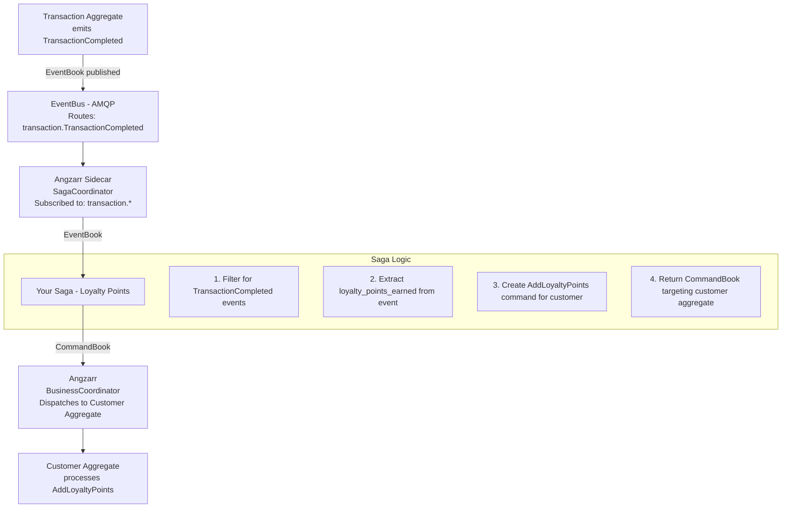
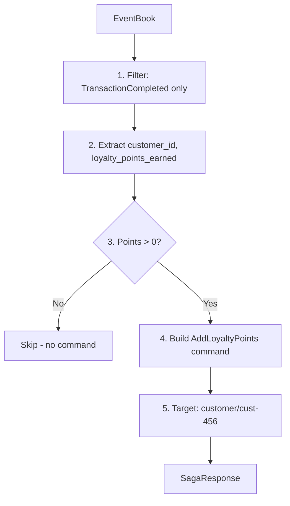
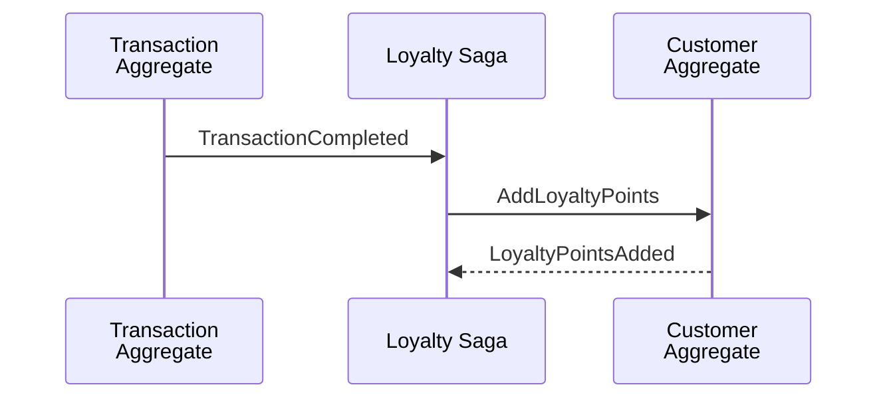
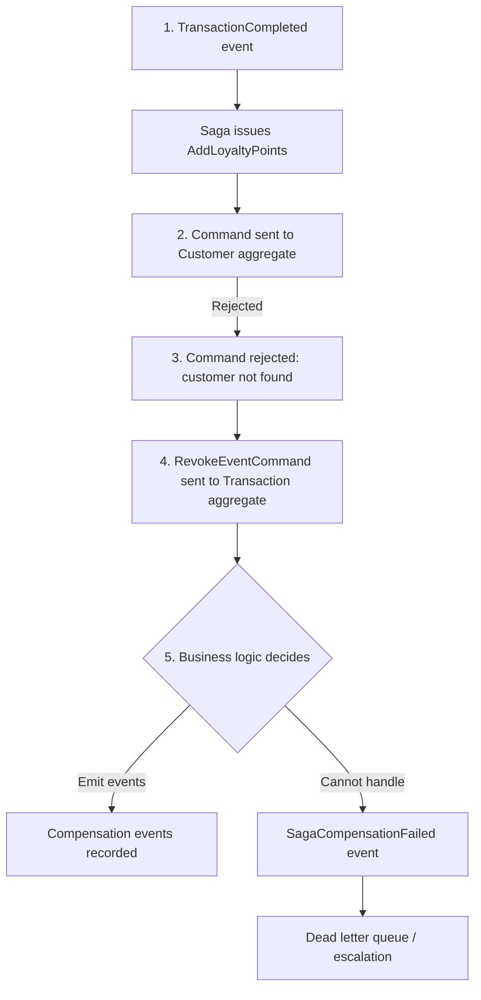
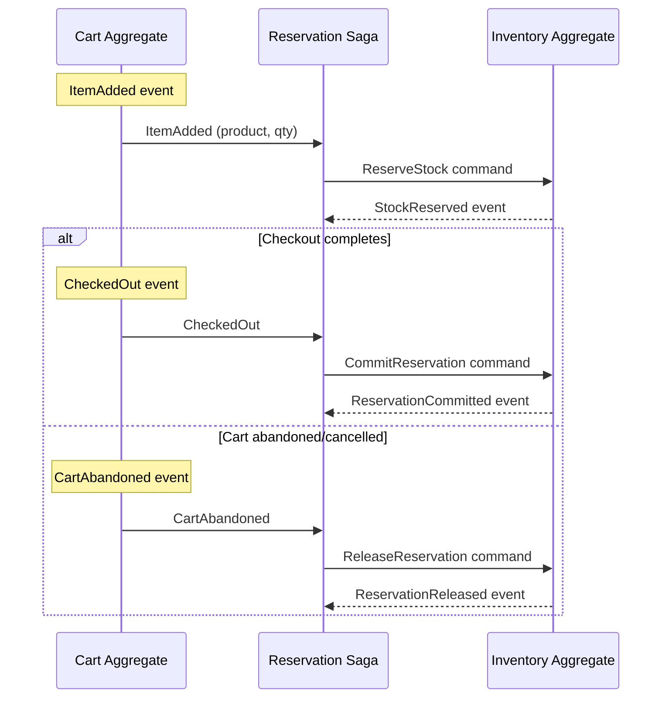

# Sagas (Process Coordinators)

A **saga** (also called a **process coordinator**) orchestrates workflows that span multiple aggregates. When an event occurs in one domain, a saga can react by issuing commands to other domains, coordinating distributed transactions without tight coupling.

Sagas are the bridge between domains. Each domain has its own aggregate that processes commands, but aggregates don't communicate directly. Instead, sagas listen to events from one domain and generate commands for other domains.

## Single Domain Subscription

**Sagas should subscribe to ONE domain.**

Multi-domain subscription creates:
- Ordering ambiguity (which event triggers first?)
- Duplicate processing (same workflow triggered multiple times)
- Debugging complexity (which event caused which command?)
- Race conditions (events from different domains arrive simultaneously)

If you need multi-domain subscription, you probably need a **[Process Manager](process-manager.md)**.

---

## Concepts

| Term | Definition |
|------|------------|
| **Saga / Process Coordinator** | A service that subscribes to events and emits commands to other aggregates. Takes events from one domain and generates commands for target domains. |
| **Choreography** | Decentralized coordination where services react to events independently. Sagas implement this pattern. |
| **Orchestration** | Centralized coordinator explicitly directs workflow steps. Alternative to choreography. |
| **Compensation** | Undo actions when a workflow fails partway through. "Semantic rollback." |
| **Saga Origin** | Metadata tracking which saga initiated a command, enabling compensation. |

---

## Component Responsibilities

### What Angzarr Provides

| Component | Responsibility |
|-----------|----------------|
| **SagaCoordinator** | Routes events to registered sagas based on topic subscriptions |
| **EventBus** | Delivers events from aggregates to saga coordinator via AMQP |
| **Command dispatch** | Executes commands emitted by sagas against target aggregates |
| **Compensation tracking** | (Planned) Track saga origins for rollback on failure |

### What You Provide

| Component | Responsibility |
|-----------|----------------|
| **Saga service** | gRPC server implementing the `Saga` interface |
| **Event filtering** | Decide which events trigger saga actions |
| **Command creation** | Build commands for other aggregates |
| **Compensation logic** | (If needed) Handle failures and rollback |

---

## Architecture



---

## gRPC Interface

Sagas implement the `Saga` service:

**[proto/angzarr/saga.proto](../proto/angzarr/saga.proto)**

```protobuf
// You implement this service
service Saga {
  // Handle events and produce commands for other aggregates
  rpc Handle (SagaRequest) returns (SagaResponse);
  // Retry with context when a command was rejected
  rpc HandleRetry (SagaRetryRequest) returns (SagaResponse);
}

// Request contains full context for command sequencing
message SagaRequest {
  SagaContext context = 1;
}

// Context provides events and target aggregate states
message SagaContext {
  EventBook events = 1;                          // Triggering events
  repeated DomainState target_domain_states = 2; // Current sequence for target aggregates
  Snapshot saga_state = 3;                       // Previous saga state (if any)
}

// Current sequence state for a domain/root combination
message DomainState {
  Cover cover = 1;
  uint32 sequence = 2;  // Current sequence (use in CommandPage.sequence)
}

message SagaResponse {
  repeated SagaCommand commands = 1;  // Commands to dispatch to other aggregates
  Snapshot new_state = 2;             // Optional new saga state to persist
}

message SagaCommand {
  Cover cover = 1;              // Target domain + aggregate root ID
  repeated CommandPage pages = 2;
  string correlation_id = 3;
}
```

### Using target_domain_states

The sidecar populates `target_domain_states` with the current sequence numbers for aggregates the saga might target. **Always use these sequences in your CommandPage** instead of hardcoding values:

```python
def get_target_sequence(context: SagaContext, domain: str, root: bytes) -> int:
    """Look up sequence for target domain/root. Returns 0 for new aggregates."""
    for state in context.target_domain_states:
        if state.cover.domain == domain and state.cover.root.value == root:
            return state.sequence
    return 0

# In your saga handler:
target_seq = get_target_sequence(context, "customer", customer_root)
command = SagaCommand(
    cover=Cover(domain="customer", root=customer_root),
    pages=[CommandPage(sequence=target_seq, command=cmd_any)],
    ...
)
```

This ensures commands use the correct sequence, avoiding "sequence mismatch" rejections.

---

## Saga Pattern

Every saga follows this pattern:

1. **Receive** EventBook with domain events
2. **Filter** for events this saga cares about
3. **Extract** data needed to build commands
4. **Create** CommandBooks targeting other aggregates
5. **Return** commands (which Angzarr dispatches)

**Input: EventBook**
```json
{
  "cover": { "domain": "transaction", "root": "txn-123" },
  "pages": [{
    "TransactionCompleted": {
      "customer_id": "cust-456",
      "final_total_cents": 9500,
      "loyalty_points_earned": 95
    }
  }]
}
```



**Output: SagaResponse**
```json
{
  "commands": [{
    "cover": { "domain": "customer", "root": "cust-456" },
    "pages": [{ "AddLoyaltyPoints": { "points": 95, "reason": "transaction:txn-123" } }],
    "saga_origin": { "saga_name": "loyalty_points" },
    "fact": true
  }]
}
```

---

## Example Implementation

### Loyalty Points Saga

Awards loyalty points to customers when transactions complete.

**Behavior:**
- Subscribes to `transaction` domain
- Filters for `TransactionCompleted` events
- Extracts `loyalty_points_earned` from event
- Emits `AddLoyaltyPoints` command to customer aggregate
- Skips if no points to award

**Implementations:**

| Language | File |
|----------|------|
| Rust | [examples/rust/saga-loyalty/src/lib.rs](../examples/rust/saga-loyalty/src/lib.rs) |
| Go | [examples/go/saga-loyalty/logic/loyalty.go](../examples/go/saga-loyalty/logic/loyalty.go) |
| Python | [examples/python/saga-loyalty/loyalty_saga.py](../examples/python/saga-loyalty/loyalty_saga.py) |

---

## Cross-Aggregate Coordination

Sagas enable loose coupling between aggregates:



**Key insight:** Transaction aggregate doesn't know about loyalty points. Customer aggregate doesn't know about transactions. The saga bridges them.

---

## Querying Other Aggregates

Sagas sometimes need data from aggregates other than the one that triggered them. For example, a fulfillment saga might need to check inventory levels before creating a shipment.

### Option 1: EventQuery (Recommended)

Query the **event store** directly via EventQuery:

```protobuf
service EventQuery {
  rpc GetEventBook (Query) returns (EventBook);
  rpc GetEvents (Query) returns (stream EventBook);  // Streams all matches
}

message Query {
  string domain = 1;           // Target domain (optional if using correlation_id)
  Uuid root = 2;               // Aggregate root ID (optional if using correlation_id)
  uint32 lower_bound = 3;      // Optional: start sequence (0 = from beginning)
  uint32 upper_bound = 4;      // Optional: end sequence (0 = unbounded)
  string correlation_id = 5;   // Query by correlation ID (cross-domain lookup)
}
```

#### Complete State Query (Preferred for Sagas)

**Query with `lower_bound=0` and `upper_bound=0` (or omit both) to get a complete picture of an aggregate's current state.** This is the preferred approach for sagas because:

1. **Snapshot optimization**: If a snapshot exists, it's returned along with only the events after the snapshot sequence
2. **No sequence tracking needed**: Saga doesn't need to know the current sequence number
3. **Always consistent**: Returns the complete state as of query time

The response contains:
- `snapshot`: Pre-computed state up to `snapshot.sequence` (if available)
- `pages`: Events after the snapshot (or all events if no snapshot)

```python
# Preferred: Query for complete state - let the system optimize
async def handle(self, event_book: EventBook) -> SagaResponse:
    order_placed = extract_event(event_book, "OrderPlaced")
    product_id = order_placed.product_id

    # Query with no bounds = complete picture
    # System returns snapshot + events after snapshot (if snapshot exists)
    # Or all events (if no snapshot)
    inventory_book = await self.event_query.get_event_book(
        Query(domain="inventory", root=to_uuid(product_id))
        # lower_bound and upper_bound default to 0
    )

    # Reconstruct state: start from snapshot (if present), then replay events
    if inventory_book.snapshot:
        stock = inventory_book.snapshot.state.stock_level
    else:
        stock = 0

    # Replay events after snapshot (or all events if no snapshot)
    for page in inventory_book.pages:
        if has_event(page, "StockAdded"):
            stock += page.event.quantity
        elif has_event(page, "StockReserved"):
            stock -= page.event.quantity

    if stock < order_placed.quantity:
        return SagaResponse(commands=[reject_order_command()])

    return SagaResponse(commands=[create_shipment_command()])
```

**Query Response Scenarios:**

| Scenario | `snapshot` | `pages` |
|----------|------------|---------|
| No snapshot exists | `None` | All events (0 to current) |
| Snapshot is current | Snapshot at seq N | Empty (no events after N) |
| Snapshot is stale | Snapshot at seq N | Events N+1 to current |

#### Range Query (For Specific Use Cases)

Use explicit bounds only when you need a specific event range (e.g., fetching events since last processed):

```python
# Range query: specific event window
# [lower_bound, upper_bound) - inclusive lower, exclusive upper
events = await self.event_query.get_event_book(
    Query(domain="inventory", root=product_id, lower_bound=5, upper_bound=10)
)
# Returns events 5, 6, 7, 8, 9 (no snapshot optimization)
```

**Note:** Range queries bypass snapshot optimization - they always return raw events.

#### Server Configuration

Snapshot optimization is **enabled by default** on EventQueryService. Complete state queries automatically return `snapshot + events_after_snapshot` when a snapshot exists.

To disable snapshots (for debugging or raw event replay):

```rust
// Disable snapshot optimization for raw event access
let query_service = EventQueryService::with_options(
    event_store,
    snapshot_store,
    false,  // disable snapshots
);
```

#### Query by Correlation ID

If you don't know the root ID but have the correlation ID, you can find all related events across domains:

```python
# Find all events related to a specific workflow
async def get_workflow_events(self, correlation_id: str) -> list[EventBook]:
    # GetEvents streams ALL matching EventBooks across all domains
    books = []
    async for book in self.event_query.get_events(
        Query(correlation_id=correlation_id)
    ):
        books.append(book)
    return books
```

This is useful when:
- A saga needs to inspect what happened in a previous workflow step
- Debugging/tracing a distributed transaction
- Building compensation logic that needs full context

**Advantages:**
- No separate read model to maintain
- Always consistent with event store (source of truth)
- Works with any aggregate if you have root ID or correlation ID
- Correlation ID queries work across all domains

**Considerations:**
- Requires replaying events to compute state
- For complex aggregates, consider caching computed state in saga
- Root ID or correlation ID must be included in triggering event or derivable

### Option 2: Projector Query

Query a projector's read model via HTTP/gRPC. Useful when:
- You need to search by non-ID fields
- The read model has pre-computed aggregations
- Multiple sagas need the same derived data

```python
# Query projector for inventory by SKU (not root ID)
inventory = await self.inventory_projector.get_by_sku(sku="WIDGET-001")
```

**Trade-off:** Projector data may lag behind the event store during high load.

### Choosing Between Options

| Scenario | Use EventQuery | Use Projector |
|----------|----------------|---------------|
| Know the aggregate root ID | ✓ | |
| Need to search by other fields | | ✓ |
| Need real-time consistency | ✓ | |
| Complex queries/aggregations | | ✓ |
| Minimal infrastructure | ✓ | |

---

## Command Properties

Commands emitted by sagas have special properties:

| Property | Purpose |
|----------|---------|
| `saga_origin` | Links command to triggering event for compensation |

The `saga_origin` enables the compensation flow when a command is rejected. See [Transactional Guarantees](#transactional-guarantees) for design principles around why saga commands should succeed.

---

## Topic Subscriptions

Sagas declare which domains/events they care about:

```rust
impl Saga for LoyaltyPointsSaga {
    fn domains(&self) -> Vec<String> {
        vec!["transaction".to_string()]
    }
}
```

Unlike projectors, sagas typically filter to specific event types in their handler logic rather than relying on AMQP routing.

---

## Transactional Guarantees

### No Distributed ACID Transactions

CQRS/ES architectures **cannot provide distributed ACID transactions**. When a saga issues commands to multiple aggregates, there is no atomic commit across domains. Instead, the system accepts eventual consistency and designs for compensation.

This is a fundamental architectural constraint, not a limitation of Angzarr.

### Guarantee by Construction

Angzarr's approach: **design domains such that saga commands cannot legitimately fail**.

When a saga reacts to a persisted event, that event is a **fact**—it already happened and cannot be undone. Commands derived from facts should succeed:

```
TransactionCompleted is a FACT (persisted in event store)
    ↓
AddLoyaltyPoints command targets customer aggregate
    ↓
Customer MUST exist (invariant: transactions require valid customers)
    ↓
Command succeeds by construction
```

If a saga command is rejected, something is wrong:
- Bug in saga logic
- Domain invariant violated elsewhere
- System inconsistency requiring investigation

### Domain Design Implications

**Saga commands should only target aggregates that must exist.**

| Triggering Event | Saga Command | Why It Must Succeed |
|------------------|--------------|---------------------|
| `OrderPlaced` | `ReserveInventory` | Order validation checked stock availability |
| `TransactionCompleted` | `AddLoyaltyPoints` | Transaction requires valid customer |
| `PaymentReceived` | `ConfirmOrder` | Order must exist to receive payment |
| `OrderShipped` | `NotifyCustomer` | Order requires valid customer |

The triggering aggregate enforces the preconditions. If `OrderPlaced` was valid, then the customer, inventory, and payment method all existed at that moment.

### Signs of Poor Domain Design

If saga commands are frequently rejected, reconsider your boundaries:

| Symptom | Likely Cause | Solution |
|---------|--------------|----------|
| Target aggregate doesn't exist | Cross-domain invariant not enforced | Triggering aggregate should validate |
| Business rule violation | Wrong aggregate owns the rule | Move rule to triggering aggregate |
| Frequent compensation | Aggregates too granular | Merge into single aggregate |
| Race conditions on every saga | Missing coordination point | Add orchestrating aggregate |

**Rule of thumb:** If two pieces of state must always be consistent, they belong in the same aggregate. Sagas are for **eventual** consistency across boundaries, not for maintaining invariants.

### When Compensation Is Appropriate

Compensation is for **exceptional cases**, not normal flow:

- **Race conditions**: Customer deleted between `OrderPlaced` and `AddLoyaltyPoints`
- **External failures**: Payment gateway timeout after order confirmed
- **Bug recovery**: Saga logic error discovered after events persisted
- **Manual intervention**: Business decision to reverse a completed workflow

If you're building compensation into every saga path, your domain boundaries are wrong.

---

## Compensation Flow

When a saga command is rejected, Angzarr initiates compensation:



### Compensation Steps

1. **Command rejection detected** — Target aggregate rejects saga command
2. **RevokeEventCommand built** — Contains saga origin, rejection reason, original command
3. **Sent to triggering aggregate** — The aggregate that emitted the event triggering the saga
4. **Business logic decides**:
   - Emit compensation events (e.g., `TransactionReversed`)
   - Request system revocation (emit `SagaCompensationFailed`)
   - Send to dead letter queue for manual review
   - Trigger escalation (webhook, alerting)
   - Abort the saga chain

### RevokeEventCommand

```protobuf
message RevokeEventCommand {
  uint32 triggering_event_sequence = 1;  // Which event triggered the saga
  string saga_name = 2;                   // Which saga failed
  string rejection_reason = 3;           // Why the command was rejected
  CommandBook rejected_command = 4;      // The command that failed
}
```

Business logic handles this like any other command, deciding what compensation events to emit.

### Fallback Domain

When business logic cannot handle compensation (or explicitly requests system handling), a `SagaCompensationFailed` event is emitted to a fallback domain (default: `angzarr.saga-failures`). This domain can be monitored, trigger alerts, or feed manual review queues.

---

## Reservation Pattern

The **reservation pattern** manages scarce resources across aggregate boundaries. Unlike error compensation, releasing reservations is **expected business flow**.

### The Pattern

```
Reserve → (Commit | Release)
```

1. **Reserve**: Tentatively allocate a resource (inventory, seat, funds)
2. **Commit**: Finalize the allocation when the business process completes
3. **Release**: Return the resource if the process is abandoned or cancelled

### Example: Inventory Reservation



### When to Reserve

| Strategy | Reserve When | Trade-offs |
|----------|--------------|------------|
| **Early (Cart Add)** | Item added to cart | Better UX (guaranteed availability), but ties up inventory; requires timeout for abandoned carts |
| **Late (Checkout)** | User initiates checkout | Maximizes inventory availability, but checkout can fail due to stock changes |
| **Two-Phase (Payment)** | Payment authorized | Minimizes hold time, but worst UX if item becomes unavailable at last step |

**Recommendation:** Choose based on business context:
- **Scarce/high-demand items** → Reserve early
- **Commodity items** → Reserve late
- **Expensive items** → Two-phase with payment authorization

### Reservation vs Error Compensation

| Aspect | Reservation Release | Error Compensation |
|--------|--------------------|--------------------|
| **Trigger** | Business decision (abandon, cancel, timeout) | System failure (command rejected) |
| **Expected?** | Yes, part of normal flow | No, indicates problem |
| **Frequency** | Common (many carts abandoned) | Rare (should not happen) |
| **Design goal** | Handle gracefully | Investigate root cause |

**Key distinction:** If you're releasing reservations frequently, that's normal business. If you're compensating for saga failures frequently, your domain boundaries are wrong.

### Implementing Reservation Sagas

The reservation saga coordinates the lifecycle:

```python
class InventoryReservationSaga:
    """Reserves inventory when items added, commits/releases based on outcome."""

    def handle(self, event_book: EventBook) -> SagaResponse:
        for event in event_book.pages:
            if is_event(event, "ItemAdded"):
                return self._reserve(event)
            elif is_event(event, "CheckedOut"):
                return self._commit(event)
            elif is_event(event, "CartAbandoned") or is_event(event, "ItemRemoved"):
                return self._release(event)
        return SagaResponse(commands=[])

    def _reserve(self, event) -> SagaResponse:
        return SagaResponse(commands=[
            SagaCommand(
                cover=Cover(domain="inventory", root=product_root(event)),
                pages=[CommandPage(command=ReserveStock(
                    quantity=event.quantity,
                    order_id=event.cart_id,
                ))]
            )
        ])
```

### Timeout Handling

Reservations should expire if not committed:

| Approach | Implementation | Trade-offs |
|----------|----------------|------------|
| **Saga timer** | Saga schedules release after N minutes | Saga must track state |
| **Inventory TTL** | Inventory auto-releases after N minutes | Simpler saga, inventory complexity |
| **External scheduler** | Cron job queries stale reservations | Decoupled, but eventual consistency |

**Angzarr pattern:** Emit a `ReservationExpired` event from the inventory domain (via scheduled job or TTL), which triggers the cancellation saga to clean up related state.

### Inventory State Model

The inventory aggregate tracks both physical and logical stock:

```protobuf
message InventoryState {
  int32 on_hand = 1;       // Physical stock in warehouse
  int32 reserved = 2;      // Allocated to pending orders
  // Derived: available = on_hand - reserved
  map<string, int32> reservations = 3;  // order_id -> quantity
}
```

| Field | Updated By |
|-------|------------|
| `on_hand` | `StockReceived` (+), `ReservationCommitted` (-) |
| `reserved` | `StockReserved` (+), `ReservationReleased` (-), `ReservationCommitted` (-) |
| `available` | Derived: `on_hand - reserved` |

See [inventory.feature](../examples/features/inventory.feature) for complete behavior specification.

---

## BDD Specifications

Saga behavior is specified in Gherkin:

| Feature | File |
|---------|------|
| Loyalty points award | [examples/features/saga-loyalty.feature](../examples/features/saga-loyalty.feature) |

Example scenario:

```gherkin
Scenario: Award loyalty points when transaction completes
  Given a customer "cust-456" exists with 100 loyalty points
  And a transaction "txn-123" for customer "cust-456" with $50.00 total
  When the transaction is completed
  Then the saga emits an "AddLoyaltyPoints" command
  And the customer has 150 loyalty points
```

---

## Saga vs Projector

| Aspect | Projector | Saga |
|--------|-----------|------|
| **Output** | Read models (Projections) | Commands |
| **Side effects** | None (read-only) | Yes (modifies other aggregates) |
| **Coupling** | To events only | To events and target aggregates |
| **Failure impact** | Query returns stale data | Workflow incomplete |
| **Typical use** | Search indexes, reports, caches | Cross-aggregate workflows |

---

## Error Handling

| Scenario | Behavior |
|----------|----------|
| Saga throws exception | Event redelivered. Log error. |
| Sequence conflict | Retry with fresh destination state (automatic) |
| Command rejected (retryable) | Fetch fresh state, re-run saga Execute, retry command |
| Command rejected (non-retryable) | Initiate compensation flow |
| Target aggregate not found | Non-retryable rejection → compensation |
| Compensation fails | Emit `SagaCompensationFailed` to fallback domain |

### Retry Logic

Angzarr automatically retries saga commands on sequence conflicts:

1. Command rejected with sequence mismatch
2. Call `Prepare()` again to get destination covers
3. Fetch fresh EventBooks for all destinations
4. Call `Execute()` with updated state
5. Retry commands with corrected sequences
6. Exponential backoff between attempts

This handles concurrent modifications without manual intervention.

### Best Practices

- **Idempotent saga logic** — May receive same event twice on redelivery
- **Include saga_origin** — Enables compensation flow on rejection
- **Design for success** — Saga commands should not fail under normal operation
- **Monitor fallback domain** — `SagaCompensationFailed` events indicate systemic issues
- **Log correlation IDs** — Trace workflows across domains

---

## Sync vs Async Sagas

| Mode | Use Case | Behavior |
|------|----------|----------|
| **Synchronous** | Command must wait for cross-aggregate effects | Original command blocks until saga completes |
| **Asynchronous** | Eventual consistency acceptable | Fire-and-forget. Original command returns immediately. |

The loyalty points saga is synchronous—the client sees points awarded before command returns.

---

## Testing

### Unit Tests

```bash
# Rust
cargo test -p saga-loyalty --lib

# Go
cd examples/go/saga-loyalty && go test ./logic/...

# Python
cd examples/python/saga-loyalty && uv run pytest test_*.py
```

### Acceptance Tests (BDD)

```bash
# Rust
cargo test -p saga-loyalty --test cucumber

# Go
cd examples/go/saga-loyalty && go test ./features/...

# Python
cd examples/python/saga-loyalty && uv run pytest features/
```

---

## Next Steps

- [Command Handlers](command-handlers.md) — Processing commands and emitting events
- [Projectors](projectors.md) — Building read models from event streams
