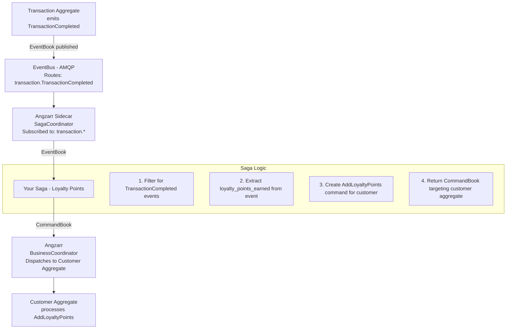
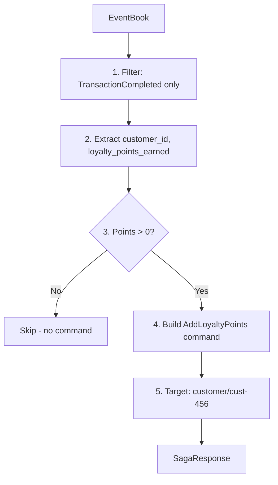
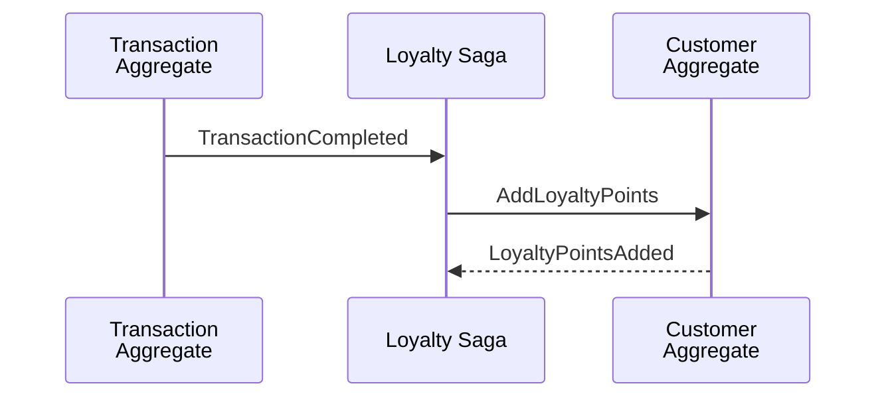
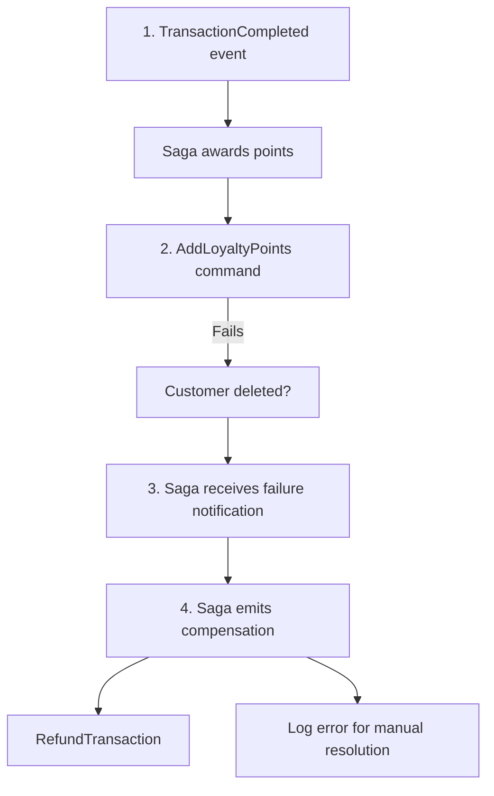

# Sagas

A **saga** orchestrates workflows that span multiple aggregates. When an event occurs in one domain, a saga can react by issuing commands to other domains, coordinating distributed transactions without tight coupling.

## Concepts

| Term | Definition |
|------|------------|
| **Saga** | A service that subscribes to events and emits commands to other aggregates. |
| **Choreography** | Decentralized coordination where services react to events independently. Sagas implement this pattern. |
| **Orchestration** | Centralized coordinator explicitly directs workflow steps. Alternative to choreography. |
| **Compensation** | Undo actions when a workflow fails partway through. "Semantic rollback." |
| **Saga Origin** | Metadata tracking which saga initiated a command, enabling compensation. |

---

## Component Responsibilities

### What Angzarr Provides

| Component | Responsibility |
|-----------|----------------|
| **SagaCoordinator** | Routes events to registered sagas based on topic subscriptions |
| **EventBus** | Delivers events from aggregates to saga coordinator via AMQP |
| **Command dispatch** | Executes commands emitted by sagas against target aggregates |
| **Compensation tracking** | (Planned) Track saga origins for rollback on failure |

### What You Provide

| Component | Responsibility |
|-----------|----------------|
| **Saga service** | gRPC server implementing the `Saga` interface |
| **Event filtering** | Decide which events trigger saga actions |
| **Command creation** | Build commands for other aggregates |
| **Compensation logic** | (If needed) Handle failures and rollback |

---

## Architecture



---

## gRPC Interface

Sagas implement the `Saga` service:

**[proto/angzarr/angzarr.proto](../proto/angzarr/angzarr.proto)**

```protobuf
// You implement this service
service Saga {
  // Asynchronous: fire-and-forget
  rpc Handle (EventBook) returns (google.protobuf.Empty);

  // Synchronous: blocks until saga produces commands
  rpc HandleSync (EventBook) returns (SagaResponse);
}

message SagaResponse {
  repeated CommandBook commands = 1;  // Commands to dispatch to other aggregates
}

message CommandBook {
  Cover cover = 1;              // Target domain + aggregate root ID
  repeated CommandPage pages = 2;
  SagaOrigin saga_origin = 3;   // For compensation tracking
  bool auto_resequence = 4;     // Retry on sequence conflicts
  bool fact = 5;                // True = guaranteed to succeed (event already committed)
}

message SagaOrigin {
  string saga_name = 1;         // Name of originating saga
  string correlation_id = 2;    // Tracks related operations
  EventBook triggering_event = 3; // Event that triggered this saga
}
```

---

## Saga Pattern

Every saga follows this pattern:

1. **Receive** EventBook with domain events
2. **Filter** for events this saga cares about
3. **Extract** data needed to build commands
4. **Create** CommandBooks targeting other aggregates
5. **Return** commands (which Angzarr dispatches)

**Input: EventBook**
```json
{
  "cover": { "domain": "transaction", "root": "txn-123" },
  "pages": [{
    "TransactionCompleted": {
      "customer_id": "cust-456",
      "final_total_cents": 9500,
      "loyalty_points_earned": 95
    }
  }]
}
```



**Output: SagaResponse**
```json
{
  "commands": [{
    "cover": { "domain": "customer", "root": "cust-456" },
    "pages": [{ "AddLoyaltyPoints": { "points": 95, "reason": "transaction:txn-123" } }],
    "saga_origin": { "saga_name": "loyalty_points" },
    "fact": true
  }]
}
```

---

## Example Implementation

### Loyalty Points Saga

Awards loyalty points to customers when transactions complete.

**Behavior:**
- Subscribes to `transaction` domain
- Filters for `TransactionCompleted` events
- Extracts `loyalty_points_earned` from event
- Emits `AddLoyaltyPoints` command to customer aggregate
- Skips if no points to award

**Implementations:**

| Language | File |
|----------|------|
| Rust | [examples/rust/saga-loyalty/src/lib.rs](../examples/rust/saga-loyalty/src/lib.rs) |
| Go | [examples/go/saga-loyalty/logic/loyalty.go](../examples/go/saga-loyalty/logic/loyalty.go) |
| Python | [examples/python/saga-loyalty/loyalty_saga.py](../examples/python/saga-loyalty/loyalty_saga.py) |

---

## Cross-Aggregate Coordination

Sagas enable loose coupling between aggregates:



**Key insight:** Transaction aggregate doesn't know about loyalty points. Customer aggregate doesn't know about transactions. The saga bridges them.

---

## Command Properties

Commands emitted by sagas have special properties:

| Property | Purpose |
|----------|---------|
| `saga_origin` | Links command to triggering event for compensation |
| `auto_resequence` | Retry with updated sequence on optimistic concurrency conflict |
| `fact` | When true, indicates the triggering event is committed—command should succeed |

### The `fact` Flag

When a saga reacts to a persisted event, that event is a **fact**—it cannot be undone. Commands derived from facts should also succeed:

```
TransactionCompleted is a FACT (already in event store)
    ↓
AddLoyaltyPoints should succeed (customer must exist)
    ↓
If customer aggregate rejects, something is wrong:
  - Bug in saga logic
  - Customer was deleted (shouldn't happen)
  - System inconsistency (needs investigation)
```

---

## Topic Subscriptions

Sagas declare which domains/events they care about:

```rust
impl Saga for LoyaltyPointsSaga {
    fn domains(&self) -> Vec<String> {
        vec!["transaction".to_string()]
    }
}
```

Unlike projectors, sagas typically filter to specific event types in their handler logic rather than relying on AMQP routing.

---

## Compensation (Planned)

When a saga-initiated command fails, compensation may be needed:



**Current status:** Saga origin tracking is in the protocol but compensation workflows are not yet implemented in the examples.

---

## BDD Specifications

Saga behavior is specified in Gherkin:

| Feature | File |
|---------|------|
| Loyalty points award | [examples/features/saga-loyalty.feature](../examples/features/saga-loyalty.feature) |

Example scenario:

```gherkin
Scenario: Award loyalty points when transaction completes
  Given a customer "cust-456" exists with 100 loyalty points
  And a transaction "txn-123" for customer "cust-456" with $50.00 total
  When the transaction is completed
  Then the saga emits an "AddLoyaltyPoints" command
  And the customer has 150 loyalty points
```

---

## Saga vs Projector

| Aspect | Projector | Saga |
|--------|-----------|------|
| **Output** | Read models (Projections) | Commands |
| **Side effects** | None (read-only) | Yes (modifies other aggregates) |
| **Coupling** | To events only | To events and target aggregates |
| **Failure impact** | Query returns stale data | Workflow incomplete |
| **Typical use** | Search indexes, reports, caches | Cross-aggregate workflows |

---

## Error Handling

| Scenario | Behavior |
|----------|----------|
| Saga throws exception | Event may be redelivered. Log error. |
| Command rejected by target | (Planned) Trigger compensation. Currently logged. |
| Target aggregate not found | Command fails. Saga may retry or compensate. |

Best practices:
- Make saga logic idempotent (may receive same event twice)
- Use `auto_resequence` for optimistic concurrency handling
- Log saga origin for debugging failed workflows
- Design for eventual consistency

---

## Sync vs Async Sagas

| Mode | Use Case | Behavior |
|------|----------|----------|
| **Synchronous** | Command must wait for cross-aggregate effects | Original command blocks until saga completes |
| **Asynchronous** | Eventual consistency acceptable | Fire-and-forget. Original command returns immediately. |

The loyalty points saga is synchronous—the client sees points awarded before command returns.

---

## Testing

### Unit Tests

```bash
# Rust
cargo test -p saga-loyalty --lib

# Go
cd examples/go/saga-loyalty && go test ./logic/...

# Python
cd examples/python/saga-loyalty && uv run pytest test_*.py
```

### Acceptance Tests (BDD)

```bash
# Rust
cargo test -p saga-loyalty --test cucumber

# Go
cd examples/go/saga-loyalty && go test ./features/...

# Python
cd examples/python/saga-loyalty && uv run pytest features/
```

---

## Next Steps

- [Command Handlers](command-handlers.md) — Processing commands and emitting events
- [Projectors](projectors.md) — Building read models from event streams
